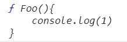

# this在node环境中

> **node环境：**
>
> 在全局环境中，this指的是 ```module.exports``` 对象
>
> - 但在node控制台中，this指的就是Global对象
>
> 全局调用函数时，this指的是Global对象
>
> **浏览器环境：**
>
> 两种情况指的都是Window对象

```javascript
function fun(){
    this.name = 'Qiyao';
    console.log(this);
}
fun(); // 打印的this是Global对象，(见下图)
console.log(this); // {}，这个this是module.exports对象
this.age = 21;
console.log(this); // {age:21}
```

<div align='center'></div>


# Window 和 window 


# substring 和 substr

- substr(start [, length])
  - length 为0或者负数，返回空字符串
- substring(start [, end])
  - 使用start、end中的较小值作为起始点
  - start 或 end 为 NaN / 负数时，将其替换成 0


# console.log() 和 console.dir()

```javascript
function Foo(){
    console.log(1)
}
```

- 如果是```console.log(Foo)```

  <div text-align='center'></div>

- 如果是```console.dir(Foo)```

  <div text-align='center'></div>


# 输错一次用户名和密码，就没有重输的机会，一直Authentication failed

[参考资料](https://blog.csdn.net/qq_34665539/article/details/80408282)

打开 windows 的凭据管理器，删除上次输错的记录


# 关于基本类型与构造函数实例的问题

```javascript
var str = "hello world";
console.log(str instanceof String); // false
console.log(str.__proto__ === String.prototype); // true
```


# 判空的问题

```javascript
var tags = []
console.log(tags === []) // 为什么返回false
```


# toString 与 toString()


# function的name

```javascript
// 为function及function的prototype增加name属性，并赋值
function Foo(){
    console.log(1)
}
Foo.name = 'Atong'
Foo.prototype.name = 'Qiyao'
console.dir(Foo)
```

<div text-align='center'></div>

```javascript
// 为function及function的prototype增加nickname属性，并赋值
function Foo(){
    console.log(1)
}
Foo.nickname = 'Atong'
Foo.prototype.nickname = 'Qiyao'
console.dir(Foo)
```

<div text-align='center'></div>

> 综上：这个是非匿名函数，自身有个内置属性```name = 函数名``` , 是不会被修改的
>
> 即使是匿名函数，也有内置属性name，只是```name = ''```，也是不能被修改的


# 使用iView的Col、Input标签报错

https://blog.csdn.net/weixin_38465623/article/details/85490353

https://blog.csdn.net/jiaqingge/article/details/80498536


# 管理员查看不到我的feature分支

https://www.cnblogs.com/zhou-chao/p/7678899.html


# vue 的 v-on:input 事件到底是什么

[参考答案](https://segmentfault.com/q/1010000009271217)


# 安装窗口逃到屏幕外边了

```Alt + space``` 进入移动状态


# 用iview的Select组件，选了之后不回显问题

```vue
<Select v-model="ruleFormData[item.prop]"
        :placeholder="item.placeholder"
        v-if="item.type == 'multiSelect'">
    <Option v-for="subitem in item.selectValue"
            :key="subitem.value"
            :value="subitem.value">
    </Option>
</Select>
```

改正：

给 ```<Option>``` 加上 ```:label="subitem.label"```


# 为什么设置crossorigin属性

当引入跨域的脚本（比如用了 apis.google.com 上的库文件）时，如果这个脚本有错误，因为浏览器的限制（根本原因是协议的规定），是拿不到错误信息的。当本地尝试使用 `window.onerror` 去记录脚本的错误时，跨域脚本的错误只会返回 ```Script error```

HTML5 新的规定，是可以允许本地获取到跨域脚本的错误信息的，但有两个条件：一是跨域脚本的服务器必须通过 `Access-Control-Allow-Origin` 头信息允许当前域名可以获取错误信息，二是网页里的 `script` 标签也必须指明 `src` 属性指定的地址是支持跨域的地址，也就是 crossorigin 属性。有了这两个条件，就可以获取跨域脚本的错误信息

[参考资料](https://www.chrisyue.com/what-the-hell-is-crossorigin-attribute-in-html-script-tag.html)


# 浮动的元素都停留在哪里

```html
<div class='container'>
    <div class='normal-box'>normal box</div>
    <div class='float-box'>float box</div>
</div>
```


# powershell yarn报错

powershell parcel 同理

[描述](https://blog.csdn.net/qq_45062261/article/details/100132489)


# IDE目录显示问题

https://www.cnblogs.com/eret9616/p/12099165.html


# 文字换行

hhhhhhhhhhhhhhhhhhhhhhhhhhhhhhhhhhhhhhhhhhhhhhhhhhhhhhh => 不换行

哈哈哈哈哈哈哈哈哈哈哈哈哈哈哈哈哈哈哈哈哈哈哈哈哈哈哈哈哈哈哈哈哈哈 => 换行


# 除了第一次外，按钮点击两次后modal才出现


# 文字溢到padding


# 项目拉下来后安装包的错误与解决

```powershell
> yarn add
Missing list of packages to add to your project
```

⬇

**使用 ```npm``` 安装**

```powershell
> npm install
Unexpected end of JSON input while parsing near '...{"caniuse-lite":"^1.0'
```

⬇

清除npm缓存后重新安装

```powershell
> npm cache clean --force
```


# 为什么子组件只有两个插槽，父组件使用时填了三个元素块

```vue
// 子组件
<template>
  <Layout>
    <BasicHeader>
      <template v-slot:beforeUser>
        <slot name="headerBeforeUser"></slot> // 第一个插槽，具名插槽
      </template>
    </BasicHeader>
    <Layout>
      <Sider>
        <BasicMenu></BasicMenu>
      </Sider>
      <Content>
        <Alert v-if="browserAlert">
          浏览器版本提醒
          <span slot="desc">{{browserAlert}}</span>
        </Alert>
        <slot></slot> // 第二个插槽，匿名插槽
      </Content>
    </Layout>
  </Layout>
</template>
```


```vue
// 父组件
<template>
  <BasicLayout>
    <BasicBread/> // ② 剩下的虽然是两个代码块，但是都是用来填那个匿名插槽的
    <HeaderScreen slot="headerBeforeUser"></HeaderScreen> // ① 填第一个具名插槽
    <div> // ②
      <router-view></router-view>
    </div>
  </BasicLayout>
</template>
```


# iview的Row组件中的gutter作用

```vue
<Row :gutter='20'>
    <Col></Col>
    <Col></Col>
</Row>
⬇
<div style="margin-left:-10px;margin-right:10px">
    <div style="padding-left: 10px; padding-right: 10px;"></div>
    <div style="padding-left: 10px; padding-right: 10px;"></div>    
</div>
```


# z-index无效

https://blog.csdn.net/zhu562002124/article/details/48545609


# 改变数组对象的属性名

<div></div>

[参考资料](https://blog.csdn.net/alisa_lisa/article/details/95620339)


# 箭头函数的错

https://blog.csdn.net/z93701081/article/details/78933174


# vue引入后无效的问题

https://zhidao.baidu.com/question/2144542621615771268.html