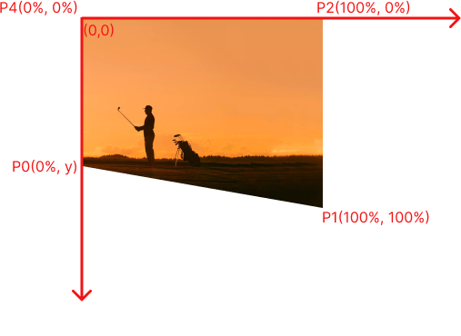
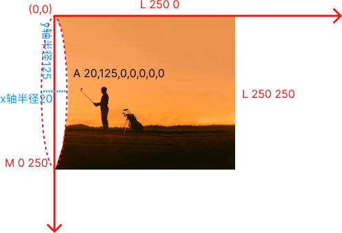

# 背景
这周工作中需要实现一种卡片效果，如下图所示（左边是 div，右边是图片，二者交界处是弧形）：


怎么实现这个弧形呢？最先想到的方案是，给左边的 div 加上 border-radius：


```css
.left-block {
  border-top-right-radius: 20px 50%;
  border-bottom-right-radius: 20px 50%;
}
```


上述代码实现了弧形，但是div 和图片留有空隙未贴合：


给 div 一个负边距，让它向右延伸与图片部分重合，再置于顶层就可以实现目标效果了：

```css
.left-block {
  border-top-right-radius: 20px 50%;
  border-bottom-right-radius: 20px 50%;
  margin-right: -20px;
  z-index: 1;
}
```


然而移动端要实现的效果却是 div 和 图片交界处为斜线：


上述 border-radius 的方法无法实现了。那么有什么通用的方法能绘制斜线又能绘制弧线呢？


# clip-path 的使用

通过查阅资料得知 CSS 3 的新属性 [clip-path](https://developer.mozilla.org/en-US/docs/Web/CSS/clip-path) 可以做到。

clip-path 绘制自定义边缘路径的封闭区域，作用元素会显示区域内的部分，隐藏区域外的部分。

回到问题上来，我们可以将div作为clip-path的作用元素，也可以将图片作为作用元素。因为需求中图片的大小是相对固定的（aspect ratio 1:1），所以我们将图片作为作用元素。


## polygon 方法

带斜线的路径：




目标区域是个梯形，可以调用 polygon 方法来插入多边形。clip-path 绘制路径时总是以 div 的左上角为原点。

polygon函数的参数都是一对对的坐标，坐标单位允许是：%，px，em，rem……。按逆时针方向将坐标连线就成了多边形。

```css
.image {
  clip-path: polygon(0% 95%, 100% 100%, 100% 0%, 0% 0%); /*百分比是相对于作用元素宽和高（border-box）*/
}
```


## path 方法

带弧形的路径：

path方法要更复杂和自由一点，参数是 指令+系数 的组合，更详细的可以参考 [SVG 规范文档](https://www.w3.org/TR/SVG2/paths.html)。我用到的指令有：

M (Move to)：将笔移到某个坐标开始绘制

L (Line to)：绘制一条从当前坐标到目标坐标的直线

A (Arc to)：绘制一条从当前坐标到目标坐标的弧线。

> A指令的系数有7个，依次为：
> 椭圆的x轴半径
> 椭圆的y轴半径
> 椭圆的 x 轴旋转角度 ，旋转方向由第5个系数决定
> 是否绘制大弧线的标志位（1>= 180度，0<180度）
> 弧线的方向的标志位（0 顺时针，1 逆时针）
> 终点x坐标，
> 终点y坐标

Z (Close Path)：关闭路径，就是绘制一条从当前坐标到起始坐标的直线

小写字母的指令表示后面跟着的坐标都是相对坐标，比如当前点是 (x,y)，则 m 100 100 的坐标是相对于 (x,y) 的，实际坐标是 (x+100, y+100)，l、a 同理。当然 path 的第一个指令肯定是绝对定位M





```css
.image {
  height: 250px;
  width: 250px;
  clip-path: path('M 0 250 A 20,125,0,0,0,0,0 L 250 0 L 250 250 Z') /*坐标和长度是像素值*/
}
```

以上代码是作用元素是定高和定宽的。如果作用元素不定高和宽，绘制 path 可以用 % 等相对长度单位吗？

```css
.image {
  clip-path: path('M 0 100% A 8%,50%,0,0,0,0,0 L 100% 0 L 100% 100% Z')
}
```

尝试后发现不行，path 的长度只能是像素值，且不带单位（包括%，em，px……）。[Unfortunately, clip-path: path() is Still a No-Go](https://css-tricks.com/unfortunately-clip-path-path-is-still-a-no-go/)

那怎么办，如何实现响应式呢？

多方参考，找到个解决方案：先定义一个svg文件，使用归一坐标绘制目标形状，然后在 css clip-path 属性中引用它的 clip-path 片段

```html
<svg>
  <defs>
    <clipPath id="customClipPath" clipPathUnits="objectBoundingBox">
      <!-- 使用归一化坐标来描述形状 -->
      <path d="M 0 1 A 0.08 0.5 0 0 0 0 0 L 1 0 L 1 1 Z" />
    </clipPath>
  </defs>
</svg>
```


```css
/* 这样不管作用元素如何缩放，都有固定的形状啦 */
.image {
  height: 100vw;
  width: 100vw;
  clip-path: url(#customClipPath)
}
```

