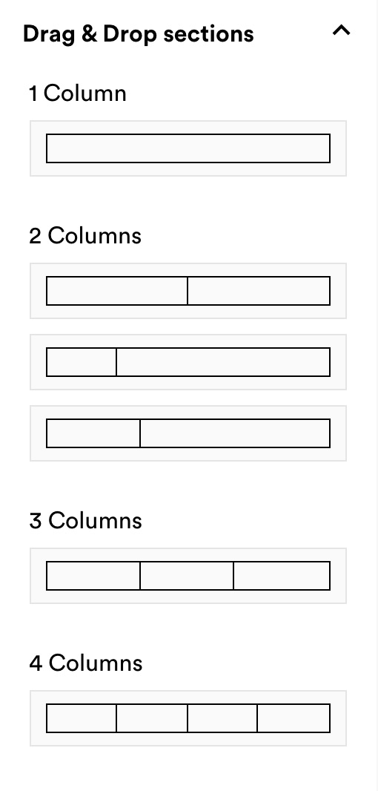
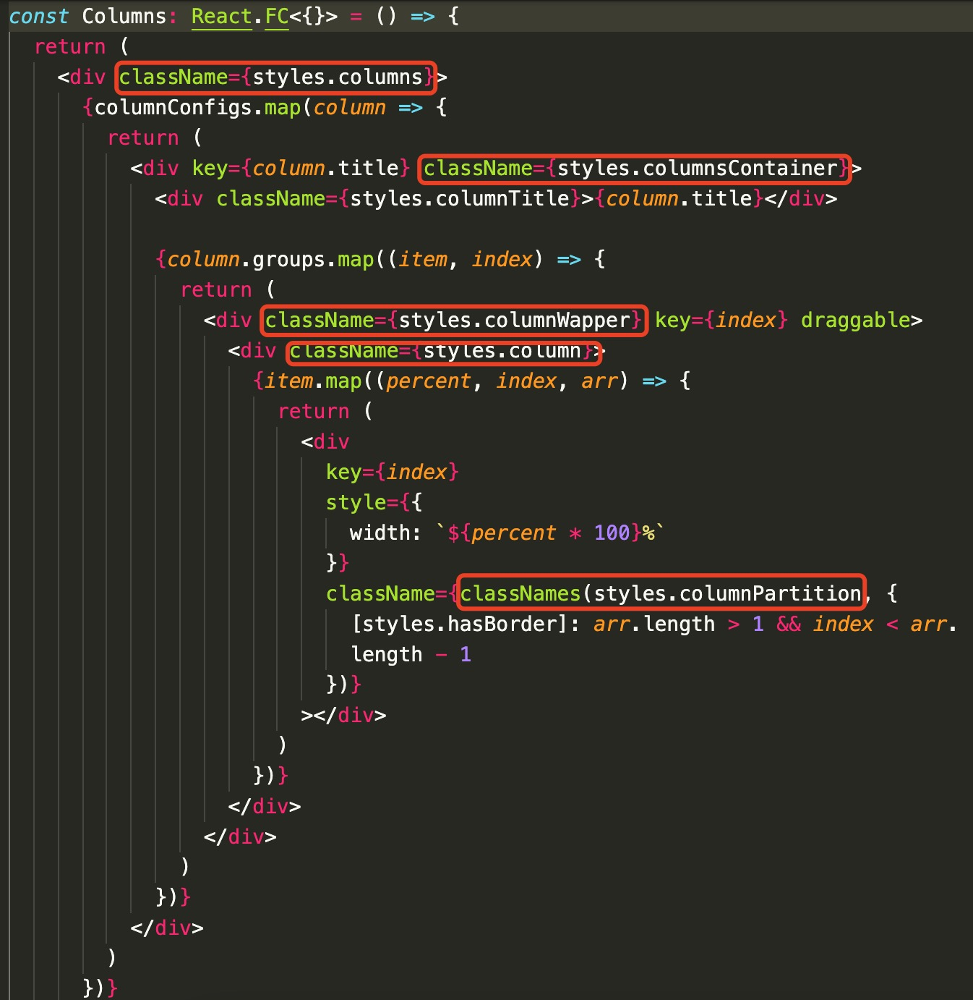

# week2

## 1 

Branch-A：

- 写了 *<u>新内容 X</u>* 并 push **( commit A1 )**，发现有个隐藏的bug
- ```git revert HEAD``` 并 push**( commit 2 )**
- 改分支被合进 master 了

Branch-B

- ```git checkout -b B ``` 新切分支
- 想要将 *<u>新内容 X</u>* 移到该分支进行修改，怎么办呢？
- ```git cherry-pick A1``` 将写了*<u>新内容 X</u>* 的 commit 移过来就可以啦！

**第一次使用 cherry-pick ，感觉很棒** 


## 2

react-beautiful-dnd 使用问题：

- react-beautiful-dnd 不支持 drag 事件发生后，产生source item 的copy，而是直接把 source item 给拉走了。

  现在的解决方案是：添加一个长得和 source item一样的 placeholder。在 source item dragging 状态下出现。但是过渡得不自然。

- move操作，因为服务器端响应数据是异步的，没有立刻触发resort操作，所以source item 会先返回原位置。


# week 1

## 1

<div align='center'> </div>

如果我写 1 + 2✖️3 + 1✖️3 + 1✖️4 个 div，那不是很蠢，更何况有5、6……n个columns呢

那就写个 configs 吧：

```tsx
const contentConfigs = [
  { title: 'Text', icon: EditorText },
  { title: 'Button', icon: EditorButton },
  { title: 'Image', icon: EditorImage }
]

const columnConfigs = [
  { title: '1 Column', column: 1, groups: [[1]] },
  {
    title: '2 Columns',
    column: 2,
    groups: [
      [1 / 2, 1 / 2],
      [1 / 4, 3 / 4],
      [1 / 3, 2 / 3]
    ]
  },
  { title: '3 Columns', column: 3, groups: [[1 / 3, 1 / 3, 1 / 3]] }, 
  { title: '4 Columns', column: 4, groups: [[1 / 4, 1 / 4, 1 / 4, 1 / 4]] }
]

const Columns: React.FC<{}> = () => {
  return (
    <div className={styles.columns}>
      {columnConfigs.map(column => {
        return (
          <div key={column.title}>
            <div>{column.title}</div>
            {column.groups.map((item, index) => {
              return (
                <div className={styles.columnWapper} key={index} draggable>
                  <div className={styles.column}>
                    {item.map((percent, index, arr) => {
                      return (
                        <div
                          key={index}
                          style={{
                            width: `${percent * 100}%`
                          }}
                          className={classNames(styles.columnPartition, {
                            [styles.hasBorder]: arr.length > 1 && index < arr.length - 1
                          })}
                        ></div>
                      )
                    })}
                  </div>
                </div>
              )
            })}
          </div>
        )
      })}
    </div>
  )
}
```

写了 3 个嵌套的 map 😭


## 2

<div align='center'> </div>

 如果再嵌套几个div，我就词穷了，我要找个命名的新思路


