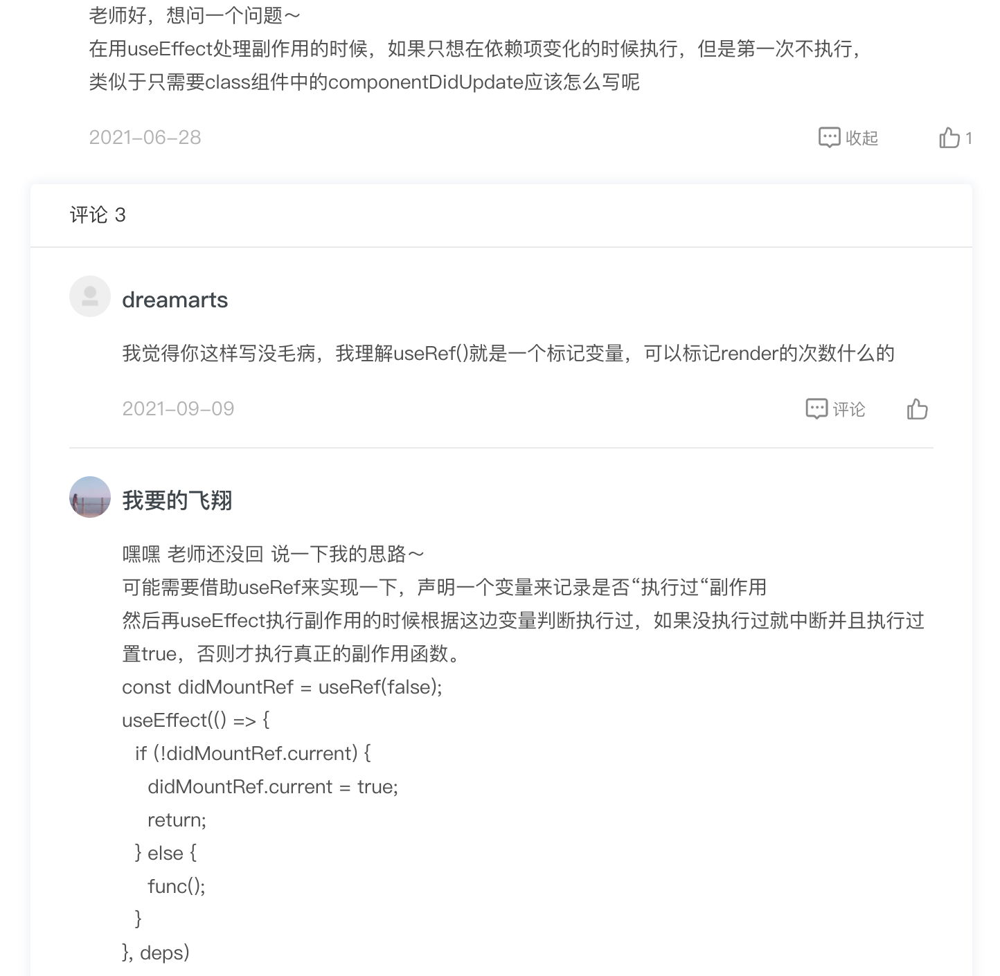

# Hooks


* [为什么要产生Hooks](#为什么要产生Hooks)
* [关于Hooks](#关于Hooks)
* [常用Hooks](#常用Hooks)
  * [useState](#useState)
  * [useEffect](#useEffect)
  * [useCallback](#useCallback)
* [引用](#引用)

<br/><br/>

## 为什么要产生Hooks

<br/>

- **函数组件更合适。** React 组件的本质就是将 model 渲染成 view ( *<u>UI=render(state, props)</u>* )，使用 class 创建组件不符合这样的思想，而且有些大材小用，因为class的一些特性完全没被利用：
  - 组件之间不是继承关系，未用到class类的继承特性
  - 组件不需要在外部调用那些实例方法
- **函数组件功能不足。**
  - 无法存在内部state（*<u>函数和对象不同，并没有⼀个实例的对象能够在多次执⾏之间保存状态，那势必需要⼀个函数之外的空间来保存这个状态</u>*）
  - 没有生命周期机制


:question:&nbsp;组合和继承

<div align='center' ></div>

<br/><br/>

## 关于Hooks

<br/>

- :wrench: &nbsp;<u>作用</u>：将某个目标结果钩到某个可能会变化的数据源或事件源上，当被钩到的数据或事件发生变化时，产生这个目标结果的代码会重新执行，产生更新后的新结果。**所有的 Hooks 的最终结果都是导致 UI 的变化。**

  <u>Hooks 提供了监听某个数据变化的能⼒。这个变化可能会触发组件的刷新，也可能是去创建⼀个副作⽤，⼜或者是刷新⼀个缓存。那么定义要监听哪些数据变化的机制，其实就是指定 Hooks 的依赖项。</u>

<div align='center' ></div>


- :boom:&nbsp; <u>caution</u>：
  - Hooks必须被执行到（所以不能写在if、for等语句中，不能放在return后）
  - Hooks按顺序被执行
  - 只能出现在函数组件的顶级作用域 或者 其他自定义Hooks中


- :+1:&nbsp;<u>优点</u>：

  - 逻辑复用：class 组件只能通过高阶组件，代码不直观难理解而且会在外层产生额外组件节点

    ```tsx
    // 高阶组件复用方式
    const withWindowSize = (component)=>{
      class WrappedComponent extends React.PureComponent{
        constructor(props){
          super(props)
          this.state = {
            size: this.getSize()
          }
        }
        componentDidMount(){
          window.addEventListener('resize', this.handler)
        }
        componentWillUnMount(){
          window.removeEventListener('resize', this.handleRedize)
        }
        getSize(){
          return window.innerHeight > 1000? 'large': 'small'
        }
        handler(){
          const currentSize = this.getSize()
          this.setState({
            size: currentSize
          })
        }
        render(){
          return <Component size={this.state.size}/>
        }
      }
      return WrappedComponent;
    }
    // 使用
    class MyComponent extends React.Component({ size }){ 
      render() { 
        if (size === "small") return <SmallComponent />; 
        else return <LargeComponent />; 
      } 
    }
    withWindowSize(MyComponent)
    ```

    <br/>

    ```tsx
    // hooks方式
    const getSize = ()=>{
      return window.innerWidth > 1000? 'large': 'small'
    }
    const useWindowSize = ()=>{
      const [size, setSize] = useState(getSize())
      useEffect(()=>{
        const handler = setSize(getSize())
        window.addEventListener('resize', handler)
        return ()=>{
          window.addEventListener('resize', handler)
        }
      },[])
      return size
    }
    // 使用
    const MyComponent = ()=>{
    	const size = useWindowSize()
      return {size === 'small'? <SmallComponent />: <LargeComponent /> }
    }
    ```

    <br/>

  - 有助于关注分离：Hooks 能够让针对同⼀个业务逻辑的代码尽可能聚合在⼀块⼉。 Class 组件中，不得不把同⼀个业务逻辑的代码分散在不同⽣命周期的⽅法中。

<br/><br/>

## 闭包陷阱

<br/>

jjjjj


<br/><br/>

## 常用Hooks

<br/>

### useState

<br/>

- :boom:&nbsp;<u>caution</u>：
  - state 不要保存可以通过计算得到的值。如从 props 传进来的需要加工的值，从 url 中读出来的值，从cookie、storage 中读出来的值……，需要的时候再取即可。
  
    因为否则就需要维护源 state 和目标 state 的一致性，会带来各种复杂度。
  
- :question:&nbsp;<u>问题</u>：

  - 函数组件重新执行，useState怎么操作？

    > 破案了！“useState 其实也是能够在组件的多次渲染之间共享数据的，那么在 useRef 的计时器例子中，我们能否用 state 去保存 window.setInterval() 返回的 timer 呢？”

<br/>

### useEffect

<br/>

```tsx
useEffect(fn, dependencies)
```

<br/>

- :wrench:&nbsp;<u>作用</u>：**每次 render 完后根据依赖项判断是否执行副作用**。(为什么叫副作用？在函数组件的当次执⾏过程中，useEffffect 中代码的执⾏是不影响渲染出来的 UI 的)


- :boom:&nbsp;<u>caution</u>：

  - 不填 dependencies，则在每次 render 后都执行；

    dependencies 是空数组，则只在组件首次渲染时才执行，即相当于 **componentDidMount** ；

    dependencies 是包含指定值的数组，则只在指定值变化后才执行，即相当于 **componentDidUpdate**；**但是第一次mount，即componentDidMount也会执行**。

  - 在 useEffect 中 return 一个匿名函数，则相当于 **componentWillUnMount**

  - 对依赖项的监听，是一种**浅比较**(===)。

    ```tsx
    const todos = [{ text: 'Learn hooks.'}]; 
    useEffect(() => { console.log('Todos changed.'); }, [todos]); // todos在每次render时都重新赋值了，所以todos变化了即使内容没变化
    // 用useMemo即可(如果是函数，则用useCallback)
    const todos = useMemo(()=>[{ text: 'Learn hooks.'}], [])
    ```
  
    
  
  - 依赖项目需要在callback中用到，否则无意义。<span style='color:red'>如果依赖项未被用到，但是作为flag来控制副作用执行呢</span>


- :question:&nbsp;<u>问题</u>：
  - 在 useEffffect 中如果使⽤了某些变量，却没有在依赖项中指定，会发⽣什么呢？ 
  
    > 1⃣️&nbsp;如果useEffect 没有依赖项参数情况下，则在每次render后都会执行副作用
    >
    > 2⃣️&nbsp;如果useEffect 有依赖项情况下，则即使该变量更新了也不会执行副作用
  
  - 在 useEffffect 中使⽤了 setBlogContent 这样⼀个函数，本质上它也是⼀个局部变量，那么这个函数需要被作为依赖项吗？为什么？ 
  
    > useState 保证了 setBlogContent 每次render时不发生变化。所以不需要作为依赖项
  
  - 如何让副作用只在依赖变化后执行
  
    <div align='center' ></div>

<br/>

### useCallback

<br/>

```javascript
useCallback(fn, dependencies)
```


<br/>

- :cake:&nbsp;<u>背景</u>：函数组件每一次render总是重新执行整个函数。所以一个函数定义总是被重复执行，生成一个新函数，这种情况下如果函数作为子组件的prop，会导致子组件一直更新*<u>【不做任何处理情况下，父组件重新render(prop、state变化)总是造成子组件更新，在这里指的是子组件使用了React.memo的情况】</u>*。

  ```tsx
  const AComponent = ()=>{
    const [age, setAge] = useState(0)
    const handleIncrement = ()=> setAge(age+1) // 每次都生成新函数，而且作为prop传入子组件子组件会重新渲染
    // 
    return <button onClick={handleIncrement}/>
  }
  ```

  

- :chestnut:&nbsp;<u>例子</u>：

  ```tsx
  JumpItem组件
  ```

  

- :wrench:&nbsp;<u>作用</u>：只在依赖项更新时，才重新定义函数

- :boom:&nbsp;<u>caution</u>：

  - 如果依赖参数是空数组[]，那么只在组件mounting时执行一次

  - useCallback可以用useMemo实现的

    ```tsx
    const func = useCallback(()=>setCount(count+1),[count])
    // 等同于
    const func = useMemo(()=>{
      return ()=>setCount(count+1)
    },[count])

- :question:&nbsp;<u>问题</u>：

  - 对于```const func = useCallback(()=>setCount(count+1),[])```，只定义一次，调用func时count一直是useState时创建的初始值。count是组件函数里的值，它是动态变化的，为什么func里的count一直不变呢？
  
    > 破案了！useCallback闭包问题。[参考回答](https://www.cnblogs.com/fe-linjin/p/11402288.html)
    >
    
  - 那定义一个函数是否都需要使用useCallback包裹呢？
  
    > 一般那种作为prop传入子组件的才有必要用useCallback


<br/>

### useMemo

<br/>

```javascript
useMemo(fn, dependencies)
```

<br/>

- :cake:&nbsp;<u>场景</u>：一个比较复杂的变量，每次render都需要重新计算来赋值，作为子组件的prop还会造成子组件更新

- :wrench:&nbsp;<u>作用</u>：只有依赖项更新时，才需要重新生成返回值

- :chestnut:&nbsp;<u>例子</u>：

  ```tsx
  ma中的columns
  ```

  

<br/>

### useRef
<br/>

- :cake:&nbsp;<u>场景</u>：函数组件每次render都从头执行一遍，定义的变量也被初始化赋值了，没法在多次渲染间共享
- :wrench:&nbsp;<u>作用</u>：
  - 创建一个容器（相当于class组件的this吗？），保存跨渲染数据
  
  - 解决闭包陷阱
  
    ```tsx
    // 自定义 usePrevious hook
    ```
  
    
  
  - 保存一个DOM节点的引用，便于操作改节点
  
- :chestnut:&nbsp;<u>例子</u>：

  ```tsx
  // 保存跨渲染数据
  import React, { useState, useCallback, useRef } from "react";
  
  export default function Timer() {
    const [time, setTime] = useState(0);
    const timer = useRef(null);
  
    const handleStart = useCallback(() => {
      timer.current = setInterval(() => {
        setTime((time) => time + 1);
      }, 100);
    }, []);
  
    const handlePause = useCallback(() => {
      clearInterval(timer.current);
      timer.current = null;
    }, []);
  
    return (
      <div>
        {time / 10} seconds.
        <br />
        <button onClick={handleStart}>Start</button>
        <button onClick={handlePause}>Pause</button>
      </div>
    );
  }
  ```

  <br/>

  ```tsx
  // 保存DOM引用
  const wrapperRef = useRef(null)
  ...
  <div ref={wrapperRef}>
  	<Select getContainer={()=>wrapperRef.current}/>
  </div>
  ```


- :question:&nbsp;<u>问题</u>：

  - 和 createRef 比，其何如？

    > 每次render，createRef 都会返回一个新的引用，而 useRef 每次都会返回相同的引用。
    >
    > [掘金demo](https://juejin.cn/post/6844904062681350157)
    >
    > ```tsx
    > const Demo = ()=>{
    >   const [count, setCount] = useState(0)
    >   const aUseRef = useState(null)
    >   const aCreateRef = useState(null)
    >   if(aUseRef.current === undefined){
    >     aUseRef.current = count
    >   }
    >   if(aCreateRef.current === undefined){
    >     aCreateRef.current = count
    >   }
    >   return <div>
    >   	<button onClick={()=>setCount(count+1)}></button>
    >     <span>{aUseRef.current}</span>  {/*一直为0*/}
    >     <span>{aCreateRef.current}</span> {/*增加ing*/}
    >   </div>
    > }
    > ```

<br/>

### useContext

<br/>

- :wrench:&nbsp;<u>作用</u>：获得组件树的值

<br/>

### useReducer


<br/><br/>


## 引用

- [1] [ReactHooks核心原理与实战-极客时间-王沛](https://pan.baidu.com/mbox/homepage#share/type=session)
- [2] [Dan's Blog ](https://overreacted.io/a-complete-guide-to-useeffect/)

- [3] [掘金分享](https://juejin.cn/post/6844903982037467143)

- [4] [官网文档](https://zh-hans.reactjs.org/docs/hooks-reference.html)

- [5] [掘金-闭包陷阱](https://juejin.cn/post/6844904193044512782)

