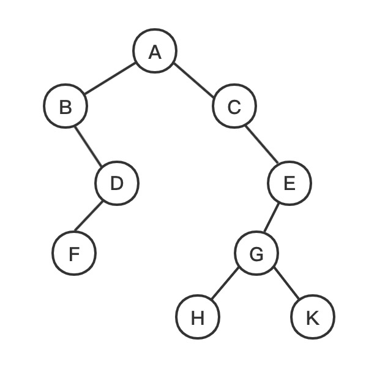

# 二叉树遍历


* [介绍](#介绍)
  * 树、二叉树等分类
  * 几种遍历
* [递归](#递归)
  * [前序遍历之递归](#前序遍历之递归)
  * [中序遍历之递归](#中序遍历之递归)
  * [后序遍历之递归](#后序遍历之递归)
* [非递归](#非递归)
  * [前序遍历之非递归](#[前序遍历之非递归](#前序递归))
  * [中序遍历之非递归](#中序遍历之非递归)
  * [后序遍历之非递归](#后序遍历之非递归)
  * [层次遍历](#层次遍历)


## 介绍

<div align='center'></div>

- 前序：ABDFCEGHK
- 中序：BFDACHGKE
- 后序：FDBHKGECA


## 递归


### 前序遍历之递归

```javascript
const preOrder = (root)=>{
  if(root === null){
    return
  }
  console.log(root.val)
  preOrder(root.left)
  preOrder(root.right)
}
```


### 中序遍历之递归

```tsx
const inOrder = (root)=>{
  if(root === null){
    return
  }
  inOrder(root.left)
  console.log(root.val)
  inOrder(root.right)
}
```


### 后序遍历之递归

```tsx
const postOrder = (root)=>{
  if(root === null){
    return
  }
  postOrder(root.left)
  postOrder(root.right)
  console.log(root.val)
}
```


## 非递归


### 前序遍历之非递归

```javascript
const preOrder = (root)=> {
  const stack = []
  const curr = root
  while(curr !== null && stack.length){
    while(curr !== null){
      console.log(curr.val)
      stack.push(curr)
      curr = curr.left
    }
    const top = curr.pop()
    curr = curr.right
  }
}
```


### 中序遍历之非递归

```javascript
const inOrder = (root)=> {
  const stack = []
  const curr = root
  while(curr !== null && stack.length){
    while(curr !== null){
      stack.push(curr)
      curr = curr.left
    }
    curr = stack.pop()
    console.log(curr.val)
    curr = curr.right
  }
}
```


### 后序遍历之非递归


### 层次遍历

root进队列，出队列打印，其左右子节点入队列；

依次出队列打印，但是需要将自身的左右子节点入队列；

直到队列为空。

```tsx
const levelOrder = (root)=>{
  const ret = []
  if(root === null){
    return ret
  }
  const queue = []
  queue.push(root)
  while(queue.length){
    let front = queue.shift()
    ret.push(front.val)
    if(front.left){
      queue.push(front.left)
    }
    if(front.right){
      queue.push(front.right)
    }
  }
  return ret
}
```

- 问题：同一层的一起打印呢

  ```javascript
  const levelOrder = (root) => {
    if(root === null){
      return []
    }
    const queue = []
    const ret = []
    let i = 0;
    while(queue.length){
      const count = queue.length
      ret[i] = []
      while(count--){
        const front = queue.shift()
        ret[i].push(front.val)
        if(front.left){
          queue.push(front.left)
        }
        if(front.right){
          queue.push(front.right)
        }
      }
      i++
    }
    return ret
  }
  ```

  


## 引用

[1] [CSND博文](https://blog.csdn.net/Monster_ii/article/details/82115772)