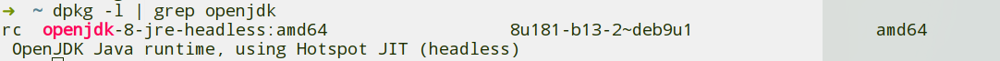
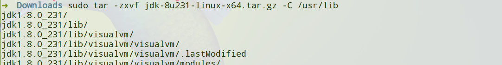
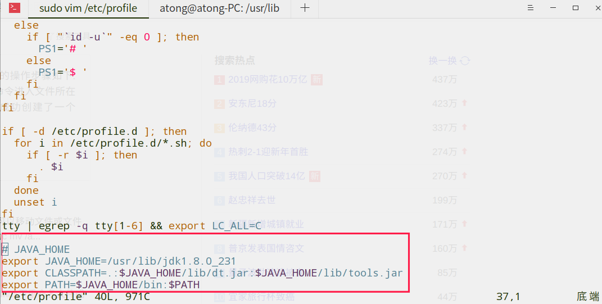
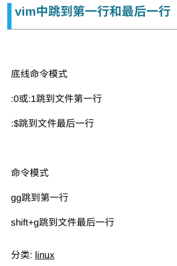
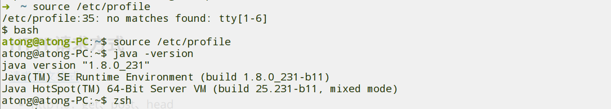

## 查看仓库中某个软件/包的信息

```shell
aptitude show xxx
```


## 解压```tar.gz```文件

```shell
sudo tar -zxvf node-v12.14.1-linux-x64.tar.xz -C /usr/lib
```


## 解压```tar.xz```文件

```shell
sudo tar -xvJf node-v12.14.1-linux-x64.tar.xz -C /usr/lib
```


## 安装与配置环境变量

[参考资料](http://www.luyixian.cn/news_show_191345.aspx)

### 查看自带的jdk、jre

```shell
dpkg -l | grep openjdk
```

<div align="center"></div>


### 下载jdk安装包，解压到相应目录

```shell
sudo tar -zxvf jdk-8u231-linux-x64.tar.gz -C /usr/lib
```

<div align="center"></div>
-  -C 选项的作用是：指定需要解压到的目录

### ①配置环境变量

```shell
sudo vim /etc/profile
```

<div align="center"></div>
<div align="center"></div>
- 小写o：在这行下面插入一行
- gg：跳到第一行
- G：跳到最后一行


### ②创建链接

node安装可①可②

```shell
sudo ln -s /usr/lib/node-xxx/node /usr/local/bin/node
sudo ln -s /usr/lib/node-xxx/npm /usr/local/bin/npm
```


### 使配置文件生效

```shell
source /etc/profile
```

但遇到问题，切换回普通bash

<div align="center"></div>
但只在当前终端生效

所以直接注销再打开就可以了


