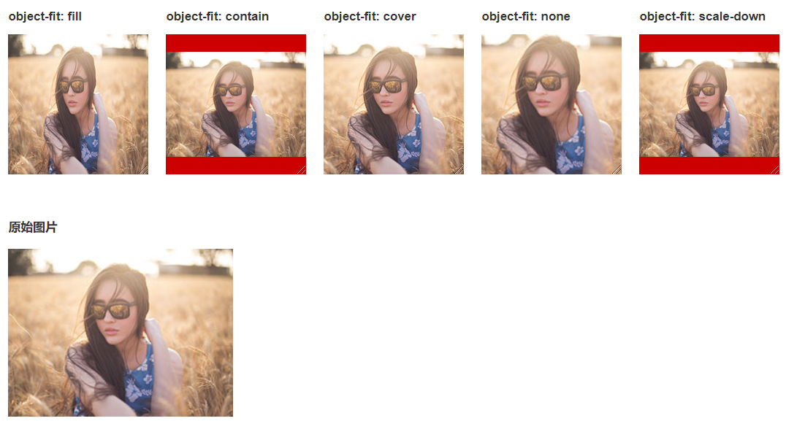

# object-fit

指定元素(一般是img、video、iframe)是如何调整大小以适应其容器框的

## 属性值

[参考资料](https://www.jianshu.com/p/9e5134e780c5)

- fill

  图片拉伸以填满容器，如果与容器高宽比不一致那么图片会变形

  高✖的倍数 =  (containerHeight/ elemHeight) 

  宽✖的倍数 = (containerWidth/ elemWidth) 

- cover

  按自己的宽高比缩放以填满容器，有超出容器范围的则裁掉

  宽、高✖的倍数 = Max(containerHeight/ elemHeight，containerWidth/ elemWidth)

  若与容器宽高比不同，则必有超出部分，将其剪裁

  

- contain

  按自己的宽高比缩放以填充容器，有未填满部分就留白

  宽、高✖的倍数 = Min(containerHeight/ elemHeight，containerWidth/ elemWidth

  若与容器宽高比不同，则必有留白部分

  

- scale-down

  如果图片小于容器，则不缩放，保持原来大小待在容器中；

  如果图片大于容器，则以contain方式缩小以留白

- none

  不对图片做改变

  

## 与background-size属性

