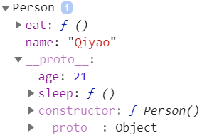

# 属性/方法的概念

[参考资料](https://segmentfault.com/a/1190000016658290)

> 有这么多分类，是面向对象编程的需要


## 公有属性/方法

> 实例对象得以获得的属性与方法

```javascript
function Person(){
    this.name = 'Qiyao'
    this.eat = function(){
        console.log("吃")
    }
}
Person.prototype.age = 21
Person.prototype.sleep = function(){
    console.log("睡觉")
}

let p1 = new Person()
console.dir(p1)
```

<div align='center'></div>


## 私有属性/方法

> 不能在构造函数外部访问（闭包情形除外）

```javascript
function Person(){
    let name = ''
    let eat = function(){}
    function sleep(){}
}
```


## 静态属性/方法

> 无需实例化，即可调用的属性、方法
>
> 实例对象不能获得类的静态属性方法

```javascript
function Person(){
    ...
}
Person.name = ''
Person.eat = function(){}   
```


## 实例属性/方法


