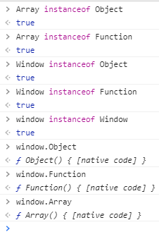

# 隐式转换

什么叫隐式转换？JS编译器自动将数值进行类型转换，转换后都是基本类型


## toString

[掘金资料](https://juejin.im/post/6844903604990509063#heading-1)

（类，本质上是构造函数）

- Object类型，最原始的toString方法来自其prototype对象

  ```javascript
  var obj = {name: 'Qiyao'} obj.toString(obj) //  "[object Object]"
  Object.prototype.toString.call({}) // "[object Object]"
  Object.prototype.toString.call([]) // "[object Array]"
  Object.prototype.toString.call(1) // "[object Number]"
  ```

  

- Array类型，重写了toString方法：

  - 对于数组，将数组元素的字符串形式拼接并用逗号分隔的字符串
  - 革除了让 undefined、null 调用
  - 其他从Object继承而来

  ```javascript
  var arr1 = []; 
  arr1.toString(); // ""
  var arr2 = [1,2,3];
  arr2.toString(); // "1,2,3"
  var arr3 = [1,2,{name: 'Qiyao'}];
  arr3.toString(); // "1,2,[object Object]"
  Array.prototype.toString.call(arr3); // "1,2,[object Object]"
  var func = function(){console.log('hello')};
  Array.prototype.toString.call(func); // "[object Function]"
  ```

  

- Function类型，重写了toString方法：

  - 革除了让 非Function对象 调用
  - 对于Function对象，返回方法的代码字符串（包括注释）

  ```javascript
  Function.prototype.toString.call({}); 
  // Uncaught TypeError: Function.prototype.toString requires that 'this' be a Function
  // =================因为这些都是构造函数===============
  Object.toString(); // "function Object() { [native code] }"
  Function.toString(); // "function Function() { [native code] }"
  Array.toString(); // "function Object() { [native code] }"
  Function.prototype.toString.call(Array); // "function Array() { [native code] }"
  // =================因为这些都是构造函数===============
  var func = function(){
      console.log('hello');
  } // "function(){console.log('hello');}"
  ```


- Date类型，重写了toString方法

  - 革除了让非Date对象调用
  - 返回带有时区信息的日期和时间字符串

  ```javascript
  var date = new Date();
  date.toString();
  Date.prototype.toString.call(date); // "Thu Aug 06 2020 16:46:42 GMT+0800 (中国标准时间)"
  ```


- RegExp类型，重写了toString方法

  - 革除了让非object类型对象调用 （this为只能Number、Boolean、Date、Array、Error、RegExp、Object......等类型对象，都返回"/undefined/undefined"）
  - 返回正则表达式的字面量

  ```javascript
  var re = /cat/g;
  re.toString();// "/cat/g"
  RegExp.prototype.toString.call(re);// "/cat/g"
  ```

  

- 基本包装类型(**Boolean、Number、String**)，重写了toString

  - 革除了让非Boolean/Number/String类型对象调用

  ```javascript
var num1 = 10; // 基本类型
  var num2 = new Number(20); // 引用类型
  var num3 = Number(30); // 基本类型
  num1.toString(); // "10"
  Number.prototype.toString.call(num1); // "10"
  num2.toString(); // "20"
  num3.toString(); // "30"
  ```
  
  

  > **toString是由构造函数创造的对象才有的方法，为什么基本类型也可以调用？**
  >
  > > 因为 JS 引擎会把基本类型的字面量转换成对应的基本包装类型的对象
  > >
  > > ```javascript
  > > var num = 10;
  > > num.toString();
  > > // num.toString()的内部过程：
  > > (1)创建Number类型的实例 var temp = new Number(num) 
  > > (2)在实例上调用指定的方法 return temp.toString()
  > > (3)销毁实例 temp = null;
  > > ```
  
  
  
- null 和 undefined，因为没有对应的构造函数，所以无法调用toString **(准确说，任何属性和方法)**


- 浏览器的Window类型，没有重写Object的toString方法，直接循着原型链找到Object的toString

  <div align="center"></div>


- 直接执行

  ```javascript
  toString() // "[object Undefined]"
  // 相当于
  Object.property.toString.call() // "[object Undefined]"
  ```

  