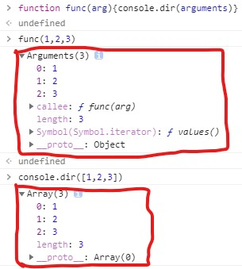
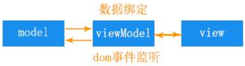

[HTML5技术](https://www.techug.com/post/40-important-html-5-interview-questions-with-answers.html)

# 前端基础


## 计算机网络


### HTTP和HTTPS

- HTTP，超文本传输协议，用于服务器端传输超文本到浏览器端

- HTTPS，在HTTP基础下加入了ssl层，确保了数据加密传输和身份认证，可以理解成HTTP的安全版

- HTTP和HTTPS对比：

  - HTTP传输的数据是未加密的明文；而HTTPS加入了SSL层，能进行身份验证、对传输的数据进行加密、使数据不被窃取改变保证完整性，更安全
  - 使用HTTPS的网站在搜索引擎上排名更高，而使用HTTP的网站可能会被标记为不安全
  - HTTP协议的端口是80；HTTPS协议的端口是443
  - 与HTTP相比，HTTPS需要ca证书，费用较高
  - HTTPS握手阶段比较费时， 会使页面加载时间延长
  - HTTPS缓存不如 HTTP高效， 会增加数据开销
  - SSL 证书需要绑定 IP， 不能再同一个 ip 上绑定多个域名， ipv4 资源支持不了这种消耗

- HTTPS工作原理：

  [参考资料：漫画聊HTTPS协议](https://zhuanlan.zhihu.com/p/57142784)

  [其他方法的不足](https://zhuanlan.zhihu.com/p/27395037)

  - 服务器端生成一对公钥和私钥，将公钥发给证书颁发机构

  - 证书机构用自己的私钥加密服务器端发送来的公钥，并利用服务端网址等信息生成证书签名，签名也经私钥加密。最后将证书发送给服务器端

  - 服务器端 直接发送给证书 客户端

  - 因为各大浏览器和操作系统有所有权威证书机构的名称和公钥，所以客户端可以根据机构名取出对应的机构公钥

  - 客户端先用公钥 解密出 证书签名，验证证书签名

  - 客户端再用机构公钥 解密 机构私钥，得到服务器端的公钥

  - 客户端对称生成密钥，用服务器端公钥加密该密钥，发送给服务器

  - 服务器端 用自己的私钥 解密 公钥，得到客户端的密钥，从此之后的数据传输就用该密钥加密解密

    （上述认证过程是在SSL层中完成的，现在的TSL是SSL的升级版）


### ❤❤❤介绍 HTTP 协议(特征)


### 说一下HTTP2.0

[一篇文章让你入门HTTP2](https://segmentfault.com/a/1190000016656529?utm_source=tag-newest)

- 多路复用

  允许通过一个http连接同时发送多个请求-响应消息，解决了浏览器限制同一个域名下的请求数量的问题

- 二进制分帧

  在应用层和传输层之间增加一个二进制分帧层，将传输信息分割成更小的帧，并进行二进制编码

- 首部压缩

  采用HPACK算法对首部进行编码，减少了首部大小（原来是文本形式的首部，加上cookie则更大）

- 服务器端推送

  服务器对客户端的一个请求发送多个响应（收到客户端的某个请求后主动推送其他资源）

- 更安全


### UDP和TCP区别

- TCP是面向连接的；UDP是无连接的
- TCP提供可靠的服务，通过TCP链接传送的数据，无差错、不丢失、不重复、按序到达；UDP不保证可靠交付 
  - TCP如何做到可靠传输
- TCP面向字节流；UDP面向字节流
- TCP只能一对一通信；UDP支持一对一，一对多
- TCP动态改变窗口的大小进行拥塞控制；UDP没有用塞控制(适合视频电话等需要源主机以恒定速率传输数据又允许丢包的应用)
- TCP首部最大20字节；UDP首部最大8字节


### TCP握手

[三次握手四次挥手](https://juejin.im/post/5b1d34eb6fb9a01e7d5c3e25#comment)

一句话概括：客户端和服务端都需要知道各自可收发， 因此需要三次握手

- 第一次握手(SYN=1，seqNum=X)：

  客户端发送一个SYN标志位置1的包，并产生随机的X放在序列号字段中，发起连接请求，等待服务器确认，进入```SYN_SEND```状态

- 第二次握手(SYN=1，ACK=1，seqNUm=Y，ackNum=X+1)：

  服务端发送一个SYN和ACK标志位都置1的确认包，（并将客户端序列号字段中的X+1存入确认号字段，随机产生Y存入序列号字段中），进入```SYN_RCVD```状态

- 第三次握手(ACK=1，ackNum=Y+1)

  客户端发送一个ACK标志位置1的确认包，并将服务端的序列号Y+1存入确认号字段中，进入```ESTABLISHED```状态

  当服务端接收到确认包后，握手结束，建立了TCP连接

### 四次挥手

- 发送FIN标志位为1的包，发起中断连接请求
- 服务器端，收到请求后，发送ACK包确认收到请求
- 服务器端，等最后一个报文发送出去后，发送FIN包，准备好关闭连接
- 客户端，收到后发送ACK包
- 服务器端收到后断开连接，客户端等待一定时间，没有收到报文则断开客户端的连接


### WebSocket的实现与应用

（一些概念：无状态、短连接、长连接、轮询、长轮询、http keep-alive、tcp keep-alive 心跳包  [参考资料1](WebSocket 是什么原理？为什么可以实现持久连接？ - Ovear的回答 - 知乎 https://www.zhihu.com/question/20215561/answer/40316953)  [参考资料2](https://juejin.im/post/5b10b822e51d4506cd4fc218 )）

WebSocket的特点是，服务器能主动发送数据给客户端，还有持久连接

实现：

①

握手建立连接的过程，与http协议差不多，只是请求头和响应头多了一些内容。

请求头的：

```Upgrade: websocket``` 和 ```Connection: Upgrade``` 告诉服务端发起的是websocket请求

```Sec-WebSocket-Key``` 是客户端随机生成的一个密钥 ，要求服务端必须返回一个对应加密的```Sec-WebSocket-Accept```应答

```Sec-WebSocket-Version```告诉服务器所使用的 Websocket 协议版本响应头的

响应头的：

```Upgrade: websocket``` 和 ```Connection: Upgrade``` 告诉客户端即将升级的是WebSocket协议（返回状态吗101）

② [websocket数据传输原理](https://cloud.tencent.com/developer/article/1194146 )  [websocket-protocol书](https://github.com/zhangkaitao/websocket-protocol)

数据传输以数据帧为单位，发送端将消息切割成多个帧发送，当标志位FIN=1时，表示是消息的最后一个分片，接收端将帧重组成消息，根据opCode标志位来对消息进行不同操作


### ❤❤❤HTTP请求方式

[请求报文格式](https://www.cnblogs.com/biyeymyhjob/archive/2012/07/28/2612910.html)

- http1.0：get、post、head
- http1.1：put、options、trace、delete、connection
- http2.0：patch


### GET 和 POST 的区别

[知乎详解](https://www.zhihu.com/question/28586791)

GET和POST作为协议的内容没有本质区别，只是规定了不同语义(性质)，GET用来获取资源，POST用来提交数据

但是浏览器对他们有具体的实现，所以GET、POST有不同的表现，在浏览器中：

- ①GET参数以查询字符串形式通过url传递，所以参数不能是敏感信息， ②有长度限制， ③参数只支持ASCII码，非ASCII字符(按utf-8方式)转成十六进制的字节数组，再用%分隔连接 [(编码解码资料)](https://segmentfault.com/a/1190000015800019)

  ①POST参数写在请求体中， ②没有长度限制， ③支持多种编码方式

- GET请求会保留在浏览记录里，能被收藏为书签，请求的结果会被缓存；POST请求不行（否则，第二次点击下单按钮就返回原来订单成功界面，点书签直接就下单）

- GET请求是幂等操作，相同的请求被执行多次也不会对服务器状态产生影响；POST请求是非幂等的

- （GET 产生一个 TCP 数据包； POST 产生两个 TCP 数据包。即GET请求把http header和data一并发送出去；而POST请求先发送header，在发送data，但火狐浏览器不是这样的）


### 讲讲 304

表示资源未修改。客户端的请求的If-Modified-Since与服务器的Last-Modified字段值比对，如果相同，表示服务器上的资源未修改，只返回响应头，状态码是304，从缓存获得资源。一般发生在协商缓存的过程中	[304资料](https://blog.csdn.net/huwei2003/article/details/70139062)


### 补充 400 和 401、 403 状态码

400：客户端请求的语法错误，可能是提交数据的类型或名称与后台实体没有对应，或者没有将对象转化为json字符串

401：当前请求需要用户验证

403：服务器收到请求，但是拒绝执行


### 301 和 302 的区别

- 301，永久移动。①请求的资源被永久移动到新的url了，浏览器自动定向到新url	②会默认缓存返回的资源	③常用在域名跳转
- 302，临时移动。①资源只是临时被移动，之后的请求继续使用原来的url	②默认不会缓存返回的资源	③常用在页面临时跳转的时候，比如访问404页面重定向到首页，点击个人中心跳转到登录页


### 状态码 304 和 200

- 304
- 200，请求成功。服务器成功处理了请求，返回请求所希望的响应头或数据体


### ❤❤❤http 常用请求头


### 具体有哪些请求头是跟缓存相关的

[条件请求If-Match、If-Modified-Since、If-None-Match、If-Range、If-Unmodified-Since](https://blog.csdn.net/jiangshangchunjiezi/article/details/88581824)

- expires
- cache-control
- if-modified-since    (if-unmodified-since?)
- if--none-match    (if-match?)
- if-range?


### ❤❤❤常见的 HTTP 的头部

给头部分个类，可以有请求头、响应头、通用头、实体头

- 请求头
- 响应头
- 通用头
- 是实体头


### cache-control 的值有哪些

cache-control的值是缓存指令，用来规定资源缓存方式、缓存位置和缓存期限

常见指令有：

no-cache：资源可以缓存，但是每次需要向服务器请求，验证后才能使用

no-store：彻底禁用缓存，每次都向浏览器请求资源

private：表明响应的资源只能由客户端缓存

public：响应的资源可以存在客户端、CDN等其他缓存中，能在用户间共享

max-age，资源缓存的有效期

（cache-control的重要性：能针对性处理公共资源、私密资源、常常更新的资源、静态资源）


### 一个图片 url 访问后直接下载怎样实现

设置响应头：

```json
'Content-Disposition':'attachment;filename=xxx',
'Content-Type':'content-type: application/octet-stream' // 告诉客户端这是一个二进制文件
```


### fetch 发送 2 次请求的原因

[HTTP访问控制（CORS）](https://developer.mozilla.org/zh-CN/docs/Web/HTTP/Access_control_CORS)

[跨源请求](https://zh.javascript.info/fetch-crossorigin)

[预检](https://www.w3cways.com/2280.html)

[跨域资源共享 CORS 详解](https://www.ruanyifeng.com/blog/2016/04/cors.html)

[简单请求非简单请求](https://juejin.im/post/5d71d1e7f265da03934c027b#comment)

**是浏览器CORS机制造成的。**

**当该请求是非简单请求时，就会触发浏览器首先会发送一个options预检请求，验证是否是服务器对跨源请求所支持 HTTP 方法，如果支持则状态码是204（no content）**

**然后在第二次中发送真正的请求**

简单请求：（普通 HTML Form 在不依赖脚本的情况下可以发出的请求）

①GET、HEAD、POST	

②没有自定义头，请求头的字段只能有Content-Type、Content-Language、Accept、Accept-Language等	

③Content-Type只能是application/x-www-form-urlencoded, multipart/form-data, text/plain

非简单请求：可能会对服务器数据产生副作用


### Cookie、 sessionStorage、 localStorage

[XXS攻击](https://segmentfault.com/a/1190000016551188)

- Cookie：存在于http头中在服务器和浏览器之间来回传送，可以自己设置过期时间，存储容量小只有4KB

  保存登录状态、保存用户页面设置信息、跟踪用户的行为(所选地区)

- sessionStorage：保存在客户端不参与与服务器通信，仅在当前窗口关闭前有效(刷新页面不会消失)，存储容量有5MB

  编辑页面自动保存草稿功能

- localStorage：保存在客户端不参与与服务器通信，除非人为清除不然不会失效同源窗口都可以共享数据， 存储容量有5MB

  可以用来页面间传递参数
  
  

### Cookie 如何防范 XSS 攻击

[美团总结](https://juejin.im/post/5bad9140e51d450e935c6d64)

[分类、危害](https://thief.one/2017/05/31/1/)

[cookie格式](https://zhuanlan.zhihu.com/p/99916740)

[深入浅出cookie](https://www.jianshu.com/p/66c6f0c0ec82)

[cookie](https://thinkjs.org/zh-cn/doc/3.0/cookie.html)

XSS(cross-site scripting)跨站脚本攻击。攻击者提交恶意脚本，未经过滤，嵌入到html页面中被执行

危害有：篡改网页代码、利用网页重定向、窃取cookie等

为了防范攻击者劫持cookie，可以在服务器的http响应头中给 ```Set-Cookie```  添加

```httponly```属性，禁止 javascript 脚本来访问 cookie

```secure```属性，告诉浏览器仅在请求为 https 的时候发送 cookie


### cookie 和 session

[cookie](https://segmentfault.com/a/1190000004743454)

[session实现原理](COOKIE和SESSION有什么区别？ - 任云肖的回答 - 知乎 https://www.zhihu.com/question/19786827/answer/151015728)

[详解cookie和session](https://www.cnblogs.com/zhouhbing/p/4204132.html)

因为http是无状态的协议，服务器不知道上一次的请求用户请求内容，所以用到cookie和session实现存储会话状态，来解决验证用户登录信息、跟踪用户行为等问题

cookie是存储在客户端的，只能存储字符串类型的数据，存储大小有限4kb，在http中明文传递安全性不高，有效期可以通过maxAge设置

session是存储在服务器端的比如文件、数据库、内存内，能存储各种类型的数据，存储大小数量没有限制但是数据量大会增加服务器的负担，以加密形式存储并在服务器上解密更安全，关于有效期服务器会把长时间内没有活跃的session从内存删除。

通常session的实现，需要借助cookie的sessionId。第一次创建session的时候，服务器发送响应告诉浏览器需要sessionId，浏览器每次的请求都带有sessionId值。（浏览器不支持cookie，可将sessionId值添加在url参数里）


###  ❤❤❤cookie 有哪些字段可以设置


### ❤❤❤cookie 有哪些编码方式


### 一句话概括 RESTFUL

（restfull ，服务器与客户端交互的风格。为什么要用？为不同的客户端提供统一的接口）

**用 URL 定位资源， 用 HTTP 动作描述操作**


### 说一下web worker

html页面中，执行js脚本会阻塞页面，导致页面状态不可响应

web worker 是运行在后台的 js， 独立于其他脚本， 不会影响页面性能。并且通过 postMessage 将结果回传到主线程


## HTML

### 说一下 web Quality

无障碍，是指网站对那些残障人士来说是易用的

比如：

- img标签使用```alt```属性，浏览器可以显示或读出图片描述
- 正确使用语义化标签，适宜读屏软件阅读
- 字体大小使用相对尺寸，便于用户按需在浏览器中调整大小
- 留意颜色的对比


### 说一下 HTML5 drag api

事件主体是被拖放元素：

- dragstart：开始拖放时触发
- drag：正在拖放时触发
- dragend：拖放操作结束时触发

事件主体是目标元素：

- dragenter：被拖放元素进入目标元素时触发
- dragover：被拖放元素在目标元素中移动时触发
- dragleave：被拖放元素移出目标元素时触发
- drop：目标元素完全接受被拖放元素时触发

拖拽事件有dataTransfer属性，用来存储拖动数据。可以通过setData、getData来操作


### 对 HTML 语义化标签的理解

[HTML语义化](https://juejin.im/post/5ae029bcf265da0b7155f15d#comment)

语义化标签能让人立马看出表达的内容，比如nav标签表示导航条

虽然一个页面仅靠div、span标签就可以构造

但是用语义标签的好处是，页面结构清晰增强代码的可读性，还有利于机器阅读对残障人士是易用的，


###  iframe 是什么？ 有什么缺点

**用iframe标签来创建包含另一个文档的内联框架**，每个iframe形成自己的窗口

**缺点：**

- **会阻塞主页面onload事件**
- **搜索引擎无法解读这种页面， 不利于 SEO**
- **浏览器限制了同一域名下的并发请求数量，iframe和主页面共享连接池，iframe加载资源占用了可用连接，阻塞了主页面资源请求加载**
- **移动设备无法完全显示框架，设备兼容性差**

(①现在基本上都是用Ajax来代替iframe，所以iframe已经渐渐的退出了前端开发。②如果需要使用iframe，最好是通过js动态给iframe添加src属性值，这样可以绕开以上1.3问题)


### Doctype 作用? 严格模式与混杂模式如何区分？ 它们有何意义

[总资料](https://www.cnblogs.com/wuqiutong/p/5986191.html)

[html5](https://www.w3school.com.cn/tags/tag_doctype.asp)

[DTD](https://www.w3school.com.cn/dtd/index.asp)

Doctype声明在html文档最前面，告诉浏览器以何种方式渲染页面

区分：不声明Doctype，或者

严格模式：排版和js运行模式，都以浏览器支持的最高标准运行

混杂模式：排版和js运行模式，不严格按照严格标准执行，主要为了向后兼容，兼容旧的浏览器

(```<!DOCTYPE html>```：按html5标准解析页面，HTML5 没有 DTD ，因此也就没有严格模式与混杂模式的区别)


### iframe 通信，同源和不同源两种情况

[比较全的参考资料](https://developer.51cto.com/art/201906/598311.htm)

- 同源：
  - 直接获取对方的window对象，子页面获取父页面通过```window.parent```获取父页面的，父页面通过```iframe的名字.window```或```document.getElementById('').contentWindow```获取子页面的window对象，然后就可以访问对方的方法、变量了
  - 通过localStorage。一个页面更新localStorage，就会触发storage事件，另一个页面监听storage就能获得消息
  - 共享线程SharedWorker
  - BroadCast Channel   [参考](https://www.cnblogs.com/tutuj/p/11023063.html)


[深入理解前端跨域方法和原理](https://www.cnblogs.com/daodaowei/p/5877954.html)

- 不同源：
  - 利用html5新特性：window.postMessage  
  
    [ 目标窗口.postMessage(msg,目标源)  &  window.addEventListener('message', function(){}, false) ]
  
  - 两个窗口一级域名相同，只是二级域名不同，那么设置页面的document.domain属性为相同，即可跨域获取DOM
  
  - 通过window.name共享数据，子页面将数据赋值给window.name，当iframe加载完成后，设置iframe的src是当前父页面域的一个页面，就可以访问iframe的window.name了  [document.domain/window.name](https://www.cnblogs.com/alsy/p/5470772.html)


### 如何画一个三角形

利用边框均分的原理

假如想要一个底边20px、高10px的白色等腰三角形

将div的宽度、高度都设为0

左右上边框属性都设置为10px solid transparent

下边框属性10px solid white

- 可以调整其余三个边框的border-width的值来改变三角形的大小形状


### HTML5 新增的元素

增加了语义标签，如header、footer、nav等

表单方面，增加了新标签datalist、keygen、output；input有了新的输入类型，比如color、email、range、search，还有新的属性autocomplete、height、width、placeholder等

多媒体方面，规定了audio、vedio元素

图形方面，新增了canvas绘图、支持内联svg

提供了许多API，比如地理定位、web worker、拖放、存储方面的sessionStorage、localStorage和离线存储([离线存储](https://segmentfault.com/a/1190000000732617))便于在客户端存取数据

还有新增了web socket协议


### ❤❤❤HTML5 和 CSS3 用的多吗？ 你了解它们的新属性吗？ 有在项目中用过吗？


## 浏览器

### 几个很实用的 BOM 属性对象方法

BOM，浏览器对象模型，描述了浏览器对象的层级关系

- window：最顶层的对象，其他对象都是他的属性
  - 弹窗类方法：alert、confirm、prompt
  - 定时器类方法：setInterval、setTimeout
  - sessionStorage、localStorage
  - ......
- document：文档对象
- location：浏览器当前url信息
  - location.href：返回或设置当前页面的url
  - location.search：返回包括？在内的查询字符串部分
  - location.hash：返回#后面的内容
  - location.host：返回url的域名部分（www.baidu.com）
  - location.hostname：返回url的主域名部分（baidu.com）
  - location.pathname：返回url的域名后面的部分（www.baidu.com/question?title=1 => /question?title=1）
  - location.port：返回url的端口部分
  - location.protocol：返回url中的协议部分 （http、https...）
  - location.assign(url)：加载url指定的新html文档。可以返回上一页
  - location.replace(url)：加载url指定的新文档替换当前文档。history对象的地址列表删除当前url，无法返回上一页
  - location.reload()：重载当前页面
- navigator：浏览器本身信息
  - navigator.cookieEnabled：返回浏览器是否启用cookie
  - navigator.userAgent：返回由客户端发送给服务器端的user-agent头部信息，包括appCodeName、appVersion
- screen：浏览器屏幕信息
  - height：屏幕总高度
  
  - availHeight：除去任务栏(电脑桌面的任务栏)后屏幕总高度
  
    height、availHeight和浏览器放大缩小没有关系
- history：浏览器访问历史信息
  - history.go(num|url)：加载history列表中的某个具体的页面
  - history.back()：后退一页
  - history.forward()：前进一页


### 讲讲 viewport 和移动端布局

[相对长度绝对长度](https://juejin.im/post/5cceb946e51d453afb40d820#comment)

[特别好的文章](https://juejin.im/post/5cddf289f265da038f77696c#heading-2)

广义的视口就是浏览器显示内容的区域，狭义的视口有布局视口、视觉视口和理想视口三种。

布局视口，是浏览器绘制网页内容的区域，顶级元素html的大小就是基于它的。在pc端，大小就是浏览器窗口的大小；在移动端，屏幕缩小，为了让网页内容不缩成一块，默认布局视口大小是980px

视觉视口，在该设备下当前可见的区域，对浏览器缩放可以调整视觉视口大小，比如缩小到50%，css像素变小，但是看到的网页的范围变大也就是视觉视口变大

理想视口，通过980px的布局视口将内容搬运到移动端效果还是不好，出现了理想的布局视口，也就是设备独立像素的大小。在viewport元标签中设置width=device-width，初始缩放比例initial-scale=1.0就可以了


为了页面能在移动端适配，需要结合一些方法来实现移动端布局：

[布局方法1](https://segmentfault.com/a/1190000010412860)

[布局方法2](https://juejin.im/post/5a8c12935188257a6049a0a4#heading-12)

- 媒体查询

  因为css文件中1px大小在不同设备中代表不同的物理像素，所以实际大小是不同的

  根据不同屏幕的大小， 编写多套样式， 从而达到自适应的效果

- 


### click 在 ios 上有 300ms 延迟， 原因及如何解决

[参考1](https://juejin.im/post/5b3cc9836fb9a04f9a5cb0e0#comment)

[参考2](https://zhuanlan.zhihu.com/p/28052894)

浏览器有个默认的双击缩放功能。当用户单击后，浏览器要等待300ms，确认不是双击后才触发click事件

浏览器双击缩放的功能主要为了提高以前那些未做移动端适配的网站体验的。而现在，只要写上viewpoint的meta标签，并设置布局视口宽度等于设备宽度，浏览器就会放弃双击缩放功能

还有利用fastclick库，检测到touchend事件后，立刻触发模拟的click事件，并且（调event.preventDefault）把浏览器300ms后真正将触发的click事件阻断

```javascript
// 引入库
...
// 纯js版
if('addEventListener' in document){
    document.addEventListener('DOMContentLoaded',function(){
        FastClick.attach(document.body);
    },false)
}
// jQuery版
$(function(){
    FastClick.attach(document.body);
})
```

css的touch-action属性设为none，（阻止浏览器的默认行为），不响应用户的触控操作


### addEventListener 参数

[介绍event相关概念](https://developer.mozilla.org/en-US/docs/Learn/JavaScript/Building_blocks/Events)

addEventListener(event, function, useCapture)

**event：事件名**	([事件列表](https://www.runoob.com/jsref/dom-obj-event.html)，写名称时去掉on)

**function：事件触发时要执行的函数**

**useCapture：可选，true代表捕获阶段执行，false代表冒泡阶段执行。默认是false**。

​				  		**新标准里面第三个参数可以是对象了**[新标准里的对象](https://developer.mozilla.org/zh-CN/docs/Web/API/EventTarget/addEventListener)

【比如触发了单击按钮事件，那按钮的父元素也被单击了，甚至整个页面都被单击了。所以出现了事件流的概念，即，从页面中接受事件的顺序。W3C规定的事件流有三个阶段，捕获阶段（事件消息从根节点被派遣到目标节点的父元素），目标阶段（目标节点接受事件消息），冒泡阶段（事件消息从目标节点传回根节点）】

[掘金参考](https://juejin.im/entry/5826ba9d0ce4630056f85e07) [事件委托](https://wordpress.diguage.com/archives/71.html)


### 强缓存/协商缓存

[github资料](http://louiszhai.github.io/2017/04/07/http-cache/)

[知乎资料❤特别全面](https://zhuanlan.zhihu.com/p/44789005)

- 强缓存：当缓存中含有浏览器请求的资源且没有过期时，则拦截请求，直接返回资源

  由字段Expires或者Cache-control里的max-age控制的，cache-control优先级高于expires

- 协商缓存：当强制缓存的资源过期时，请求服务器，由服务器决定缓存内容是否失效

  由两组字段控制：

  Last-Modified & If-Modified-Since  与 E-Tag & If-None-Match

  ①缓存区保存的响应资源有Last-Modified字段，存储该资源最后修改时间，

  该值付给请求头的If-Modified-Since字段，发送给服务器，

  与服务器最新资源的Last-Modified比较，如果等，表示未修改，响应状态码304，直接从缓存中取

  不同则响应状态码200，返回最新资源

  - 这样根据时间来判断资源是否修改不精确，比如文件是动态生成的，即使内容没变修改时间也变了，就不能缓存文件了。所以出现了Etag字段，存储的是资源版本的标志，能更精确缓存未修改的资源

    [Etag优点](https://developer.mozilla.org/zh-CN/docs/Web/HTTP/Headers/Etag)

  ②判断过程与上面类似


### 强缓存、 协商缓存什么时候用哪个

缓存内的资源没有过期，就用强缓存，直接从缓存中获取

缓存过期后，就用协商缓存，请求服务器，服务器上的资源更新了返回新的资源， 没有更新就从缓存中获取， 

以最大程度的减少因网络请求而产生的资源浪费


### 浏览器在生成页面的时候， 会生成那两颗树

DOM树 和 CSSOM规则树

浏览器的渲染引擎，解析HTML生成DOM树，解析CSS生成CSSOM规则树，

将DOM树与CSSOM规则树合并在一起生成渲染树

遍历渲染树，计算每个节点的位置大小信息，开始布局

将渲染树每个节点绘制到屏幕上（由浏览器的UI后端组件绘制）


### ❤❤❤在地址栏里输入一个 URL,到这个页面呈现出来， 中间会发生什么

[浏览器进程角度](https://www.infoq.cn/article/CS9-WZQlNR5h05HHDo1b)


### ❤❤❤浏览器输入网址到页面渲染全过程


### ❤❤❤csrf 和 xss 的网络攻击及防范


## 前端优化

优化点：

- **降低请求量**： （合并资源， 减少 HTTP 请求数， minify / gzip 压缩， webP， lazyLoad）

  我：用tinyPNG压缩图片

- **加快请求速度**： 
  预解析 DNS， 减少域名数， 并行加载， CDN 分发。
  
- **缓存**： HTTP 协议缓存请求， 离线缓存 manifest， 离线数据缓存 localStorage。

- **渲染**： JS/CSS 优化， 加载顺序， 服务端渲染， pipeline。  


## ❤❤❤怎么看网站的性能如何


## CSS

### 实现一个两列等高布局， 讲讲思路  

- 等高（重点）：

  - ①父元素```overflow: hidden```，②两个子元素设置较大值的```padding-bottom```，③用相同大小的```margin-bottom```负值去抵消```padding-bottom```撑大的区域
  
- 如果有border-bottom，会被移到容器外导致看不见
  
- 模仿table布局，table里面的table-cell元素就是等高的
  
    ```css
    .container{
        display: table;
    }
    .item{
        display: table-cell;
    }
  ```
  
- flex布局，item默认会被拉伸至父容器的高度
  
  - PC端兼容问题，不支持ie9及以下
  
- grid布局
  
    - PC端兼容问题，不支持ie9及以下


## JavaScript


### 说一下事件流

[知乎参考资料](https://zhuanlan.zhihu.com/p/73091706)

[具体的使用](https://blog.csdn.net/qq_39773416/article/details/94446288)

当事件发生后，会在子元素与父元素之间传播。事件流：描述了元素从页面中接收事件的顺序。（有两种机制，①捕获事件流，事件在从根元素传递到目标元素过程中被接收；②冒泡事件流，事件在从目标元素传递到根元素过程中被接收）

DOM2标准把两种机制合在一起，形成DOM事件流，包括三个阶段：捕获阶段、目标阶段(**处于目标阶段是事件冒泡阶段的一部分**)、冒泡阶段。一个事件默认是在冒泡阶段被接收的。可以用 ```addEventListtener``` 函数来指定元素接收事件做出反应的顺序。

怎么阻止冒泡/捕获呢？[阻止冒泡/捕获](https://www.cnblogs.com/zhuzhenwei918/p/6139880.html) [事件流的提问](https://juejin.im/post/5b29cdaa518825749d2d557a#heading-5)

- e.cancelBubble = true（默认为false）   阻止冒泡
- e.stopPropagation()    阻止该事件继续传播（冒泡/捕获）

- e.stopImmediatePropagation()    阻止该事件继续传播（冒泡/捕获），同时阻止后续同类型事件的执行

  ```html
   <div id="father" style="background-color: pink;">hhh
      <p id="child" style="background-color: aquamarine;">你好</p>
    </div>
  let fun1 = (e) => {
      console.log("child");
      e.stopPropagation(); // 点击child后：child hhh
  	e.stopImmediatePropagation(); // 点击child后：child
    }
    let fun3 = () => {
      console.log("hhhh");
    }
    let fun2 = () => {
      console.log("father");
    }
    document.getElementById('child').addEventListener('click', fun1, false);
    document.getElementById('child').addEventListener('click', fun3, false);
    document.getElementById('father').addEventListener('click', fun2, false);
  ```


### 如何让事件先冒泡后捕获  

为元素绑定两个addListener，参数为false的写前面


### 事件委托

- 介绍：不在事件的目标元素上设置事件监听函数，而在其父元素上设置监听函数，通过事件冒泡。父元素接收到发生在子元素上的事件，通过判断发生元素的DOM类型来执行相应函数

- 好处，常用的场景是：需要动态添加子元素情况下，在父元素上设置监听函数，避免为每一个新增元素绑定事件
- 局限：
  - focus、blur 之类的事件本身没有事件冒泡机制，所以无法委托；
  - mousemove、mouseout 这样的事件，虽然有事件冒泡，但是只能不断通过位置去计算定位，对性能消耗高，因此也是不适合于事件委托的

[优化事件委托1](https://juejin.im/post/58fd95bcac502e0063b197db)

[优化事件委托2](https://juejin.im/post/5e739534e51d4526f23a4150#comment)

```javascript
// 写一个简单的事件委托
ul.addEventListener('click', function(e){
    e = e || window.event;
    target = e.target || e.srcElement;
    if(target.tagName.toLowerCase === 'li'){
        fn()
    }
}) // 如果点击的是li里的span，不会触发

// 如果e.target不是目标，则一级级遍历其父元素
function delegate(element, eventType, selector, fn) {
     element.addEventListener(eventType, e => {
       let el = e.target
       while (!el.matches(selector)) {
         if (element === el) {
           el = null
           break
         }
         el = el.parentNode
       }
       el && fn.call(el, e, el)
     })
     return element
   }
```


### 图片的预加载和懒加载

介绍：

- 预加载：提前加载图片，用户需要时直接从缓存获得。目的是后续能够无缝浏览图片

- 懒加载：延迟加载图片，满足某种条件后才加载。一般是为了提高首屏加载速度，减少服务器压力，

关于实现：

- 预加载：① 在页面中插入img标签或者在css里设置背景图片就属于预加载  ② JS新建image对象，将图片路径赋值给他 [预加载](https://juejin.im/post/5c3bf63ae51d45520a7687a6#comment)
- 懒加载：把页面图片位置都用一张占位图来占位，图片的真实路径存在img标签的其他属性里，如果图片出现在可视区范围内，取出真实路径赋值给src
  - 怎么判断图片在可视区域内？[参考答案](https://juejin.im/post/5be03f4fe51d45053a454e69)
    1. 该元素顶部距离父元素顶部的距离 - 父元素隐藏的上部分高度(滚动的距离) > 0 && <= 浏览器可视高度
    
       ```javascript
       function isInViewPoint(ele){
           const offsetTop = ele.offsetTop; // 与第一个position为relative或者absolute元素的距离
           const scrollTop = document.documentElement.scrollTop;
           const clientHeight = document.documentElement.clientHeight || window.innerHeight || document.body.clientHeight 
       }
       ```
    
    2. ele.getBoundingClientRect().top <= clientHeight，因为el.getBoundingClientRect().top ==ele.offsetTop - document.documentElement.scrollTop


### mouseover 和 mouseenter 的区别  

- mouseover：这个事件有冒泡的过程，鼠标移入子元素，其父元素也能监听到这个事件。对应的移出事件是mouseout
- mouseenter：这个事件没有冒泡过程，对应的移出事件是mouseleave


### js的各种位置， 比如 clientHeight,scrollHeight,offsetHeight ,以及 scrollTop, offsetTop,clientTop的区别

（属性值会被四舍五入为整数值，如果你需要一个浮点数值，请用```element.getBoundingClientRect()```）

- clientHeight：元素的内容高度 + padding，不包括滚动条、border、外边距

- offsetHeight：元素的内容高度 + padding + border + 滚动条，不包括外边距、:after等伪类元素 

- scrollHeight：元素的内容区 + padding ，如果内容超出(有纵向滚动条)，则超出部分也算，包括:after等伪元素

- clientTop：与是否滚动无关，指的是border-top的宽度，没有则为0

- offsetTop：与是否滚动无关，指的是当前元素的顶部距其最近的父元素顶部之间的距离(当前元素的margin-top + 父元素的padding-top、border-top、margin-top )

- scrollTop：滚动后，子元素被隐藏的距离，即滚动的距离，即子元素顶部距离父元素顶部的距离；没有滚动条时，值为0 **（可读，可修改）**

- ====================================================================================================================

  [鼠标位置参考](https://www.cnblogs.com/jiangxiaobo/p/6593584.html)

- pageX：鼠标相对于整个文档水平方向上原点的距离（包含滚动到视口外的部分）

- clientX：鼠标相对于浏览器窗口水平方向上原点的距离

- screenX：鼠标相对于电脑水平方向上原点的距离

- offsetX：鼠标相对于作用对象的padding edge在水平方向上的距离

- layerX：？


### JS拖拽功能的实现

[很棒的讲解](https://juejin.im/post/5e3e54586fb9a07ccf302d4a#comment)

思路：监听鼠标的三个事件，事件发生时触发对应的动作

mousedown：拖拽开始，flag标志为true

mousemove：设置移动目标的坐标

mousedown：拖拽结束，flg标志为false

```javascript
const ball = document.getElemmentById('ball');
const door = document.getElemmentById('door');
let startFlag = false;
const mousemoveCb = (e)=>{
    if(!startFlag) return;
    const left = e.pageX - ball.offsetWidth/2;
    const top = e.pageY - ball.offsetHeight/2;
    ball.style.left = `${left}px`;
    ball.style.top = `${top}px`;
}
ball.addEventListener('mousedown',mousemoveCb);
document.addEventListener('mousemove', (e)=>{
    if(!startFlag) return;
    const left = e.pageX - ball.offsetWidth/2;
    const top = e.pageY - ball.offsetHeight/2;
    ball.style.left = `${left}px`;
    ball.style.top = `${top}px`;
})
ball.addEventListener('mousedown', (e)=>{
    startFlag = false;
    // 如果想增加拖进door容器内的功能：
    const elementBelow = document.elementFromPoint(e.clientX, e.clientY); // 获得当前位置z-index最大的元素
    if(elementBelow === door){
        door.append(ball);
        ball.style.left = `0px`;
        ball.style.top = `0px`;
        ball.style.position = 'static';
        // 如果小球不想继续被移动
        document.removeEventListener('mousemove', mousemoveCb);
    } 
})
```

用H5的 拖放API 实现

(dragenter和dragover事件的默认行为是拒绝接受任何被拖放的元素。因此，我们必须阻止浏览器这种默认行为。e.preventDefault();)

```html
<div id="ball" dragable="true"></div>
<script>
</script>
```


### 数组的方法

#### splice

- var elemArr = arr.splice(index, howmany,[item1,……itemX])

- 向数组中添加或删除项目
- **返回被删除元素组成的数组，没有删除则返回空数组**
- **改变原数组**

#### slice

- var selectArr = arr.slice(start,[end])
- 从数组中选定[start, end)的元素
- 负数，表示倒数第n个（slice(-2,-1)=>[倒数第2个, 最后一个)）
- **返回由选定元素组成的新数组**
- **不改变原数组**

#### contact

- var newArr = arr.contact(arr1, arr2, 'hello', 100, arr3...)
- 连接两个或多个数组
- **返回连接后的数组(不去重)**
- **不改变原数组**

#### reverse

- arr.reverse()
- 使数组元素倒置
- **没有返回值**
- **改变原数组**

#### join

- var str = arr.join(param) 
  - param不填，以  **,**  分隔
  - param是空字符串，不分隔

- 将数组元素连接成字符串，反过来用split方法
- **返回字符串**
- **不改变原数组**

#### sort

- arr.sort([compareFun])
  - 不填参数，默认将元素转成字符串，按各字符的Unicode位点排序
  
  - ```javascript
    var arr = [10,5,40,25,1000,1]
    console.log(arr.sort()) // 1, 10, 1000, 25, 40, 5
  console.log(arr.sort((a, b)=>a-b)) // 数字升序
    console.log(arr.sort((a, b)=>b-a)) // 数字降序
    ```
    
  
- **没有返回值**

- **改变原数组**

#### shift

- let firstElem = arr.shift()
- 删除数组开头的第一个元素
- **返回被删除的元素**
- **改变原数组**

#### unshift

- let newLength = arr.unshift(4,5)
- 将1个或多个元素加到数组开头
- **返回修改后的数组的长度**
- **改变原数组**

#### push

- let newLength = arr.push(4,5)
- 将1个或多个元素追加到数组末尾
- **返回修改后的数组的长度**
- **改变原数组**

#### pop

- var deleteEle = arr.pop()
- 删除数组末尾的元素
- **返回被删除元素的值**
- **改变原数组**


#### 。。。。


#### map

#### filter

#### every

#### some

#### forEach

#### indexOf

- let index = arr.indexOf(targetEle, [fromIndex])
- 返回第一个匹配到的element的索引
- ①targetEle，传入会被自动转成string；②fromIndex，传入会被自动转成number，不填或填undefined、NaN则fromIndex=0

#### lastIndexOf

- 从后往前找，返回第一个匹配到的element的索引（也可以说是，从fromIndex开始，最后一个匹配的索引）

#### fill

- arr.fill(value, start, end)
- **返回修改后的数组** [start, end)
- **改变原数组**

#### includes

- const flag = arr.includes(value, [formIndex])
- 判断数组中是否包含某元素
- **返回true/false**
- **不改变原数组**

#### flat

- let newArr = arr.flat([depth]) // 默认1

- ```javascript
  var arr1 = [1, 2, [3, 4]];
  newArr = arr1.flat(); // [1, 2, 3, 4]
  //使用 Infinity，可展开任意深度的嵌套数组
  var arr2 = [1, 2, [3, 4, [5, 6, [7, 8, [9, 10]]]]];
  newArr = arr2.flat(Infinity); // [1, 2, 3, 4, 5, 6, 7, 8, 9, 10]
  // 会自动忽略空元素
  var arr3 = [1, 2, , 4, 5];
  newArr = arr4.flat(); // [1,2,4,5]
  ```

- **按指定深度遍历数组，返回展开后的新数组**

- **不改变原数组**

#### flatMap

- ```javascript
  let arr1 = ["it's Sunny in", "", "California"];
  arr1.map(x => x.split(" "));
  // [["it's","Sunny","in"],[""],["California"]]
  arr1.flatMap(x => x.split(" "));
  // ["it's","Sunny","in", "", "California"]
  // =======================================
  let arr2 = [1, 2, 3, 4];
  arr2.map(x => [x * 2]); // [[2], [4], [6], [8]]
  arr2.flatMap(x => [x * 2]); // [2, 4, 6, 8]
  
  ```

#### find

- let element = arr.find( ele => ele > 10)
- 返回数组中满足条件的第一个元素的**值**，没有则返回**undefind**
- **不改变原数组**

#### findIndex

- let index = arr.find( ele => ele > 10）
- 返回数组中满足条件的第一个元素的**索引**，没有则返回**-1**
- **不改变原数组**

#### copyWithin

- ```javascript
  const array1 = ['a', 'b', 'c', 'd', 'e'];
  console.log(array1.copyWithin(0, 1, 4)); // ['b','c','d','d','e']
  // 浅拷贝[1,4)的数组元素，替换从0开始的对应个数的元素
  ```

- **返回修改过的数组**

- **改变了原数组**

#### reduce

- ```javascript
  const reducer = (accumulator, currValue, curIndex, sourceArray) => accumulator + curValue
  let ret = arr.reduce(reducer, [initialValue]) // initialValue: 计算时accumulator初始值，未指定则为数组第一个元素。所以，当数组为空且未指定初始值，会报错
  ```

- 每个element参与计算

- **返回一个累计值**

- **不改变原数组**

#### reduceRight

- 从后往前计算

- ```javascript
  const ret = [[0, 1], [2, 3], [4, 5]].reduceRight(
    (accumulator, currentValue) => accumulator.concat(currentValue)
  ) // [4,5,2,3,0,1]
  ```

#### toString

- ```javascript
  const array1 = [1, 2, 'a', '1a'];
  let str = array1.toString(); // "1,2,a,1a"
  ```

#### Array.form

- Array.from(arrayLike, [mapFunc])

- 将类数组对象或可迭代对象那个转成数组

- ```javascript
  // 字符串
  Array.from('foo') // ['f','o','o']
  // 集合Set
  const set = new Set(['foo', 'bar']) {'foo', 'bar'}
  Array.from(set) // ['foo', 'bar']
  // map
  const map = new Map([[1,2], [2,4], [4,8]]) //  {1 => 2, 2 => 4, 4 => 8}
  Array.from(map) // [[1,2], [2,4], [4,8]]
  Array.from(map.keys()) // [1,2,4]
  Array.from(map.values()) // [2,4,8]
  // arguments类数组对象
  function f() {
    return Array.from(arguments);
  }
  f(1,2,3); // [1,2,3]
  // 使用mapFun
  Array.from([1, 2, 3], x => x + x); // [2,4,6]
  Array.from({length: 5}, (v, i) => i); // [0, 1, 2, 3, 4]
  ```

- **返回新数组的实例**

- **不会改变原对象**

#### Array.isArray

- 检测某元素是否为数组
- 返回true、false
- 当检测Array实例时, `Array.isArray` 优于 `instanceof`,因为Array.isArray能检测`iframes`.

#### Array.of

- let arr = Array.of(elem,[elem2,...])

- ```javascript
  Array.of(7);       // [7] 
  Array.of(1, 2, 3); // [1, 2, 3]
  
  Array(7);          // [ , , , , , , ]
  Array(1, 2, 3);    // [1, 2, 3]
  ```

  


### 说一下闭包

闭包就是持久的局部变量作用域 [stackoverflow](https://stackoverflow.com/questions/36636/what-is-a-closure) [知乎讲解原理](https://www.zhihu.com/question/19554716/answer/146795877) [scope属性里的Closure](https://juejin.im/post/5c08ef8ef265da616301dd01#comment) [详细执行过程](https://segmentfault.com/a/1190000018001871)

常用的形式是在一个函数内部在声明一个子函数并返回子函数，调用该函数后，调用子函数还能访问到作用域内的值

闭包的原理涉及到执行上下文和scope属性。子函数执行前的预编译阶段产生scope属性，引用了父函数执行产生的执行上下文 ；执行时，产生自身的执行上下文，依次引用scope属性的值和活动对象。 因为父函数的执行上下文一直被引用着，内存空间没有被销毁，所以局部变量一直可以访问。 [详细原理](https://blog.csdn.net/q1056843325/article/details/53086893#commentBox)

(具体过程：假如一个父函数A，其内部声明的子函数是B。A预编译，产生scope属性并创建活动对象；A执行时产生执行上下文，引用了scope属性的值和活动对象；子函数B预编译时，同样产生scope属性和活动对象，scope属性引用父函数A执行产生的执行上下文。当B执行时，产生的执行上下文，又引用scope属性的值和活动对象。)

闭包的常见应用场景，外围的父函数作为函数工厂来新建函数，作为事件处理程序(event handler)[event](https://stackoverflow.com/questions/2622421/what-are-the-use-cases-for-closures-callback-functions-in-javascript)，模拟私有方法的功能   [私有化方法](https://medium.com/@dis_is_patrick/practical-uses-for-closures-c65640ae7304)

(缺点：内存消耗大，可以在外部修改父函数内部的值)

(优点：保存作用域，外部可访问)


### 说一下类的创建和继承

[网道js教程-对象的继承](https://wangdoc.com/javascript/oop/prototype.html#prototype-%E5%B1%9E%E6%80%A7%E7%9A%84%E4%BD%9C%E7%94%A8)

[github解答](https://github.com/creeperyang/blog/issues/9#)

[掘金](https://juejin.im/post/5c72a1766fb9a049ea3993e6#heading-5)

[JavaScript 世界万物诞生记](https://zhuanlan.zhihu.com/p/22989691)

JavaScript的对象是基于原型的，但是为了迎合主流的用类描述对象，加了一些语言特性模拟类

**类的创建：**

- ES6之前，类是通过构造函数和原型对象来创建的：声明一个构造函数，然后给他的prototype对象定义实例能共享的属性、方法

- es6中增加新特性class(实际上是对原型继承的封装  [封装](https://segmentfault.com/a/1190000017842257))：声明方式是class+类名，成员变量最好写在构造器里，括号加大括号表示方法

  ```javascript
  class Person{
      constructor(name){
          this.name = name;
      }
      smile(){}
  }
  ```

  

**类的继承**：

- 构造继承：子类的构造函数里调用call方法，使用父类的构造函数来增强子类实例， 等于是复制父类的实例属性给子类

  优点：能够多继承

  缺点：没有用到原型，无法继承原型对象的属性方法；子类的实例不是父类的实例

  ```javascript
  function Cat(name){
  Animal.call(this);
  this.name = name || 'Tom';
  }
  ```

- 基于原型链的继承：new一个父类对象，赋值给子类的prototype

  优点：能获得原型对象的属性方法；子类的实例也是父类的实例

  缺点：不能多继承，子类只能获得一个父类的功能

  ```javascript
  function Cat(){}
  Cat.prototype = new Animal()
  ```

- 组合继承：父类的实例属性、方法初始化两次

- 寄生组合继承：

  ```javascript
  function Cat(){
      Animal.call(this);
      this.name = 'Cat';
  }
  (function(){
      var f = function(){};
      f.prototype = Animal.prototype;
      Cat.prototype = new f();
  })();
  ```

> 为什么不 ```Cat.prototype = Animal.prototype```  ?
>
> 这样的话，Cat 和 Animal 共享一个原型对象，Cat的存在没有意义了。需要一个中间对象帮助形成正确的原型链


### js的eventloop

[eventloop掘金参考](https://juejin.im/post/59e85eebf265da430d571f89#heading-1)

[eventloop进阶](https://juejin.im/post/59e85eebf265da430d571f89#heading-1)

[node环境中](https://juejin.im/post/5e5c7f6c518825491b11ce93#heading-14)

[外文资料](https://jakearchibald.com/2015/tasks-microtasks-queues-and-schedules/)

> 宏任务：script(整体代码)、setTimeout、setInterval、I/O、UI 交互事件、postMessage、MessageChannel、setImmediate(Node.js 环境)
>
> 微任务：Promise.then、 MutationObserver、 process.nextTick(Node.js 环境)

js是单线程的，他是怎么解决异步任务问题呢？通过事件循环（event loop）机制来实现的：

- 一整段js代码，看成自执行函数，作为宏任务首先在主线程的执行栈中开始执行；

- 遇到异步任务，属于宏任务的放在宏任务队列中，属于微任务的放在微任务队列中。
- 至此整体的代码作为第一个宏任务执行完成
- 微任务队列中的任务依次出栈执行，过程中遇到异步任务则将其放置于对应任务队列尾部，直到微任务队列为空
- **...(loop1 结束，UI rendering)**

- 接着从宏任务队列中取出一个异步任务，执行时遇到异步任务则加入对应队列中。

- 微任务队列再依次出队执行，直到队列为空
- **...(loop2 结束，UI rendering)**


### ❤❤UI渲染发生在事件循环的哪一阶段


### ❤❤❤如何解决异步回调地狱

- Promise

  把嵌套的回调改成链式的回调

  

- generator

  

- async/await

  


### js 的 new 操作符做了哪些事情

1. 新建一个空的新对象
2. 将构造函数的 ```prototype``` 原型对象（显式原型）赋值给新对象的 ```__proto__``` 属性（隐式原型）
3. 改变构造函数中的this指向，改成指向新对象
4. 执行构造函数
5. 返回这个新对象


### 改变函数内部 this 指针的指向函数（ bind， apply， call 的区别）

三个函数的意义就是：改变函数运行时的this指向

第一个参数作为新函数的this指向，其余的参数作为新函数的参数

- bind：

  一个函数调用bind改变this指向后，返回一个新的函数，并不立马执行
  
- call 和 apply 

  都是改变函数的this指向后，就执行这个函数

  但是apply的参数形式与bind、call不同，除了第一个对象参数外，剩余的参数写在一个数组中


### this关键字

指代当前的运行环境  [阮一峰从对象存储结构方向解释为什么需要this](https://www.ruanyifeng.com/blog/2018/06/javascript-this.html)

this指向问题

- **普通函数中的this：**
  - 函数作为构造函数，用new进行调用，this指向新创建的对象
  - 如果使用bind、call、apply改变this指向，this指向第一个参数绑定的对象
  - 使用上下文调用，this指向上下文对象
  - 否则非严格模式下，指向window对象，严格模式下undefined

- **箭头函数中的this：**
  - 沿着作用域链继承外层第一个普通函数的this


### 箭头函数特性

[掘金详细资料](https://juejin.im/post/5c76972af265da2dc4538b64#comment)

- 箭头函数没有prototype原型，所以箭头函数本身没有this

- 箭头函数的this的指向继承自在定义时外层第一个普通函数

- 不能直接修改箭头函数this的指向，可以通过修改箭头函数外层函数的this指向实现


### 数组去重

- 利用indexOf

  新建一个新数组，用indexOf判断新数组里是否含有这个元素，没有就添加

- es6的Array.form() + Set，new Set将数组去重变成集合，Array.form将类数组对象转成真正的数组

- 


### 深浅拷贝的区别和实现

【第三方库有封装好的方法，如lodash。使用：想要啥引入啥：```import get from 'lodash/get';``` 全引入：```import * as _ from 'lodash';```】

浅拷贝，只是保存着指向对象的引用

深拷贝，完全拷贝，保存的是与原对象一模一样的新对象，不共用内存空间

- 浅拷贝的实现

  - Object.assign({}, obj)

    ```javascript
    // 数组
    let arr = [1, 2, {name: 'Qiyao'}]
    let newArray = Object.assign([], arr)
    // 对象
    let obj = {name: 'Qiyao', age: 21}
    let newObj = Object.assign({}, obj)
    ```

  

  - ...扩展运算符

    ```javascript
    // 数组
    let arr = [1, 2, {name: 'Qiyao'}]
    let newArray = [...arr]
    // 对象
    let obj = {name: 'Qiyao', age: 21}
    let newObj = {...obj}
    ```

    

  

  - 数组的slice、contact方法：只适用于数组的浅拷贝

    - ```concat()```：连接两个或多个数组，返回新数组，不改变原数组，参数可以为空、数值、数组

      ```javascript
      let newArray = arr.concat()
      ```

    - ```slice()```：获取[start, end)范围的数值组成数组，返回新数组，不改变原数组

      ```javascript
      let newArray = arr.slice()
      ```

      

      

  - ```javascript
    let shallowCopy = function(obj){
        if(typeof obj != 'object'){
            return;
        }
        let newObject = obj instanceof Array ? [] : {};
        for(let key in obj){
            if(obj.hasOwnProperty(key)){
                newObj[key] = obj[key];
            }
        }
        return newObject;
    }
    ```

  

- 深拷贝的实现
  
  - JSON.parse(JSON.stringfy(obj))
  
    - 属性值为undefined、symbol、函数的，序列化后键值对消失
    - 属性值为NaN、Infinity、-Infinity，序列化后属性值为null
    - RegExp引用类型会变成空对象，Date引用类型会变成字符串
  
    
  
  - ```javascript
    // 判断值的类型，递归调用深拷贝函数
    let deepCopy = function(obj){
        if(typeof obj != 'object'){
            return;
        }
        let newObject = obj instanceof Array ? [] : {};
        for(let key in obj){
            if(obj.hasOwnProperty(key)){
                newObject[key]  = typeof obj[key] == 'object' ? deepCopy(obj[key]) : obj[key]; // 如果obj.source = obj，存在这样的循环引用，会造成栈内存溢出
            }
        }
        return newObject;
    }
    ```
    
    ```javascript
    // 改进：
    ```
    
    [掘金参考](https://juejin.im/post/6844904197595332622#heading-11) [思否](https://segmentfault.com/a/1190000020255831)

#### ♥♥赋值 与 浅拷贝♥♥

赋值，直接保存引用的地址，不开辟内存空间

浅拷贝，开辟新的内存空间，但是遇到引用型属性只保存内存地址

```javascript
[
  {
    name: '高风险',
    value: 'P0',
  },
  {
    name: '中风险',
    value: 'P2',
  },
  {
    name: '低风险',
    value: 'P3',
  },
];
```


### 异步加载 js 的方法  

[掘金资料](https://juejin.im/entry/6844903560879013896)

这个题目的意思是在script标签在head文件里吧？默认情况下，JS是同步加载的，等js加载执行完，才进行下面的加载

- IE里面，在script标签上加上 ```defer``` 属性，只适用于加载外部脚本

  （defer表明该脚本在执行时不会影响页面的构造。script资源立刻异步下载，但延迟执行。在load事件之前执行，标签写在前面的先下载先执行。就相当于script标签放在body底部）

- 使用HTML5的新属性 ```async```，只适用于加载外部脚本

  （立即异步下载文件，谁先下载完谁先立刻执行（新进程，不阻塞主进程），不保证执行顺序）

- 创建script标签，插入到DOM中。

  ```javascript
  (function(){
      var scriptEle = document.createElement("script");
      scriptEle.type = "text/javasctipt";
      scriptEle.async = true;
      scriptEle.src = "http://cdn.bootcss.com/jquery/3.0.0-beta1/jquery.min.js";
      var x = document.getElementsByTagName("head")[0];
      x.insertBefore(scriptEle, x.firstChild);		
  })();
  // 以上是在load事件之前发生的，会阻塞load事件。当load事件绑定了额外的渲染工作，中断就很长
  // 所以，监听load事件
  (function(){
      if(window.attachEvent){
      	window.attachEvent("load", asyncLoad);
      }else{
      	window.addEventListener("load", asyncLoad);
      }
      var asyncLoad = function(){
      	var ga = document.createElement('script'); 
          ga.type = 'text/javascript'; 
          ga.async = true; 
          ga.src = ('https:' == document.location.protocol ? 'https://ssl' : 'http://www') + '.google-analytics.com/ga.js'; 
          var s = document.getElementsByTagName('script')[0]; 
          s.parentNode.insertBefore(ga, s);
      }		
  })();
  ```

  


### Ajax 解决浏览器缓存问题  

可以设置与缓存相关的请求头：

- if-modified-since：0
- cache-control：no-cache

改变请求的url的参数，如：

- 用random函数生成个随机数
- 加个当前的时间

**目的就是让请求与服务器交互**


### js的节流和防抖

- 防抖：事件触发n秒后执行函数，n秒内又有事件发生就重新计时。事件高频触发结束，n秒后执行一次
```javascript
function debounce(func, delay){
    return function(){ // 为什么把timeout改成func.timeout，因为会报未定义的错
        clearTimeOut(func.timeout); // 每次事件发生就清除上一次定时器事件，如果事件发生频繁，间隔<delay，func就一次也没执行
        func.timeout = setTimeOut(func, delay);
    }
} 
```

  

- 节流：每隔n秒就会执行一次

```javascript
// 计时器方法
function throttle(func, delay){
    return arguments => {
        if(timeout) return; // n秒内发生事件，不触发函数
        	func.timeout = setTimeout(()=>{ // 如果事件时间间隔小于delay，回调函数未执行，timeout等于这个定时器事件标志
            func.call(this, arguments);
            clearTimeout(func.timeout);
            func.timeout = null;
        }, delay);
    }
}
// 时间戳方法
function throttle (func, delay) {
    let last = 0; // 想知道：这样可以？难道不是每次调用last都是0
    return arguments => {        
        let now = Date.now();
        if (now > last + delay) {
            fn.call(fn, args);
            last = now;
        }
    }
}
```


### JS 中的垃圾回收机制  

当对象在程序中不再被使用时，js解释器就会释放其内存

垃圾回收大致有两种方式：标记清除 和 计数引用。

[几种垃圾回收算法](https://www.jianshu.com/p/a8a04fd00c3c) [深度理解的资料](http://newhtml.net/v8-garbage-collection/)

- 标记清除法：标记阶段，将全局对象及其后续的一层层活动对象打上标记；清除阶段，删除未标记的对象
  - 优点：实现比较简单
  - 缺点：每次都要遍历一层层标记
- 引用计数法：记录每个对象被引用的次数，每次新建对象、赋值引用和删除引用的同时更新计数器，如果计数器值为0则直接回收内存
  - 优点：能即刻回收垃圾
  - 缺点：无法回收循环引用；计数器增减操作很繁重


### eval是做什么的

[MDN](https://developer.mozilla.org/zh-CN/docs/Web/JavaScript/Reference/Global_Objects/eval) [你不知道的eval](https://juejin.im/post/6844903713140637709#comment)

是全局对象的函数，将字符串参数解析成js并执行。

- 比较耗性能


### 如何理解前端模块化  


### 说一下 Commonjs、 AMD 和 CMD  


### 实现一个 once 函数， 传入函数参数只执行一次  

```javascript
function once(fn){
    var flag = true;
    return function(){
        if(flag === true){
            fn();
            flag = false;
        }
        return;
    }
}
```


### 将原生的 ajax 封装成 promise  

通过XmlHttpRequest对象来向服务器发送异步请求

```javascript
constructQuery(params){
    var str = ''
    for (var i in data) {
        str = i + '=' + data[i]
    }
    return str
}
let myAjax = function({url, method, data, query}){
    return new Promise((resolve, reject)=>{
        let xhr = XMLHttpRequest? new XMLHttpRequest(): new ActiveXObject('Microsoft.XMLHTTP'); // 兼容IE5，6
        xhr.open(method, url);
        xhr.send(data);
        xhr.onreadystatechange = ()=>{
            if(xhr.status === 200 && xhr.readyState === 4){
                resolve();
            }else if(xhr.readyState === 4 && xhr.status !== 200){
                reject('error');
            }
        }
    })
}
```


### Ajax 的 readyState

- 0：新建了XMLHttpRequest对象，但是没有初始化，即没有调用open方法
- 1：调用open方法，初始化对象
- 2：调用send方法，发送请求
- 3：开始接收响应
- 4：接收到全部响应数据


### js 监听对象属性的改变  

- ES5 的 ```Object.defineProperty```

  介绍：在对象**定义新属性**，或**修改**一个对象的**现有属性**，并**返回对象**。

  ```javascript
  // 参数：①对象；②属性名；③属性描述符
  Object.defineProperty(obj, 'prop1', 
                        {value: undefined, // 属性值
                         writable: false,  // 为true，value才可以被修改
                         configurable: false, // ♥对象的属性是否可以被删除，以及除value和writable特性外的其他特性是否可以被修改
                         enumerable: false, // 为true，属性才会出现在对象的可枚举属性中
                         get: undefined, // value 或 writable 和 get 或 set 不能同时存在 
                         set: undefined, } )
  ```

  如何监听：每个对象的属性都有隐藏的get、set函数，分别在获取属性值、设置属性值时调用

  缺点：①无法监听数组的变化；②对对象中没有的属性，无法监听；③只能监听属性，而不是监听对象本身，需要对对象的每个属性进行遍历

  

- ES6 的  ```proxy```

  介绍：在目标对象之前的一层代理，可以对外部访问进行过滤和修改

  ```javascript
  // 参数：①目标对象；②以函数为属性的handler对象
  const p = new Proxy(obj, {
      get: function(target, property, receiver){
          return property in target ? target[property] : 37;
      },
      set: function(target, property, value, receiver){
          if(!Number.isInteger(value)){
              throw new TypeError('The value is not an integer')
          }
          target[prop] = value;
          return true;
      }, // 捕获设置属性的操作。参数：①目标对象；②属性名；③将要设的新属性值；④最初被调用的对象？
      apply: function(){},
      ......
  })
  ```

  优点：①可以监听数组变化；②监听的是对象本身，所以即使属性不存在，也可以监听到变化


### 如何实现一个私有变量， 用 getName 方法可以访问， 不能直接访问  

- defineProperty，这种方法不行啊？

- 闭包

  ```javascript
  // ①
  function func(){
      var name = 'Qiyao';
      return {
          getName: function(){
              return name;
          }
      }
  }
  var person = func().getName();
  
  // ②
  function Person(){
      var name = 'Qiyao';
      this.getName = function(){
          return name;
      }
  }
  var person = new Person();
  person.getName()
  ```

  

### ==和===、 以及 Object.is 的区别  

- == 与 === ：==对类型不同的值会先进行强转
  - 六个虚值：undefined、null、''、0、NaN、false，if(...)的时候是false的
- === 与 Object.is：Object.is将NaN与NaN判断为相等，-0与+0判断为不相等


### + 运算符


### 手写bind函数

> 为什么不直接arguments.slice(1)?
>
> > 因为arguments不是数组，只是类数组对象，没有slice方法。但是调用Array原型的slice，改变this指向，会

<div align="center"></div>

[参考答案](https://blog.csdn.net/q3254421/article/details/82999718)

```javascript
Function.prototype.myBind = function(obj, ...args){
    if(typeof this !== 'function'){
        throw new TypeError('not a function');
	}
    var fn = this;
    var obj;
    return function(newArgs){
        // 返回的函数被当作构造函数使用的情况
        if(this instanceof fn){
            obj = this;
        }
        return fn.apply(obj, args.contact(newArgs));
    }
}
```


### 手写apply

```javascript
Function.prototype.myApply = function(obj = window, arg){
    obj.fn = this;
    var result;
    // var arg = arguments[1];
    var arg = arg? arg: [];
    result = obj.fn(...arg); // 为什么需要...arg，因为arg=[1,2,3]，...arg => 1 2 3
    delete obj.fn;
    return result;
}
```


### 手写call

```javascript
Function.prototype.myCall = function(obj= window, ...args){
    obj.fn = this;
    var result;
    var arg = args? args: [];
    result = obj.fn(...arg);
    delete obj.fn;
    return result;
}
```


### setTimeout、 setInterval 和 requestAnimationFrame 之间的区别  


### 用 setTimeout 来实现 setInterval  


### js 怎么控制一次加载一张图片， 加载完后再加载下一张  


### js 判断类型 的方法

typeof()， instanceof， Object.prototype.toString.call()等  


### 判断是绝对路径还是相对路径

```javascript
checkAbsUrl(url = '') {
    return /^(http(|s):)?\/\//.test(url);
}
```


# MVVM

model变化，view会自动更新；同时view变化，也会导致model更新。通过ViewModel实现数据的双向绑定

[MVVM、MVC](https://baijiahao.baidu.com/s?id=1596277899370862119&wfr=spider&for=pc)

<div align='center'></div>


# Vue 面试30题


## 1. 说说你对 SPA 单页面的理解，它的优缺点分别是什么

[CSDN博客](https://blog.csdn.net/jiang7701037/article/details/93243545)

[Introduction to Single-Page Applications](https://dzone.com/articles/what-is-a-single-page-application)

[What is a Single Page Application](https://huspi.com/blog-open/definitive-guide-to-spa-why-do-we-need-single-page-applications)

 单页应用，只有一个 ```html``` 页面，作为容器来装载不同内容组件，利用路由机制来实现页面内容变换

优点：

- 用户体验更好一些，内容改变不需要重新加载页面，避免了不必要的跳转（因为资源缓存了，直接通过js动态变换内容即可）

- 对开发者来说，前后端职责分明，前端负责交互逻辑后端负责数据处理；而且利于移动端重构

缺点：

- 第一次加载所有的资源，耗时较长
- 不能使用浏览器的前进后退功能
- 不利于 SEO


## 2. v-show 与 v-if 有什么区别

[详解](https://juejin.im/post/5c4ad735518825233b4e980d)

- ```v-if``` 是真的条件渲染，在初始渲染时条件为假，则什么也不做；直到条件第一次变为真时，才会开始渲染元素，条件由假变为真时则删除元素 （如果元素是子组件，若需要重新执行生命周期使用这个）
- ```v-show``` 不管初始条件是什么，都会渲染元素，只是基于 CSS 的 display 属性进行切换 （频繁操作使用这个）


## 3. Class 与 Style 如何动态绑定

```Class``` 和 ```Style``` 都可以使用 对象语法 和 数组语法 两种方法来动态绑定

- class：

  - ```vue
    // 对象语法
    <div v-bind:class="{active: isActive, text-danger: isError}"></div>
    data:{
    	isActive: true,
    	isError: false
    }
    ```

  - ```vue
    // 数组语法
    <div v-bind:class="[isActive? activeClass : '', errorClass]"></div>
    data:{
    	activeClass: active,
    	errorClass: text-danger
    }
    ```


- style：

  - ```vue
    // 对象语法
    <div v-bind:style="{color: isRed, font-size: num + 'px'}"></div>
    data:{
    	isRed: red,
    	num: 10
    }
    ```

  - ```vue
    // 数组对象
    <div v-bind:style="[colorStyle, fontSizeStyle]"></div>
    data:{
    	colorStyle:{
    		color: red;
    	},
    	fontSizeStyle:{
    		font-size: 10px;
    	}
    }
    ```

    

## 4. 怎样理解 Vue 的单向数据流

父级 ```prop``` 的更新会向下流动到子组件中，子组件中所有的 ```prop``` 都将会刷新为最新的值，反过来不行。如果子组件的 ```prop``` 更改，会在控制台发出警告。

子组件想修改只能通过 ```$emit``` 派发一个自定义事件，父组件接收后，由父组件修改。

两种情况？①子组件本地，data:{return this.title} ② 对初始值进行转换，使用计算属性 computed

[单向数据流和双向绑定](https://blog.csdn.net/weixin_42755677/article/details/91047876)


## 5. computed 和 watch 的区别和运用的场景

[掘金详细解释](https://juejin.im/post/5c9990d6f265da60ea146d21#comment)

- computed：计算属性，当依赖的数据更新时显示新的计算结果（结果会缓存）

  场景：设计初衷是为了解决在模板中填写复杂的计算表达式的问题，所以这个表达式如果依赖于其他数据又需要重复取值就使用computed

- watch：差不多是data的监听回调，当data值更新时，执行回调函数

  场景：在数据变化时如果要执行异步或开销较大的操作，可以使用watch


## 6. 直接给一个数组项赋值，Vue 能检测到变化吗

[Vue 数组更新检测](https://www.jianshu.com/p/8cf55172e422)

[官方深入响应式原理](https://cn.vuejs.org/v2/guide/reactivity.html)

如果给指定索引位置的数组项赋值，或 修改数组长度，不能检测到变化

第一种情况解决：

```vue
//方法一
Vue.set(vm.items, indexOfItem, newValue)
//方法二
// Array.prototype.splice
vm.items.splice(indexOfItem, 1, newValue)
//方法三
vm.$set(vm.items, indexOfItem, newValue)
```

第二种方法解决：

```vue
// Array.prototype.splice
vm.items.splice(newLength) // ?
```


## 7. 谈谈你对 Vue 生命周期的理解

Vue 的生命周期指 ：Vue 实例从开始创建、初始化数据、编译模板、挂载DOM渲染、更新渲染、卸载的过程

在生命周期的不同阶段，有不同的钩子函数，让开发者可以在不同阶段添加对应的操作：


| 钩子函数      | 描述 |
| ------------- | ---- |
| beforeCreated |      |
|               |      |
|               |      |
|               |      |
|               |      |
|               |      |
|               |      |


## 8. Vue 的父组件和子组件生命周期钩子函数执行顺序

有四种情况：

- 加载渲染过程：父beforeCreated → 父created →父beforeMounted → 子beforeCreated → 子created →  子beforeMounted →  子mounted → 父mounted
- 子组件更新过程：父beforeUpdated →  子beforeUpdated →  子updated →  父updated
- 父组件更新过程：父beforeUpdated → 父updated
- 销毁过程：父beforeDestroyed → 子beforedDestroyed → 子destroyed → 父destroyed


## 9. 在哪个生命周期内调用异步请求

一般在created中

因为：

1. 越早获取数据，在mounted实例挂载的时候就越及时，减少loading时间
2. ssr 不支持 beforeMount 、mounted 钩子函数，所以放在 created 中有助于一致性


## 10. 在什么阶段才能访问操作DOM

当Vue 已经将编译好的模板挂载到页面上就可以访问操作DOM，所以在 mounted 中可以访问


## 11. 父组件可以监听到子组件的生命周期吗

可以

比如，父组件箱监听到子组件挂载后，执行一些方法

1. 子组件在mounted钩子中通过 emit 触发父组件的事件
2. 父组件引用子组件时，使用@hook来监听


## 12. 谈谈你对 keep-alive 的了解

[掘金按需缓存的demo](https://juejin.im/post/5cdcbae9e51d454759351d84#comment)

Vue的一个内置抽象组件，作用是使得被包含的组件保留状态，防止被销毁，后续又重新渲染

如果组件的name在keep-alive的include中，那这个组件就被缓存

经常配合vue-router一起使用

keep-alive对内部包含的组件都默认缓存，如果有按需缓存的需求时：

- 首先写两个 ```router-view``` 出口，一个被keep-alive包含表示需要被缓存，另一个不需要被缓存
- 在router的meta属性里面定义keepAlive是否为true，表示组件是否需要缓存
- 为keep-alive设置include，在app.vue里监听路由的变化，根据离开/进入的页面是否需要缓存，push到include或者从include中splice


## 13. 组件中 data 为什么是一个函数（而new Vue里是一个对象）

是js本身的特性决定的。

因为组件是用来复用的，如果 data 是一个对象，JS里对象是引用关系，组件实例的data属性值会相互影响。

而 new Vue 实例不会被复用，所以可以是对象。


## 14. v-model 的原理

v-model 主要用来在表单元素如input、textarea等元素上创建双向数据绑定。

实际是一个语法糖，为表单元素绑定一个属性来响应data的变化，同时抛出一个事件监听表单元素的变化从而改变data值


## 15. Vue 组件间通信有哪几种方式

- 父子组件通信：
- 


## 16. 你使用过 Vuex 吗


## 17. 使用过 Vue SSR 吗？说说 SSR


## 18. vue-router 路由模式有几种


## 19. 能说下 vue-router 中常用的 hash 和 history 路由模式实现原理吗


## 20. 什么是 MVVM


## 21. Vue 是如何实现数据双向绑定的


## 22. Vue 框架怎么实现对象和数组的监听


## 23. Proxy 与 Object.defineProperty 优劣对比


## 24. Vue 怎么用 vm.$set() 解决对象新增属性不能响应的问题 


## 25. 虚拟 DOM 的优缺点


## 26. 虚拟 DOM 实现原理


## 27. Vue 中的 key 有什么作用


## 28. 你有对 Vue 项目进行哪些优化


## 29. 对于即将到来的 vue3.0 特性你有什么了解的吗


## 30. 说说你使用 Vue 框架踩过最大的坑是什么，怎么解决的

