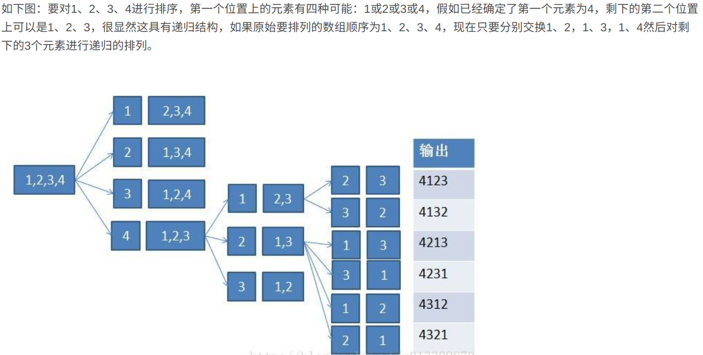

从n个元素中取m个元素，当m=n时所有的排列情况叫全排列

[原理](https://blog.csdn.net/u013309870/article/details/68941284#commentBox)

[递归法全面的代码](https://www.cnblogs.com/hapjin/p/5757810.html)

# 递归法

```java
// 'abc' ————str.toCharArray()——> ['a','b','c']
public void allPermutation(Char elems, LinkedList<String> listStr, int start){
    if(start === elems.length-1){
        listStr.add(String.valueOf(elems));
    }else{
        for(var i = start; i < elems.length; i++){
            swap(elems,i,start);
            allPermutation(elems, listStr, start+1);
            swap(elems,i,start);
        }
    }
}
// 当有重复的元素时('aabc')，要去除重复情况
// 循环外面套上 if(start == i || elems[start]!=elems[i]){}
```

<div align='center'></div>


# 字典排序法