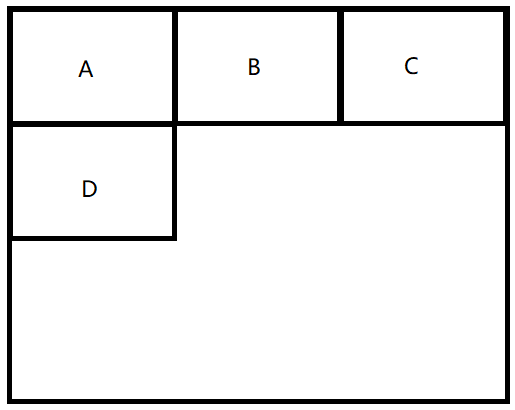

# 暑期实习

## 百姓网

### 一面

- 怎么实现文本不能复制

  - JS 禁止右键点击事件：

    ```javascript
    // 整个文档屏蔽：
    document.ontextmenu = function(){ return false; }
    // 某个区域屏蔽
    document.getElementById('myDiv').eventListener('ontextmenu',function(){return false;})
    ```

  - CSS pointxxx属性

  - 空元素覆盖


- 为什么C语言的数组声明时有长度，JavaScript没有
  - 因为JavaScript数组不是单纯的数组，是个对象。hash？


- 手写一个 call


- NaN


- transition 和 animation


- 判断一个链表长度
  - 一个循环，看有没到链表尾部 + 快慢指针


- Vue数据双向绑定


- async 怎么捕获异常


- ```javascript
  catch{
      return true;
  }finally{
      return false;
  }
  // 最后返回的是？
  ```

  - false

    

- commonJS 模块 和 ES6模块区别


- 说一下 继承


- ES6继承 和 原型链继承 比，有什么优势


### 二面

- 计算机网络 五层 、 七层


- 什么是长连接


- 什么是无状态


- 304 
  - 回答了协商缓存。（但是协商缓存只是一种情况）


- 302


- 400、403


- 用户登录状态怎么判断
  - session
  - token？


- tcp三次握手


- 基本数据结构有哪些


- 链表特点


## 海康威视

### 一面

- 项目
- CSS盒子模型
- 怎样实现垂直居中
- JavaScript的事件机制
- 算法：给一个字符串，判断出现的最多的字符


## 迅盟科技

### 技术面

- 说一下闭包，闭包的使用场景
- 说一下 let、var、const
- 说一下箭头函数与普通函数的区别
- 怎么改变this指向
- bind、apply、call区别
- flex布局
- 平时怎么学习的

### hr面


## 美团

### 一面

- 项目

  - 兼容cookie和本地存储怎么实现的？

    - 为什么用 cookie 和 本地存储
    - cookie 和 localStorage 区别

    

  - 讲讲避免页面闪动

    - loading什么时候结束

    

  - 淘宝的移动端适配方案的原理

    - 获取的是设备的什么信息
    - 改变的是什么标签，改变了哪些内容

    

  - 说一下项目中的按需渲染

    - 还有哪些优化页面性能的方法（我：缓存……）

    

  - history 改善 Ajax 是什么实现的

    - 为什么没有考虑 H5 的 history 的兼容性问题

    

  - 封装饼状图是怎么实现的

    - 饼状图怎么使用
    - 构造函数怎么写的
    - canvas 的什么API 用来填充颜色
    - canvas 怎么改变线条的粗细、颜色

    

  - 服务端渲染怎么实现的

    - 需要实例化Vue吗
    - 在 create、beforeMounted、mounted 中都可以吗
    - 为什么在后两个中不可以

    

  - 说一下GraphQL

    

- 怎么实现如下效果：

  <div align="center"></div>


- 浏览器是怎么实现跨域的
  - （我说了iframe）iframe是怎么实现跨域的


- CSS3动画可以用哪些实现
  - 怎么用


- 为什么要用语义标签


- 说一下 eventloop
  - 有哪两个队列


- 说一下promise

  - 如果一个 promise 已经是 resolved，再调用resolve会执行吗

  - 如果是rejected呢，调用resolve会执行吗

  - 用promise实现下面的wait方法(x秒后执行函数)

    ```javascript
    function wait(second){}
    wait(4).then(function(){
        console.log(1);
    })
    ```

    

- 说一下原型和原型链

  - var obj = {} 的原型是什么

    

- let、const、let的区别

  

- 说一下下面的结果

  ```javascript
  // 题目1
  var obj = {
      x:1,
      fun(){
          return this.x;
      }
  }
  obj.fun()
  // 题目2
  var obj = {
      x:1,
      fun(){
          return this.x;
      }
  }
  var fun = obj.fun;
  // 题目3
  var obj = {
      x:1,
      fun:()=>{
          return this.x;
      }
  }
  obj.fun()
  fun();
  // 题目4
  var obj = {
      x:1,
      fun:()=>{
          return this.x;
      }
  }
  var fun = obj.fun;
  fun();
  // 报错，为什么会报错
  ```

  

- 用构造函数实现一个链表


- 假如一个链表是：

  ```javascript
  function Node(val,next){
      
  }
  var linkList = new Node();
  var link = {
      val:1,
      next:{
          val:2,
          next:{
              val:3,
              next:null
          }
      }
  }
  // 请实现链表的逆转
  function reverse(link){
      
  } // 3 2 1
  ```


## 盒马

### 一面

- history 优化 Ajax 列表怎么实现的？用的什么方法

- 点击浏览器箭头监听的事件是什么

- 描述一下Ajax请求的过程

- Ajax的状态码分别代表什么

- loading什么时候结束

- 如果很多个异步请求，怎么处理（我回答了promise的all）

  - 如果出现rejected呢
  - 如果都是rejected呢

- 502是什么

- js基本数据类型

- 怎么判断一个变量的数据类型

- Vue 单向数据流

- Vue 跨代组件通信怎么处理？用过Vuex吗？什么原理？

- 了解过设计模式吗？(发布订阅模式、观察者模式) 请你实现一个发布订阅模式 和 观察者模式

  

## 网易严选

### 一面

- 遍历对象的方法
- 说一下对象属性的四大要点（value、length。。。）
- 没用过map吗
- 说一下 Object.defineProterty
- 遍历数组的方法
- 说一下数组的方法
  - slice 和 splice区别
- 有用过 reduce、reserve 吗
- express 怎么判断是不同用户的请求
- 说一下express中间件的原理
- 除了 fs 模块，还用过其他模块吗？比如 stream


## 华为

### 一面

- click事件，能拆分成哪些更小的事件
  - mouseup、mousedown
- 有自己实现过v-model吗
- 断点续传服务器端有做过压测吗
- 怎样写一个组件
- es6的新的数据类型是？马上要出来的数据类型是
- 关于服务器端渲染，有了解更多吗


## 数字浙江

### 一面

- 说一下tcp协议
- 说一下计算机网络各层是干什么的
- 说一下http和https
- 在浏览器环境中，怎么看到http的信息
- http的结构
- 除了json数据，还可以发送什么
- http请求方法有哪些
- http状态码
- 说一下闭包
- 闭包的应用场景是什么
- 跨域
- 说一下盒子模型
- Vue的生命周期
- 内置事件绑定是在什么时候


### 二面

- 请你解释一下什么是时间复杂度和空间复杂度
- 冒泡排序 和 堆排序 的时间复杂度分别是多少
- http 的请求有哪些
- cookie 、sessionStorage、sessionStorage
- 盒子模型
- 浏览器内核有哪些


### hr面

- 为什么不考研


# 秋招

## 腾讯音乐

### 一面

- 自我介绍
- 实习项目（怎么写组件的？项目重构涉及到哪些内容？……记不真切了）
- 用过哪些技术栈？Vue和express区别
- mvvm
-  js数据类型有哪些？展开说一下基本数据类型和引用类型？说一下深拷贝浅拷贝
- 说一下跨域
- 原型链
- 说一下闭包，闭包解决了什么问题
- var、let、const区别
- 说一下前端模块化，ES6之前怎么实现模块化的？实现模块化的原理
- 项目中怎么配置typescript的
- 没太听明白，好像是怎么禁止修改对象的属性？我懵了一下，被跳过了
- js执行机制
- 说一下webpack，自由发挥说
- 一道算法题，判断字符串的括号是否配对
- 最近在学什么，后期有什么学习规划


## 绿盟科技

### 一面

- DOM渲染是在哪个生命周期的哪个阶段
- 说一下快速排序，怎么实现的，时间复杂度、空间复杂度怎么计算
- 冒泡排序
- 说一下eventloop
- 深度优先遍历、广度优先遍历
- 函数是怎么执行的（变量提升）
- 说一下闭包
- vue的指令
- v-if、v-show的区别
- 用css做过动画吗
- 说了canvas，怎么使用？如何把三点连起来
- vue路由的钩子函数


## 依图科技

### 一面

Node是同步还是异步

说一下回调函数在node、浏览器中分别怎么用的

微任务队列、宏任务队列除了出队顺序，还有什么区别

说一下什么是同步、异步

说一下闭包，应用场景

浏览器渲染页面的过程

get请求、post请求区别

node中对url长度的限制

http中，除了url、body可以传数据，还有什么可以传数据

登录的token？

怎么判断是http请求的（从tcp角度？）

单例模式

用两个栈实现一个队列


### 二面

1. ```javascript
   const p1 = new Promise((resolve) => {
     console.log(3);
     resolve(4);
   });
   const p2 = new Promise((resolve) => {
     console.log(1);
     setTimeout(() => {
       console.log(6)
     }, 0);
     resolve(2);
   });
   p1.then((res) => {
     console.log(res)
   });
   p2.then((res) => {
     console.log(res)
   });
   console.log(5);
   ```


2. ```javascript
   // 实现 reactive 方法，能够躲到 dom 和 js 双向绑定
   
   <div id="wrapper">
     <div>{ value }</div>
     <input v-model={ value } />
     <button v-on={ test } ></button>
   </div>
   
   <script>
     const re = reactive({
      el: "#wrapper"
      model: {
        value: "123",
      },
      methods: {
          test: () => {
               this.val = "456"
           }
      }
    })
   </script>
   
   ```


3. ```javascript
   实现 css border layout（
      header 
      footer 
      left-sidebar 
      right-siderbar 
     center
   ）
   写出 html 和 css代码
   ```


4. ```javascript
   Pub/Sub - 发布订阅模式
   ```


5. ```javascript
   function foo(){ 
   
   }();
   
   // IIFE
   +(function foo(){
   
    }());
   
   ```


6. ```prototype``` 与 ```__proto__```


7. 怎么实现一个没有 ```__proto__``` 的对象


## 有赞

### 一面

- 算法题：

  // 序列化、反序列化

  //  decodeURIComponent

  ```javascript
  // =====================================================
  // 欢迎参加有赞前端 Coding 面试
  // =====================================================
  // 界面介绍：
  //   上方设置按钮可以切换语言、字体大小、主题
  //   右侧控制台可以显示代码执行结果，可用于编码过程中的 DEBUG
  // =====================================================
  // Coding 须知：
  //   本次 Coding 时间限制为 30 分钟，共 2 道题
  // =====================================================
  
  
  /**
   * ## 问题1
   * 解析url中的queryString
   * 
   * 输入：https://www.youzan.com?name=coder&age=20&callback=https%3A%2F%2Fyouzan.com%3Fname%3Dtest
   * 输出：
   * {
   *  name: "coder",
   *  age: "20",
   *  callback: "https://youzan.com?name=test",
   *  json: {
   *    str: "abc",
   *    num: 123
   *  },
   *  list: ["a"]
   * }
   */
  // decodeURIComponent()
  function parseQuery(url) {
      // ...a
      let query = url.split('?')[1];
      //    return query;
      let params = query.split('&');
      //    let ret = new Map();
      let ret = {};
  
      params.forEach((item, index) => {
          ret[item.split('=')[0]] = decodeURIComponent(item.split('=')[1]);
      })
      return ret;
  }
  
  const url = 'https://www.youzan.com?name=coder&age=20&callback=https%3A%2F%2Fyouzan.com%3Fname%3Dtest&json=%7B%22str%22%3A%22abc%22,%22num%22%3A123%7D&list[]=a';
  console.log(parseQuery(url));
  
  
  /**
   * ## 问题2
   * 将48位的时间位图格式化成字符串
   * 要求：写一个函数timeBitmapToRanges，将下述规则描述的时间位图转换成一个选中时间区间的数组。
   * 
   * 规则描述：
   * 将一天24小时按每半小划分成48段，我们用一个位图表示选中的时间区间，例如`110000000000000000000000000000000000000000000000`，
   * 表示第一个半小时和第二个半小时被选中了，其余时间段都没有被选中，也就是对应00:00~01:00这个时间区间。一个位图中可能有多个不连续的
   * 时间区间被选中，例如`110010000000000000000000000000000000000000000000`，表示00:00-1:00和02:00-02:30这两个时间区间被选中了。
   * 
   * 示例输入：`"110010000000000000000000000000000000000000000000"`
   * 示例输出：`["00:00~01:00", "02:00~02:30"]`
   */
  function timeBitmapToRanges(bitmap) {
      //...
  }
  
  console.log(timeBitmapToRanges('111010000000000000000000000000000000000000000011'));
  
  ```


- 平时怎么学习的

- 有问题去哪里提问

- 线程 和 进程 的区别

- http和https区别

- https怎么实现身份验证

- 混合加密了解过吗

- 登录，怎么保证密码不泄露

- 为什么需要验证码

- OSI五层模型

- http属于哪一层，请求从应用层到底层需要经过哪些协议

- http3了解过吗

- TCP、UDP区别

- UDP怎么保证接收方收到包的

- vue的data为什么返回一个函数

- v-for为什么要加key

  


## 海康威视

### 电话面

- express项目，orm？
- 用过vuex吗
- hash路由实现原理
- setTimeOut、promise什么区别
- 说一下事件循环机制
- 浏览器安全问题
- css优化
  - 说了一个

### 视频面


## 字节跳动

### 一面

- 项目

- css的position属性有哪些

- 怎么实现一个登录框

- ```javascript
  var o = {  
          f1: function () {  
              console.log(this);  
              var f2 = function (){
                console.log(this);
              }();
          }
  }
  
  o.f1() 
  ```

  
  
- 实现一个100的数组，存入0~99

  - 写了个java的
  - 用Array的API实现呢？


- ```shell
  比较版本号
  描述信息
  比较两个版本号 version1 和 version2。
  
  如果 version1 > version2 返回 1，如果 version1 < version2 返回 -1， 除此之外返回 0。
  
  你可以假设版本字符串非空，并且只包含数字和 . 字符。
  
   . 字符不代表小数点，而是用于分隔数字序列。
  
  例如，2.5 不是“两个半”，也不是“差一半到三”，而是第二版中的第五个小版本。
  
  你可以假设版本号的每一级的默认修订版号为 0。例如，版本号 3.4 的第一级（大版本）和第二级（小版本）修订号分别为 3 和 4。其第三级和第四级修订号均为 0。
  
   
  
  示例 1:
  
  输入: version1 = "0.1", version2 = "1.1"
  
  输出: -1
  
  示例 2:
  
  输入: version1 = "1.0.1", version2 = "1"
  
  输出: 1
  
  示例 3:
  
  输入: version1 = "7.5.2.4", version2 = "7.5.3"
  
  输出: -1
  
  示例 4：
  
  输入：version1 = "1.01", version2 = "1.001"
  
  输出：0
  
  解释：忽略前导零，“01” 和 “001” 表示相同的数字 “1”。
  
  示例 5：
  
  输入：version1 = "1.0", version2 = "1.0.0"
  
  输出：0
  
  解释：version1 没有第三级修订号，这意味着它的第三级修订号默认为 “0”。
  ```

- tcp三次握手、四次挥手

  - 为什么tcp两次握手不行

- http头有哪些字段

- 怎么实现单页应用

- view-router怎么实现的？

  - history有哪些api


## 招银

### 一面

- ```javascript
  js实现函数, 输入`,`分隔的一串单词, 输出升序排列、`,`分隔的单词串
  "hello,  world  ,  abc ,  fox"
  "abc,fox,hello,world"
  
  [{name: '''xxx, score: xxxx}, {}, {}]
  ```


- html5新特性
  - input表单的新type有哪些


- 异步的promise，怎么理解


- await和async怎么理解


- 跨域传数据怎么做


- 一个新版本发布，怎么让新版本的新资源不从缓存里获取


- html文档的结构


- vue的dom和原生js的dom有什么不同


- vue是怎么实现双向绑定的


- vue父子组件的通信

  

- localStorage、sessionStorage区别


### hr面


## 大华


### 电话面

- v-key
- 请求写在mounted还是created里
- 组件间通信：父子组件、兄弟组件
- 数组的方法有哪些
- map和forEach区别
- js事件触发机制
- promise
- es6新特性有哪些
- 数组的解构赋值怎么用
- let、const区别
  - const，修改对象属性
- 401，403
- 宏任务、微任务


## 恒生

### 一面

- vue生命周期 

- vue组件通信 

- react了解吗（只知道jsx那种语法 ） 

- 最近在学哪些新的东西
- 对闭包的理解 
- 对原型链的理解 
- html5有哪些新特性 
- 前端优化 
-  canvas是怎么实现饼图的 
- css动画用过哪些 
- 原生JS怎么实现小球拖拽 
- call和apply区别 
- 职业规划
- 觉得自己能胜任这份工作吗？为什么


## 酷家乐

- 简历上的首页按需加载，怎么做的
- http状态码，2xx、3xx、4xx、5xx
- tcp三次握手
  - 假如设计的时候只有两次握手，有什么问题
- https对比http，有什么区别
  - https身份验证的过程
- 说一下什么是闭包，及使用场景
- ES6的新特性
  - let、const区别
  - js的作用域和其他语言的作用域的区别
- MVVM和MVC区别


## GrowingIO

### 一面

- vue的v-if，v-show区别

- 怎么理解MVVM，知道MVC吗

- 为什么使用for循环，还有elementUI的table，要加上key

- 说一下节流和防抖，写一下

- 输入url后的过程

- 只能走1，2级台阶，求[1, 2, 3 ,4, 4, 1, 3, 4]的最小代价

  ```java
  import java.util.Scanner;
  public class Main {
      public static void main(String[] args) {
          //Scanner in = new Scanner(System.in);
          //int a = in.nextInt();
          //System.out.println(a);
          System.out.println("Hello World!");
          int[] arr = {1, 2,3 ,4, 4, 1, 3, 4};
          int ret = func(arr);
          System.out.println(ret);
      }
      
      public static int func(int[] arr){
          int len = arr.length;
          int[] dp = new int[len];
          dp[0] = 0;
          dp[1] = arr[0];
          dp[2] = Math.min(dp[0]+arr[1], dp[1]+arr[1]);
          for(int i = 3; i <= len; i++){
              dp[i] = Math.min(dp[i-1]+arr[i-1], dp[i-2]+arr[i-1]);
          }
          return dp[len];
      }
  }
  ```

  

### 二面

- 字符串相等

  可以对字符串执行以下操作：

  1. 将零个或多个小写字母转成大写字母。
  2. 删除小写字母。

  给定两个字符串 a 和 b，确定是否有可能经过操作后使 a 等于 b。如果可以请YES换行打印，否则，请打印NO。

  例如，给定 AbcDE 和 ABDE ，我们可以转换 b => B 和删除 c 使得它们匹配。如果换做 AbcDE 和 AFDE，则不可能匹配，因为字母只能大写或丢弃，不能更改

  ```shell
  输入：
  daBcd
  ABC
  输出：
  YES
  ```

  

- 字符串操作

  Shashank 非常喜欢字符串，特别是那些连续字符都是不一样的字符串。比如：他喜欢 ABABAB ,但他不喜欢 ABAA。给定一个字符串，该字符串只可能由字母 A 和 B 组成。Shashank想把这个字符串转变成他喜欢的字符串，在转变的过程中，他允许删除字符串中的某些字符。 你的任务就是找出最少需要删除几个字符，才能把给定的字符串转变成Shashank喜欢的字符串。

  ```shell
  输入：
  5
  AAAA
  BBBBB
  ABABABAB
  BABABA
  AAABBB
  输出：
  3
  4
  0
  0
  4
  ```

  

- 调整数组顺序使奇数位于偶数前面

  ```shell
  输入：
  [1,2,3,4,5,6]
  输出：
  [1,3,5,2,4,6]
  ```

  


### 三面

- 实现一个shuffle 函数：输入一个数组，返回一个顺序打乱的原数组

  [1,2,3,4]

  [2,1,4,3]

  [4,1,3,2]

```javascript
function shuffle(arr){
    let len = arr.length;
    let index1 = parseInt(Math.random()*len);
    let index2 = parseInt(Math.random()*len);
    while(index1 === index2){
        index2 = parseInt(Math.random()*len);
    }
    console.log(index1);
    console.log(index2);
    let temp = arr[index1];
    arr[index1] = arr[index2];
    arr[index2] = temp;
    return arr;
}
```


