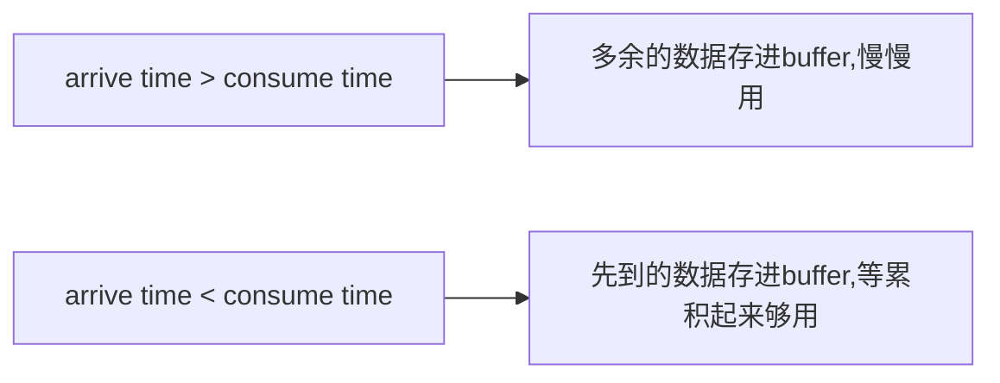

# 一些小问题

1. 为什么执行后出现  ```undefined```

   > 因为**每执行一次代码，就会返回该表达式的返回值**。console.log()，var a = xx等这些并没有返回值，所以undefined

   <div align="center"></div>


# <a name='runMechnism'>补充JavaScript运行机制</a>


<div align='center'></div>


- **一些问题**：
  1. 当ajax里的参数填成同步时，流程会变成怎么样？
  2. 函数为什么在栈中？执行栈是什么？栈有很多分类吗？
  3. 嵌套函数的流程是怎么样的？


# 异步编程


## 回调函数


### 回调函数基本介绍  

<a href='https://blog.csdn.net/starter_____/article/details/78717959'>参考资料1</a>  <a href='https://cnodejs.org/topic/564dd2881ba2ef107f854e0b'>参考资料2</a>  <a href='http://javascriptissexy.com/understand-javascript-callback-functions-and-use-them/'>参考资料3</a>

1. 什么是回调函数？

   > 实质就是函数作为参数传递给另外一个函数。使用回调函数实际上仅是一种解决问题的模式 。

2. 为什么说回调函数可以在需要/方便的时候调用

   > （回调函数和同步、异步是不同的概念，不要捆绑在一起）
   >
   > 原因很简单：传的参数只是该回调函数的定义，要调用需要加上()，所以什么时候加()执行由开发者决定

3. 回调函数格式：

   > **function(err,results,……)**：一般是两个参数，可能有的会有更多
   >
   > - err表示操作的成功或失败状态，其值：
   >
   >   :one: null：表示操作成功
   >
   >   :two: 一个Error对象的实例 
   >
   > - results表示操作返回的的结果或信息(文件句柄、数据库连接、查询到的数据集等)

4. 问：异步任务中的回调函数什么时候执行？

  > **==答==**：  主线程中的执行栈空时，即所有同步任务完成之后


### 回调函数与异常处理

- **setTimeout函数在Node的事件队列中添加了新事件**(告诉node1000ms后调用)，该回调函数是**在全新的上下文和作用域中执行的**。

  ```javascript
  var num = undefined
  // 与异步编程有关
  try {
  // 回调函数执行时，try...catch已经执行过了，console.log(num.toString())出错
    setTimeout(function () {
        console.log(num.toString())
    }, 1000) 
  } catch (e) {
    console.log("error……" + e.message)
  }
  // 与异步编程无关，肯定会出错
  try 
    var demo = function () {
        console.log(num.toString())
    }
  } catch (e) {
  // 不会捕捉到错误因为var demo = xxx的赋值没错,
    console.log("error……" + e.message) 
  }
  // 该函数执行时内部才会报错
  demo() 
  ```

- **规范的错误处理**

  - 第一种

    ``` javascript
    function(err,handle){
    if(err){
        console.log("ERROR: " + err.code + "(" + err.message + ")");
        return;
    }
    ……
    }
    ```

  - 第二种

    ```javascript
    function(err,handle){
      if(err){
          console.log("ERROR: " + err.code + "(" + err.message + ")");
      }
      else{
          ……
      }
    }
    ```


### this和回调函数出现的问题

<div align='center'></div> 

1. 为什么打开失败时，fileName是undefined的

  > <a href='#runMechnism'>参考事件运行机制</a>
  >
  > 同步事务：file_exits()函数进入主线程调用 &longrightarrow;    console.log(“About to open: ”+…) &longrightarrow; console.log("我…")
  >
  > 异步事务：fs.open()函数调用(初始化自己+调用底层操作系统函数打开文件) &longrightarrow; 回调函数进入任务队列
  >
  > 回调函数是在主线程执行栈中没有任务时，才最后执行的。此时file_exits函数已退出。this不再指向FileObject

1. 为什么 ```fs.open()```已经退出了，回调函数还记得```fs.open()``` 所得结果err的内容？

  > 函数作用域是一直保存着的  <a link='《JavaScript高级程序设计》.md#scope'>参考[[scope]]的资料？</a>  <a href='https://www.cnblogs.com/wangfupeng1988/p/3994065.html'>闭包的资料</a>
  >
  > ```javascript
  > // undefined问题的解决方法：将this保存的对象的地址赋值给一个变量
  > var xxx = this // 看到很多代码里写到：var that = this，可能也是这个原因
  > ```


## ```process.nextTick ()```

```process``` 是Node核心API提供的一个全局对象

```nextTick()``` 让函数延迟执行直到下一轮event loop

```process.nextTick(callback)```


1. 为什么函数名叫nextTick？

   > "each iteration of an Event Loop is called a *tick*"  每一次event loop的迭代都称为**tick**


### async flows


## stream

# 模块化

Node的模块系统：CommonJS模块规范进行**取舍** + **增添**自身需要的特性 

## 模块定义

```module.exports```    ```exports```     ```global```（不推荐）

1. ```module.exports```  与  ```exports```  的关系是什么

  > <div></div>
  >
  > exports是module.exports的引用？
  >
  > 当二者都只是添加属性、方法，所指内容是一样的
  >
  > 但被直接赋值后，二者联系切断，所指的就是各自的内容了

- ```exports``` ：单个单个地export。常用于export命名了的方法 （更推荐使用）

  ```javascript
  // module.js
  // ① 并在一起写
  exports.area = function(radius){
      return (radius ** 2) * P;
  }
  // ② 分开写
  circumference = function(radius) {
      return 2 * radius * P;
  }
  exports.cir = circumference;
  ```

- ```module.exports``` ：批量进行地export。1. export根作用域下的一个类、对象、方法  2. 包含许多需要export的内容的对象

  ```javascript
  
  var num = 100;
  var str = "Hello node";
  var f = function (){
      console.log("Hello");
  };
  module.exports = {
      price:num,
      name:str,
     myFunction:f
  };
  ```


## 模块引用

require('xx') **返回**的是 **module.exports**

加载速度：核心模块缓存 > 文件模块缓存 > 核心模块 > 路径形式的文件模块 > 非路径形式的自定义的文件模块


- 模块怎么用于多个项目，且只要修改模块源代码，其他引用该模块的项目都会做修改？

  > 1. 告诉npm，所操作的模块还不想发布，不能发布到外部npm源中
  >
  > <div></div>
  > 2. ```npm link``` ，创建一个链接，指向当前机器默认公开包库(如Windows中的C:\Usrs\username\AppData\location\npm，Linux中的/usr/local/lib/node_modules)的 album-manager 包
  >
  > <div></div>
  >
  > 3. 为项目创建一个到album-manager模块的引用
  >
  > <div></div>


## 模块发布


## 介绍一些模块

### ```async``` :  

实现异步功能时，可能会大量回调嵌套，可读性很差  => 运用async 模块的async flows来提高可读性、可维护性

<a href='https://caolan.github.io/async/'>参考资料</a>

#### ```waterfall(tasks, callback)```  

常用于执行后者需要前者输出的结果的多任务，串行执行

- tasks ：需要执行的任务的**数组**形式

- callback： 当tasks执行完成 或 执行时遇到err,task停止后 执行

  ```javascript
  var async = require('async');
  var a = 10;
  async.waterfall([
      function(callback){
          console.log("func1");
          console.log(`a = ${a}`);
          setTimeout(function(){
              if(a == 0){
                  callback(new Error("a不能为0")); // 则进入waterfall的callback
              }else{
                  console.log("right");
                  var b = 1/a;
                  callback(null,b); // callback(null,x1,x2)
                  				// 带着参数x1、x2进入下一个函数(即下一个函数的参数是x1,x2)
              }                   
          },1000);
          console.log("先执行?");
      },
      function(b,callback){ // 参数一定是上面传下来的，不能多也不能少
          console.log("func2")
          console.log(`b = ${b}`);
          var c = b * 100;
          callback(null,c);
      }
  ],function(err,result){
      if(err){
          console.log(err);
      }else{
          console.log(`c = ${result}`);
      }
  });
  // 结果 ： func1 a=10 先执行？ right func2 b=1 c=10
  ```

  

#### ```series(tasks,callback)```  

后一个函数不需要前一个函数的结果，但也是串行执行。且结果是存在一个数组里，一起作为参数传给最后的结果函数

- tasks ：需要执行的任务的**数组** 或 **对象** 形式

- callback ：当tasks执行完成 或 执行时遇到err,task停止后 执行

  ```javascript
  var num = 1;
  async.series({
      number: function (callback) {
          num = 2;
          setTimeout(function () {
              if (num == 1) {
                  callback(new Error("num不能为1"))
              } else {
                  console.log(`num==${num},没错`);
                  callback(null, 1, 2);
              }
          }, 1000);
      },
      letter: function (callback) {
          console.log(`num=${num}`);
          setTimeout(function () {
              callback(null, "a", "b");
          }, 1000);
      }
  },
      function (err, results) {
          if (err) {
              console.log(`错误是：${err}`);
          }
          else {
              console.log(results);
          }
      }
  )
  // 结果：{number:[1,2],letter:['a','b']}
  ```


#### ```parallel(tasks,callback)```

各个函数之间是独立的，且不用等待前一个完成，即可执行。

- 需要执行的任务的**数组** 或 **对象** 形式


#### 异步循环


# stream

## 关于stream

```stream```继承自```EventEmitter```；

根据所实现的方法接口不同，形成了四种不同的流：```readable```、```writable```、```Duplex```、```Transform```

不同的流实现不同的流对象：http服务中的request(readable stream)、response(writable stream)

<div align='center'></div>

node从外源读取数据的方法：

> The source can be anything. It can be a simple file on your file system, a buffer in memory or even another stream

- **Buffered Approach**：

  所有数据都被存进缓存了才能被读

- **Streamed Approach**：

  数据被拆分成小块，以流动的形式，先流出的可以先被读

  


## ```readable``` 与 ```data``` 事件

```javascript
var fs = require('fs');
var contents;
var rs = fs.createReadStream('simple_stream.js');
① rs.on('readable',function(){});     
// 当有chunk流动时，readable事件会发出通知显示数据可读；监听到通知时，调用数据流的read()函数读取；没有通知时，则继续等待，直到监听到下一个readable事件或end事件
② rs.on('data',function(param){});
// 当有chunk流动时，data事件的监听函数将数据作为参数传给回调函数处理
rs.on('end',function(){});
```


## ```pipe()```

```streamA.pipe(streamB)``` : streamA流中的数据传给streamB


# Buffer类

作用：①暂存二进制数据；②将数据存为其他数据；③将数据写入文件；④将数据打散并重新组合

​                        &downarrow; 

Node不能决定stream中数据流动速度，只能决定什么时候该送数据 <a href='<https://www.freecodecamp.org/news/do-you-want-a-better-understanding-of-buffer-in-node-js-check-this-out-2e29de2968e8/>'>参考资料</a>




# event

Event类提供连接和触发事件的所有功能


# Application Demo


## ```读取文件内容demo:```

 <div align='left'>
    </div>

 <div align='left'>
    </div>


## ```相册网站demo```

- 如何获得请求的参数？

  > - get请求：参数在url中。只要解析url中的字符串即可：
  >
  >   ```url.parse(req.url, true)```   ```querystring.parse(query) ``` 等
  >
  > - post请求：参数在请求体中。需要用监听的方法处理：
  >
  >   **(POST请求一般用来发送比较大量的内容，所以内容分成一个一个的包进行传输)**
  >
  >   ```req.on('xx',function(){})``` :  小包传输完成后做什么
  >
  >   ```req.on('end',function(){})``` :  当所有的包传输完成后做什么

  