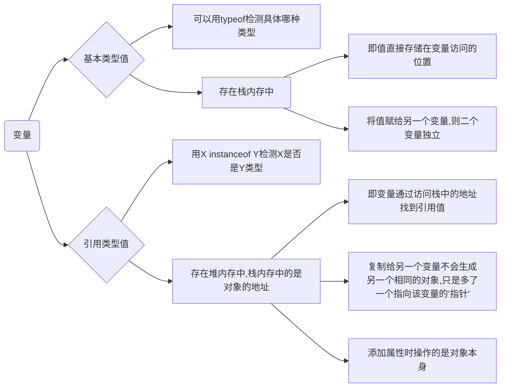

# 一、一些常识

# 二、基础语法知识
# 三、变量、作用域和内存问题

[比较科学的参考资料(涉及预编译的知识)](https://blog.csdn.net/q1056843325/article/details/53086893?utm_source=blogxgwz9#commentBox) 

## <a name="variable">变量</a>



## 传参

**函数中所有的参数都是按值传递**

+ **参数是基本类型值**

```javascript
function setNum(num){
    num += 10;
    return num;
}
var count = 20;
var result = setNum(count);
console.log(count);// 只是把值赋给num局部变量，从此二者独立
console.log(result);
```

+ **参数是引用类型值**

```javascript
function setName(obj){
    obj.name = "小红";
    obj = new Object();// 这时obj存储新对象的地址；如果是传的不是值而是引用，person会指向有新name的新对象，实际没有==>证明传的是值
    				   // 重写obj时，它存的是局部对象的地址，退出函数则释放
    obj.name = "小明";
}
var person = new Object();
setName(person);
console.log(person.name);//结果：小红
```
## 作用域

- 变量能够引用、函数能生效的区域

- 理解为作用域是js引擎根据名称查找变量的一套规则

- 作用域限制了我们对内存空间上值的获取和修改

### [[scope]]

- 函数有我们能访问的属性，也有只有js引擎才能访问的内部属性。==[[scope]]==就是一**内部属性**。

  [[scope]]包含了函数被==创建时==的作用域中对象的集合，是==一直存在==的。保存着，当函数执行时，被执行环境复制。**集合呈链式连接**，被称为函数的作用域链。

- 作用域链上的每一个对象被称为可变对象，每一个可变对象都以**键值对形式**存在 ：（如下:smile:）

```javascript
var a = 1;
function foo(){
    ...
}
========下面是作用域链的表现形式=======
foo.[[scope]] = {
    GO:{//全局对象(Global Object)
        this:window,
        window:...,
        document:...,
        ......
        a:undefined,//预编译阶段undefined
        foo:function(){...}
    }
}
```

### 执行环境

**在函数==执行==，会创建一个叫做执行环境/执行上下文（execution context）的内部对象** 

**函数每次执行时的执行环境独一无二** 

**多次调用函数就多次创建执行环境 ；并且函数执行完毕后，执行环境就会被==销毁==**

**执行环境有自己的作用域链，==用于解析标识符==*

<div align="center"></div>
<div align="center"></div>

**每个执行环境都有与之相关的变量对象，环境中的所有变量和函数都在变量对象中；**

**我们无法用代码访问对象，但解析器可在后台使用**

**不同执行环境有不同的变量对象:**


+ **全局环境中**：全局对象(GO)
  - 进入任何执行上下文前就创建出来

  - 以单例形式存在

    * 只有一个实例

    * 必须自行创建这个实例

    * 自行向整个系统提供这个实例
  - 全局变量的属性在任何地方都能被访问（可通过this或DOM中的Window对象来访问）
  - 全局变量中的变量对象就是全局变量本身
+ **函数环境中**：活动对象(AO)
  - 函数被调用时产生

  - 变量对象通过函数的 arguments 对象来初始化

  - arguments 对象是活动对象上的属性

### 延长作用域链
当执行流进入下列语句时作用域链会增长：
1. **try-catch语句的catch块**

   会创建一个新的变量对象(包含的是被抛出的错误对象的声明)，添加在作用域链的前端

2. **with语句**

   将with(xx)指定的xx对象变量，添加到作用域链的前端

### 没有块级作用域

- **if、for这些语句内部声明的变量只会添加到当前执行环境的变量对象中，所以出了语句依然可以访问**

- 解决没有块级作用域的限制：

  1. ES6新增let、const

  |                 比较点                 |  var   |  let   | const  |
  | :------------------------------------: | :----: | :----: | :----: |
  |                变量提升                |   能   |  不能  |  不能  |
  | 暂时性死区（只能在声明的位置后面使用） |   无   |   有   |   有   |
  |     同一代码块内重复声明同一个变量     |   能   |  不能  |  不能  |
  |        代码块外访问代码块内变量        |   能   |  不能  |  不能  |
  |           声明后变量是否可变           |  可变  |  可变  | 不可变 |
  |         声明时是否一定要初始化         | 不一定 | 不一定 |  一定  |

  
  2. 用函数作用域模拟块级作用域
  ```JavaScript
  function demo(){
      var i = 0;
  }
  demo();
  console.log(i);
  // 或函数自执行
  (function(){
      var i = 0;
  })();
  console.log(i);
  ```
  


## 内存问题


### 垃圾回收

**JavaScript有自动垃圾收集机制，即执行环境负责管理代码执行过程中的内存**

方式：

1. **标记清除**

   <div align='center'>
       
   </div>

2. **引用计数**（JavaScript引擎已不使用）

- 引用计数 = 1：

  <div align='center'></div>

- 引用计数加一 , 引用计数 = 2 ：

   <div align='center'></div>

- 引用计数减一 , 引用计数 = 0 ，内存空间释放 ：

   <div align='center'></div>

- 缺陷：**循环引用**问题

  + ObjectA和ObjectB的引用次数一直是2，如果在函数中，反复调用，大量内存得不到回收，造成内存泄露

  + **内存泄露**是指一块被分配的内存既不能使用，又不能回收，直到浏览器进程结束

  + 但标记清除方法，执行完，执行环境释放，被标记后清除，不存在该问题

  + IE中部分对象不是JavaScript原生对象(如DOM、BOM中的对象是使用C++以COM对象的形式实现的)，COM对象是采用引用计数的方式来回收的，涉及COM对象即存在循环引用问题 （==IE9已经把DOM、BOM转换为JavaScript原生对象了==）

    + 解决方法：

      ```javascript
      var element = document.getElementById('item')
      var obj = new Object()
      obj.element = element
      element.obj = obj
      ===========解决==========
      obj.element = null
      element.obj = null
      ```

      

  <div align='center'></div>

### 垃圾回收性能

垃圾回收器是间隔一些时间运行一次的，那么多久清理一次？

以IE为例：

- **原来：**设一些关于变量、字符串等的静态临界值，达到临界值就清理 ——> 问题：一直保存那么多的变量
- **改进后：**临界值动态修改


### 内存管理

JavaScript的**内存限制**：分配给浏览器的内存要少于桌面应用程序。为了防止出现浏览器耗尽系统内存而导致系统崩溃的安全问题

内存限制的影响：

- 影响给**变量分配内存**
- 影响**调用栈**或一个**线程**中能**同时执行**的**语句数**

所以要求**优化内存占用**(感觉像节约用地)。方法：**解除引用**（只保留有用的）

解除引用的**真正作用是让值脱离执行环境**，以便**垃圾收集器下次运行时将其回收**

- 自动解除引用：局部变量离开执行环境时则自动被解除引用
- 手动解除引用：把不再用的全局变量设为null


# 四、引用类型

- 【引用类型的值（对象）—— 引用类型 】  相当于  【对象  —— 类】（终于理解了 :cry:）

- **引用类型是一种数据结构**，将功能与属性整合在一起。相当于Java等语言中的类，但又不同：

  因为“尽管 ECMAScript从技术上讲是一门面向对象的语言，但它不具备传统的面向对象语言所支持的类和接口等基本结构”

  <u>我的理解</u>：JavaScript是一门**基于对象而不是面向对象**的语言（因为只有继承、封装、多态中的封装），但可以模拟面向对象的思想

- 引用类型又被称为对象定义（因为描述一类对象的属性方法），**引用类型值（对象）是其实例**

- 有共有的属性

- JavaScript没有明确的类，关键字或类型。事实上，其所有类都以函数形式定义。声明类的函数就是这个类的构造函数。

  

## Object类型

- Object的实例功能不多，多用于存储和传输数据

  向函数传递大量可选参数时，可以对象字面量：

  ```javascript
  function display(args){
      if(typeOf args.name == "string"){ // 检测属性是否存在
          alert(args.name);
      }
      if(typeOf args.age == "number"){
          alert(args[age]); // 访问属性，可以用.也可以用[]。用[]的好处：
      }                     // 1.可以通过变量来访问属性 2.当属性中有空格时，.访问不了，只能用[]
  }
  display({
      "name":"HuQiyao", // 属性可以加双引号，也可以不加的
      "age":20 // 最后一对键值对后面，往往不加逗号，如果加了在IE7以前的版本中会报错
  })
  ```

- 实例化方法：

  1. 构造函数
     - 系统构造函数 ```var obj = new Object()```
     - 自定义构造函数
  2. 对象字面量表示法（通过字面量定义对象，不会调用Object构造方法）


## Array类型

- JavaScript数组有点特别，

  1. 每一项能存储**任何类型**的数据 

  2. 数组**大小可以动态调整** 

  3. length属性**不是只读**的，可以通过设置length值在末尾增添删除项

     ```javascript
     var arr = ["red","pink","white"]
     // 删除尾项
     arr.length = 2
     alert(arr[2]) //undefined
     // 增添一尾项
     arr[length] = "black"
     alert(arr[2]) // "black"
     // 指定位置添加一项
     arr[4] = "green"
     alert(arr.length) // 5
     alert(arr[3]) // undefined
     ```

- 数组最多可以包含 4 294 967 295（2^32-1）个项。

  超过这个上限会报错；且创建一个与之接近的初始数组可能会导致运行时间超长的脚本错误

- 创建实例的方法：

  1. 构造函数

  ```javascript
  var arr1 = new Array() // 括号中可填：1. 一个数字，给length属性赋值 2. 一些项
  var arr2 = Array // 可以省略new
  ```

  2. 数组字面量表示法（通过字面量定义对象，不会调用Array构造方法）

  ```javascript
  // 一些异类
  var arr1 = [1,2,3,] 
  //最后一项后面有逗号：IE8以前版本，创建包含4项的数组，最后一项是undefined；建议不要有逗号
  var arr2 = [,,,,] 
  //全省略值：1.IE9+、chrome、Opera、Safari、FireFox中创建3项的数组 2.IE8以前创建4项的
  ```


### 检测数组

[检测数组较靠谱的参考资料](https://segmentfault.com/a/1190000006150186)

1. 一个全局执行环境（一个网页或全局作用域中）：```xxx  instanceof Array ``` 即可

2. 多个全局执行环境（网页中包含多个框架）：```Array.isArray()```   

   因为```object instanceof constructor```<u>检测的就是某个构造函数(constructor)的prototype属性是否在被检测对象(object)的原型链上</u>，那么检测数组就是被检测对象原型链上是否有Array构造函数

   但==不同全局执行环境的Array构造函数不同==。在A中实例化的对象在B环境中检测，就可能不是数组

3. 补充
   * ```xx.constructor == Array``` 
   * ```Object.prototype.toString.call/apply(xx) === '[object Array]'```


### 转换方法

```valueOf()```    ```toString()```    ```toLocalString()```

- ```valueOf()```返回数组自身

  ```javascript
  var arr = ["1","2","3"]
  alert(arr.valueOf()) // 结果竟然是"1,2,3" alert()要接收字符串参数，所以在后台调用toString()
  ```

- ```toString()```  与  ```toLocaleString()``` 都创建一个数组值的以逗号分隔的字符串

  - ```toString()```  与  ```toLocaleString()```  的区别

    - <a name="date">在日期上：</a>

    ```javascript
    var date = new Date()
    date.toLocaleString() // "4/14/2019, 5:00:54 PM"
    date.toString() // "Sun Apr 14 2019 17:00:54 GMT+0800 (中国标准时间)"
    date.valueOf() // 1555232454830 //毫秒数
    ```

    - 在数字上：

    ```javascript
    var num = 1234567
    num.toLocaleString() // "1,234,567"  不同机器有自己的不同转换规则
    num.toString() // "1234567"
    num.toString(2) // "100101101011010000111"   可以填参数：进制
    ```

- ```join()``` 是数组的方法，用于把数组中的所有元素放入一个字符串，参数是项与项之间的分割方式。如果参数不填或填undefined，则默认为用","


### 栈方法

> 让数组的行为像栈这种数据结构的方法
>
> ```push()``` +  ```pop()```  模拟出入栈

- ```push()```  :  将任意项添加到数组末端```arr.push("e","f","g")```，**返回新数组的长度**
- ```pop()```  :  将数组的最后一项去除，**返回去除的那项**


### 队列方法

> 让数组的行为像队列这种数据结构的方法
>
> ```push()```  +  ```shift()```  和  ```unshift()```  +  ```pop()```  模拟出入队

- ```unshift()```  :  将任意项添加到数组前端```arr.push("a","b","c")```，**返回新数组的长度**
- ```shift()```  :  将数组的第一项去除，**返回去除的那项**


### 重排序方法

- ```reverse()```  :  将数组倒序（不是降序！！！），**返回排序后的数组**

- ```sort()```  :  将数组升序排列 ，**返回排序后的数组**     [sort的底层实现学习资料](https://blog.csdn.net/coder_chenz/article/details/77156047)

  - 默认情况下，无论数组里每一项是什么类型，```sort()``` 调用每项的 ```toString()```  将其转成字符串，然后根据各个字符的Unicode位点进行排序再比较大小排序

    ```javascript
    var arr = [5,10,15,20]
    arr.sort(arr)
    console.log(arr) // [10, 15, 20, 5]  由此可看出比的真是字符串
    ```

  - 填一个参数就可以指定比较规则：比较函数 ，指定哪个值位于哪个值的前面 

    ```javascript
    // 升序
    function(value1, value2){
        if(value1 < value2){
            return 1;
        }
        else if(value1 > value2){
            return -1;
        }
        else{
            return 0;
        }
    }
    // 降序则value1、value2互换
              ……
    // 如果是是数值项，可以简化成：
    function compare(value1, value2){
        return value2-value1;
    }
    ```

    

    


### 操作方法

- ```concat()```  :  一种拼接操作，**返回新数组**，不会影响原数组

  - 先创建调用该函数的数组的副本
  - 没有参数时，返回副本(一个新数组)
  - 有参数时，若参数为数组，则将每一项添加到副本后面；其他非数组直接按原类型添加到副本后

- ```slice()```  :  一种按位置复制操作，**返回新数组**，不会影响原数组

  - 只有一个参数x时，将[x, arr.length-1]的项组成新数组

  - 有两个参数x、y时，将[x，y)项组成新数组

- ```splice()```  :  一种能插入、删除、替换的操作，返回新数组（从原数组中删除的项组成），会影响原数组

  - 插入：```splice(开始位置，0，即将插入的项，即将插入的项……)```
  - 删除：```splice(开始的位置，要删除的项数)```
  - 替换：```splice(开始位置，要删除的项数，即将插入的项，即将插入的项……)```


### 位置方法

- ```indexOf()```  ：返回要查找的元素在数组中的位置，**没找到返回-1**
  - 从数组的头部（index = 0的地方）开始找
  - ```indexOf(要查找的元素，（开始查找的位子）)```
- ```lastIndexOf()```  ：返回要查找的元素在数组中的位置，**没找到返回-1**
  - 从数组的尾部（index = length-1的地方）开始找
  - ```lastIndexOf(要查找的元素，（开始查找的位子）)```


### 迭代方法

[图解迭代方法参考资料](https://www.cnblogs.com/shuiyi/p/5058524.html)

两个参数：在每一项上调用的函数 (参数：数组项，项的索引，该数组） +  作用域对象（可选）

作用域对象参数：**作为该执行回调时使用，传递给函数**，用作 ```this``` 的值。 如果省略了 ```this``` 的值为 ```undefined```

```javascript
var obj = {name : 3}
var newArr = [1,2,3,4].map(function(item,index,array){
        return (item + obj.name)
    },obj)
    console.log(newArr) // [4,5,6,7]
```

- ```every()```  :  只有每一项对于给定函数都是true，则返回true，否则为false
- ```forEach()```  :  每一项都执行给定函数，没有返回值
- ```some()```  :  只要有一项对于给定函数是true，则返回true
- ```map()```  :  每一项执行给定函数进行变形**组成新数组并返回**
- ```filter()```  :  每一项执行给定函数，筛选出符合条件的项组成**新数组并返回**
- ```find()```  :  每一项执行给定函数，直到找到第一个**符合条件的项并返回**


### 归并方法

两个参数：在每一项上调用的函数（参数：前一项，当前项，项的索引，该数组）+ 归并基础的初始值（可选）

- ```reduce()```  :  迭代数组的所有项，然后构建一个最终返回的值，可以用来计算数组中所有值的和

- ```reduceRight()```  :  与```reduce()``` 一样，只是从数组末端往前，所以前一项只是不同而已

  ```javascript
  var values = [1,2,3,4,5];
  var sum = values.reduceRight(function(prev, cur, index, array){
      return prev + cur;
  })
  alert(sum); //15
  ```

  

## Date类型

> ```ECMAScript```中的Date类型是在早期Java 中的``` java.util.Date```类基础上构建的
>
> 使用自 ```UTC ```1970年 1月1日午夜(零时)开始经过的毫秒数来保存日期
>
> > **时间戳：**
> >
> > Unix时间戳表示当前时间到```UTC ```1970年 1月1日午夜对应的秒数。
> >
> > JavaScript内的时间戳指：当前时间到```UTC ```1970年 1月1日午夜对应的毫秒数。和Unix时间戳概念不同
>
> >  **为什么**：
> >
> >  是1970年 1月1日午夜(零时)？
> >
> >  **回答**：
> >
> >  原来的计算机是32位的，Integer在Java内用 32 位表示。因此 32 位能表示数值范围-2^16~2^16-1，一年有31536000秒，2^16-1/31536000 = 68年……，即这么长的时间段，只要**选一个时刻作为基准**，就可以表示此时刻前后的68年……内的每个时刻了。这个时刻选为**1970年 1月1日午夜(零时)**

- 用构造函数创建一个日期对象实例```var date = new Date()```（该不传参情况下date保存的是此刻）

- 想用特定日期创建对象，须传入该日期的毫秒数。获得毫秒数既有方法：```Date.parse()```  ```Date.UTC()```

  - ```Date.parse()```

    - 参数：表示日期的字符串

    - 参数格式因地区而异，通常有：

      1. 6/13/2004
      2. January 12,2004
      3. ISO 8601 扩展格式 （例如 2004-05-25T00:00:00）
      4. Tue May 25 2004 00:00:00 GMT-0700   **……**

    - 如果字符串参数不能表示时间，则返回的是NaN

    - 实际上，参数直接写在new Date( )中，后台也会调用  ```Date.parse()```

      ```javascript
      new Date(6/13/2004) 等于  new Date(Date.parse(6/13/2004))
      ```

  - ```Date.UTC()```

    - 参数：（年份，<u>基于0的月份(0-11)</u>，月中的一天(1-31)，小时数(0-23)，分钟，秒，毫秒）
    - 只有年份、月份两参数是必须的，天数不填时默认为1，其他默认为0

- 实际上，参数直接写在 ```new Date()``` 中可以起相同作用

  - 当参数是合适的日期时间字符串时，后台调用```Date.parse()```方法

  - 当参数是 (数值1，数值2，……) 时，后台调用```Date.UTC()```方法。

    `Date.UTC`方法的参数被解释为 ```UTC``` 时间（世界标准时间）`Date`构造函数的参数被解释为本地时间

    ```javascript
    var date1 = new Date(Date.UTC(2019,3,14,15,45)) 
    //date1 ： Sun Apr 14 2019 23:45:00 GMT+0800 (China Standard Time)
    var date2 = new Date(2019,3,14,15,45)
    //date2 ： Sun Apr 14 2019 15:45:00 GMT+0800 (China Standard Time)
    ```

- ```Data.now()```  :  返回表示调用这个方法时的日期和时间的毫秒数

  ```javascript
  var start = Date.now()
  // var start = +new Date();在不支持该方法的浏览器中，用+操作符把Data对象转换成字符串也可达到效果
  doSomeThing()
  var stop = Date.now()
  // var stop = +new Date();
  var result = stop - start
  ```


### 继承的方法

重写了所有引用类型都有的```valueOf()```  ```toString()```  ```toLocalString()```  方法

<a href="#date">在Array类型的转换方法中有介绍</a>


### 一些常用的日期/时间的方法

……后续补充……


## RegExp类型

- ECMAScript通过```RegExp```类型来支持正则表达式

- 创建正则表达式方法：

  - 字面量方法：```var r = / pattern / flags```

  - RegExp构造函数：```var r = new RegExp("pattern", "flag")```    **两个参数都是字符串**

    ​                                                                                                                           &Downarrow;

    > 第一个字符串参数如何与字面量中的pattern对应？   **答：** ==**元字符双重转义**==
    >
    > “\”是Js字符串中的转义符，“\”也是正则表达式中的转义符。所以，在正则表达式字符串中，一个\只代表字符串中的转义符，两个\才是经转义后的正则表达式中的转义符

    |    字面量模式    |     等价的字符串      |
    | :--------------: | :-------------------: |
    | /\w\\hello\\123/ | "\\w\\\\hello\\\\123" |

  - 在<u>ECMAScript3</u>中 字面量创建的正则表达式始终共享一个RegExp实例，构造函数创建的每个都是新的RegExp实例。在<u>ECMAScript5</u>中 规定两种创建方式每次都创建新的RegExp实例，所以浏览器做出修改


### RegExp实例的属性

|    属性    |                             内容                             |
| :--------: | :----------------------------------------------------------: |
|   global   |                          是否设了g                           |
| ignoreCase |                          是否设了i                           |
| multiLine  |                          是否设了m                           |
| lastIndex  |                开始搜索下一个匹配项的字符位置                |
|   source   | 正则表达式的patten的字符串表示<br> (==是字面量形式的字符串，不用双重转义那种==，即**规范形式的字符串**) |

```javascript
var pattern = new RegExp("\\[bc\\]at", "i")
pattern.source() // "\[bc\]at"
```


### RegExp实例的方法

- ```exec()```      ```text()```
  - 加了全局  ```g```，每一次执行```exec()```，pattern(实例)的lastIndex属性值会增加；不加  ```g```  则不变

- 实例继承了```valueOf()```  ```toString()```   ```toLocalString()```  方法
  - ```toString```  和  ```toLocalString```  返回的都是正则表达式的字面量
  - ```valueOf```  返回正则表达式本身


### RegExp构造函数的属性

|  长属性名   | 短属性名  |               内容               |
| :---------: | :-------: | :------------------------------: |
|    input    |    $_     |          要匹配的字符串          |
|  multiline  |    $*     |                                  |
|  lastMatch  |    $&     |           最近一次匹配           |
|  lastParen  |    $+     |       最近一次匹配的捕获组       |
| leftContext |    $`     |      最近一次匹配的前面内容      |
| rightContet |    $'     |      最近一次匹配的后面内容      |
|             | $1,$2……$9 | 专门用来存储捕获组的构造函数属性 |
- 短属性名可代替长属性名。但除了"$_"，其他的都必须用[""]的形式调用，因为不是有效的ECMAScript标识符

```RegExp.$_ 或 RegExp["$_"]```

```javascript
var str = "nihaoma wohenhao"
var reg = /(\w{1})o/g
console.log(str.match(reg))
console.log(reg.lastIndex) // 0
console.log(reg.exec(str)) // ["ao","a"]
console.log(reg.lastIndex) // 5
if (reg.test(str)) { // 如果没有这个判断，下面的打印全是空的
    console.log(RegExp.input); // nihaoma wohenhao
    console.log(RegExp.leftContext); // nihaoma
    console.log(RegExp.rightContext); // henhao
    console.log(RegExp.lastMatch); // wo
    console.log(RegExp.lastParen); // w
    console.log(RegExp.multiline); // undefined  (我不知道为什么)
}
```


### 模式的局限性

ECMAScript的正则表达式不具有比如Perl语言那么强大的高级特性，但在不断更新中：

<a href="https://mathiasbynens.be/notes/es-regexp-proposals">不断更新的ECMAScript正则表达式</a>


## Function类型


- 函数名实际上是指针（指针变量）

  > 为什么呀？  答：前面有提到，**<a href="#variable">引用类型的变量存储的就是地址</a>**

- 创造function实例的方式：

  - 函数表达式   **只有到达该表达式才会解析执行**

    ```javascript
    var result = fun()        // X
    var fun = function(){……}; // 在这就不需要函数名，因为可通过变量引用函数
    ```

  - 函数声明      **解析器会将其提前**

    ```javascript
    var result = fun()        // √
    function fun(){……}
    ```

  - 使用构造函数

    **不推荐这种方法！**

    ```javascript
    var fun = new Function("","",…任意数量的参数…, 函数体)； // 也算函数表达式
    //实例：
    var fun = new Function("para1", "para2", "return para1 + para2")
    ```


### 没有重载

> 什么是重载？  函数名相同，但参数数量或类型不相同

```javascript
function addNum(num){
    return num + 10
}
function addNum(){
    return 100
}
console.log(addNum(10))  // 100
```

&Downarrow;     why？

```javascript
var fun = function(num){
    return num + 10
}
fun = function(){
    return 100
}
```


### 函数作为值的运用

- 函数作为参数

  ```javascript
  function getResult(fun,para){
      return fun(para)
  }
  function fun(para){
      return 10 + para
  }
  getResult(fun,10) // 20
  ```

- 作为另一个函数的值返回

  ```javascript
  // 按数组对象的某个属性排序
  function getSortRule(propertyName){
      return function(obj1,obj2){
          if(obj1[propertyName] > obj2[propertyName]){
              return 1
          }
          else if(obj1[propertyName] < obj2[propertyName]){
              return -1
          }
          else{
              return 0
          }
      }
  }
  ```

  

### 函数内部对象的属性

```arguments```、```this```  是函数内部的两个对象

```this``` 引用的是函数据以执行的环境对象

```javascript
window.color = "red"; 
var o = { color: "blue" };
function sayColor(){ 
    alert(this.color); 
} 
sayColor(); // "red" // 当在网页的全局作用域中调用函数时， this对象引用的就是window
o.sayColor = sayColor; 
o.sayColor(); // "blue" // 把这个函数赋给对象o,并调用o.sayColor()时，this引用的是对象o
// 函数名字仅是一个包含指针的变量,因此即使在不同环境中执行,全局sayColor与o.sayColor指向的仍是同一个函数
```


- ```callee```  : 是```arguments```(主要保存函数参数)的属性。是指针，指向有这个```arguments``` 对象的函数

  <u>即返回该函数体</u>

  ```javascript
  function factorial(num){
      if(num <= 1){
          return num
      }else{
          // return num * factorial(num-1) 
          //改成 
          return num * arguments.callee(num-1) // 解除了函数体内的代码与函数名的耦合
      }
  }
  var trueFactorial = factorial
  factorial = function(){
      return 0
  }
  console.log(trueFactorial(5))  // 120 如果不修改，则输出为0
  console.log(factorial(5)) // 0
  ```


函数对象的属性```caller```  : 保存着调用当前函数的函数的引用（如果是在全局作用域中调用当前函数，它的值为 null）

  <u>即返回调用该函数的函数体</u>

  ```javascript
  function outer(){
      inner()
  }
  function inner(){
      console.log(inner.caller)
      // 改为console.log(arguments.callee.caller)，降低耦合
  }
  outer() // 打印出outer函数的源代码
  // 可以通过inner.caller.caller找出再上一级的函数体
  ```


>在严格模式下，arguments.callee会报错

> ECMAScript5也定义了arguments.caller方法，在严格模式下会报错，非严格模式下结果为undefined

> 可通过null还是undefined 区分 函数的caller和arguments的caller

> js函数可以无限嵌套构成树，通过caller、callee访问父节点。为了安全起见，严格模式下无法使用


### 函数属性和方法

- 属性

  - ```length```  ：函数希望接收的命名参数的个数

    ```javascript
    var sum(num1, num2){
        ...
    }
    console.log(sum.length) // 2
    ```

  - ```prototype ```  ：是函数特有的属性 ，实质是函数的原型对象      <a href='https://www.cnblogs.com/loveyoume/p/6112044.html'>资料1</a>  <a href='https://blog.csdn.net/cc18868876837/article/details/81211729'>资料2</a>  <a href='https://www.cnblogs.com/objectorl/archive/2010/01/11/Object-instancof-Function-clarification.html'>资料3</a>

- 方法
  - ```apply()```  ：能劫持另外一个对象的方法，继承另外一个对象的属性

    ```javascript
    function person(name,age){
        this.name = name
        this.age = age
        this.speak = function(){
            console.log("I speak English")
        }
    }
    function student(name, age, grage){
        // 第一个参数是作用域，将代替person的this；因为在全局作用域中调用，所以window对象代替this
        // 严格模式下，直接写this会出错，要写明window
        // 第二个参数可以是arguments也可以是Array实例[name,age]
        person.apply(this,arguments) 
        this.grade = grade
    }
    var student_1 = new student("张三",18,"高三")
    console.log(student_1) // student {name: "张三", age: 18, speak: ƒ, grade: "高三"}
    student_1.speak() // "I speak English"
    ```

  - ```call()```  ： 与apply作用与结果相同，只是接受参数方式不一样

    ```javascript
    person.call(this, name, age) // 参数要具体
    ```

  - ```call()```  ```apply()```  的最强大、常用的功能:airplane:：扩充函数运行的作用域  

    ```javascript
    window.color = "red"; 
    var o = { color: "blue" };
    function sayColor(){ 
        console.log(this.color);
    } 
    sayColor(); // "red" // 因为在全局作用域中调用时，this.color被加工为window.color
    sayColor.call(this); // "red"
    sayColor.call(window); // "red"
    sayColor.call(o); // "blue"
    ```

  - ```bind()```  ：创建一个函数实例，实例的this值绑定为bind方法的参数值

    ```javascript
    window.color = "red"; 
    var o = { color: "blue" };
    function sayColor(){ 
        alert(this.color);
    } 
    var objectSayColor = sayColor.bind(o); // 调用bind并传入对象o，创建objectSayColor函数
    objectSayColor(); // "blue"
    ```

   - 继承的  ```valueOf()```  ```toLocalString()```  ```toString()```  返回的是函数的代码

     返回代码的格式因浏览器而异：:one:与源代码一样 :two:代码的内部表示(解析器删除了注释并改动某些代码)


## 基本包装类型

```Boolean() ```   ```String()```    ```Number()```

- 基本包装类型是引用类型，但是有各自对应的基本数据类型的特性
- 基本类型变量调用方法属性时，会在后台创建相应基本包装类型对象，所以==**基本类型变量也能调用方法、属性**==

  ```javascript
  var s1 = "some text"; 
  var s2 = s1.substring(2);
  ```
  ​                                                      &Downarrow;
  ```javascript
  var s1 = new String('some text') // 当读取到字符串时，创建基本包装类型String的实例
  var s2 = s1.substring(2) // 基本包装类型对象调用方法
  s1 = null // 销毁实例
  ```


- 自动创建的基本包装类型实例在调用一次属性或方法后立马销毁，下次使用时再创建

  使用 new 操作符创建的引用类型的实例，在执行流离开当前作用域之前都一直保存在内存中

  ```javascript
  // new操作符创建    // Notice! 一般没必要这样做，除非有特殊要求
  var str1 = new String("Hello")
  // console.log(typeof str1) // object  // 对基本包装类型的实例使用typeof，都返回object
  // console.log(str1 instanceof String) // true
  // console.log(str1 instanceof Object) // true
  // console.log(str1 instanceof object) // object is not defined
  str1.color = "red"
  console.log(str1.color) // "red"
  // 自动创建
  var str1 = "Hello"
  str1.color = "red" // 使用属性，赋值后，实例销毁
  console.log(str1.color) // undefined
  ```

  > 为什么用typeof检测对象，返回**object**，而用instanceof 必须要接**Object**  <a href='https://www.jb51.net/article/106804.htm'>答案参考</a>


- Object 构造函数也会像工厂方法一样，根据传入值的类型返回相应基本包装类型的实例

  ```javascript
  var obj = new Object("some text"); 
  console.log(obj instanceof String); //true
  ```


- 转型函数与基本包装类型构造函数是不一样的 （如，```Number()``` 和 ```new Number(2)```）

  


### Boolean

- Boolean类型实例

  重写 ```valueOf()``` 方法：返回布尔值true或false；

  重写 ```toString()``` 方法 ：返回字符串"true"或"false"

- Boolean 对象在 ECMAScript 中的用处不大，且容易引起混乱问题，<u>建议永远不要用Boolean对象</u>:joy:

  :one: 在布尔表达式中：

  ```javascript
  // 用构造函数创建基本包装类型
  var falseObject = new Boolean(false); 
  var result = falseObject && true; 
  console.log(result); //true
  // 基本数据类型
  var falseValue = false; 
  var result = falseValue && true; 
  console.log(result); //false
  ```

  > 为什么结果不一样？
  >
  > 答：**布尔表达式中的所有对象都会被转 换为 true**   


### Number

- Number类型实例

  重写了```valueOf()``` :  返回对象表示的基本类型的数值

  重写```toString()``` 和 ```toLocalString()```  : 都返回对象表示的基本类型的数值的字符串形式

  

- 除了继承的方法之外，Number类型新增的将数值格式化为字符串的方法：

  |         函数          |                 作用                 |             参数             |
  | :-------------------: | :----------------------------------: | :--------------------------: |
  |    ```toFixed()```    |    将数值保留几位小数后返回字符串    |        保留的小数位数        |
  | ```toExponential()``` |  将数值变成指定指数形式后返回字符串  |     保留的底数的小数位数     |
  |  ```toPrecision()```  | 返回合适形式的字符串(小数型或指数型) | 数值的总位数(不包括指数部分) |
  
  > 三种方法都能向上或向下舍入，达到参数要求的最准确的形式

   ```javascript
  var num = 99;
  alert(num.toPrecision(1)); //"1e+2" 
  alert(num.toPrecision(2)); //"99" 
  alert(num.toPrecision(3)); //"99.0"
   ```

  

- <u>不建议使用Number实例对象</u> :joy:     **为什么？不懂为什么不可以用**

  ```javascript
  var numberObject = new Number(10); 
  var numberValue = 10; 
  alert(typeof numberObject); // "object" 
  alert(typeof numberValue); // "number"
  alert(numberObject instanceof Number); //true 
  alert(numberValue instanceof Number); //false
  ```


### String

- 继承的 ```valueOf()``` ```toLocaleString()``` ```toString()``` 方法，都返回对象所表示的基本字符串值

- ```length``` 属性，返回字符串中字符数量，一个双字节数量也是1

- 一些方法：

  |      种类      |    方法     |                           作用                           |
  | :------------: | :---------: | :------------------------------------------------------: |
  |  字符操作方法  |   charAt    |                  得到参数所指位置的字符                  |
  |                | charCodeAt  |                得到参数所指位置的字符编码                |
  | 字符串操作方法 |   concat    |                                                          |
  |                |    slice    |                                                          |
  |                |   substr    |                                                          |
  |                |  substring  |                                                          |
  | 字符串位置方法 |   indexOf   |                                                          |
  |                | lastIndexOf |                                                          |
  |    trim方法    |    trim     | 返回删除了前置及后缀的所有空格的字符串(**不改变原始值**) |

  - 除了```str.charAt(1)```，还可以用```str[1]```的方法，结果一样
  - 


## 单体内置对象


