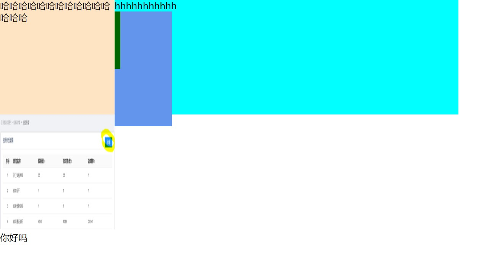

# 浮动

## 浮动作用

- 最初是为了实现文字环绕图片的效果


## 浮动元素是如何运动的

[详尽的资料](https://blog.csdn.net/huhaha24/article/details/79595704)

- 如果前一个元素不是浮动元素：
  - “上浮一层”，
  - 水平方向上，相应地左右移动，直到遇到父元素边框 或 前一个元素的边框停留
  - 垂直方向上不动
- 如果前一个元素也是浮动元素：
  - “上浮一层”
  - 跟在前一个元素后面 


## 浮动元素对其他元素的影响

[参考资料](https://blog.csdn.net/Vrainy/article/details/105693893)

- 父元素
  - 因为浮动元素脱离文档流，所以由其撑起的那部分父元素高度坍塌

- 前面的元素

  如果前一个元素是内联元素：

  如果前一个元素是块级元素：

- 后面的元素

  如果后一个元素是内联元素：

  如果后一个元素是块级元素：

```html
// 我写的一个有代表性的综合例子
<div style="height:200px;width:800px;background-color: aqua;">
    <span>hhhhhhhhhhh</span>
    <span style="float:left;background-color: bisque;height: 200px;width: 200px;">
        哈哈哈哈哈哈哈哈哈哈哈哈哈哈哈
    </span>
    <div style="background-color: cornflowerblue;width:300px;height:200px;">
      <div style="height: 100px;width: 210px;background-color: darkgreen;"></div>
      
      <div>你好吗</div>
    </div>
 </div>
```

