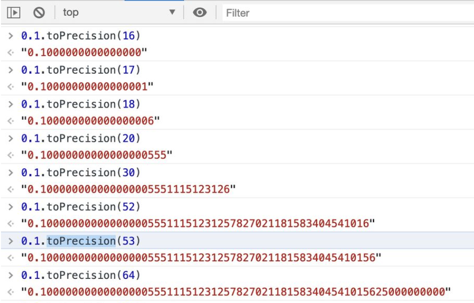

# 计算机编码

## 原码

原码：最高位作为符号位，其余位相加（2^x +...）作为绝对值

## 补码

补码：反码加1


## 反码

反码：将原码除符号位外，全取反


> 如何判断一个二进制数是正数还是负数

看一个二进制是否是正数还是负数，需要先说明其是存储在计算机中，然后要知道其在计算机中是以有符号还是无符号存储。

如果仅仅是给了一堆二进制：比如10101010，如果不说是在哪存的，那么它是没有正负概念的。或者说10101010是原码或者补码，进而推断它的原始的值。


## IEEE754标准

[IEEE754可视化工具可自己实验来验证一下](http://bartaz.github.io/ieee754-visualization/)

[知乎参考资料，比较全面详尽](https://zhuanlan.zhihu.com/p/66949640)

JavaScript的数字都是number类型的，不管是整数还是浮点数都以 ```IEEE754双精度``` 的格式存储

JavaScript 语言的底层根本没有整数，所有数字都是小数（64位浮点数）。某些运算只有整数才能完成，此时 JavaScript 会自动把64位浮点数，转成32位整数，然后再进行运算。


### 结构

以双精度（32位）为例

| S(符号位)    | Exp（指数位）                                                | Fraction（尾数位）                            |
| ------------ | ------------------------------------------------------------ | --------------------------------------------- |
| 63           | 52～62                                                       | 0～51                                         |
| 1位          | 共11位                                                       | 共52位                                        |
| 0：正  1：负 | 0～2^11-1(2047)，<br>为了区分正负，引入偏正值1023，指数范围[-1023, 1024] | 小数二进制计数法形式中.后面的数，从高至低填入 |


指数为2^e – 1且尾数的小数部分全0，这个数字是±∞。（符号位决定正负）
指数为2^e – 1且尾数的小数部分非全0，这个数字是NaN


### 舍入规则（最近偶数）

当二进制小数科学记数法形式中，尾数超过了52位，那么53位以后的就舍去

- 首先判断精度损失：向下（直接舍去）、向上（舍去并进1）两种情况哪个更接近原值就选哪种
- 如果精度损失相等，执行偶数判断，即最低位为偶数


### 精度问题

**正是因为舍入原则存在，才会有小数的精度丢失问题**

且**浮点数的精度丢失在每一个表达式，而不仅仅是表达式的求值结果**：

0.1丢失 + 0.2丢失 = 0.0100 1100 1100 1100 1100 1100 1100 1100 1100 1100 1100 1100 1100 111即 0.30000000000000004 > 0.3丢失(0.0100 1100 1100 1100 1100 1100 1100 1100 1100 1100 1100 1100 1100 1100 1100 1100)


- 存储在计算机中0.1的已经是精度丢失的，为什么还能=== 0.1呢？

  **如果一个双精度的浮点数转为十进制的数字时，只要它转回来的双精度浮点数不变，精度取最短的那个就行**

  0.1存在计算机中存为二进制丢失了精度，再转成十进制时，与原0.1不一致，可以取不同精度，但是这些精度转为二进制存储时都相同。所以直接取最小精度情况0.1

<div align='center'></div>


- 1.005.toFixed(2)=1.00而不是1.01

  1.005存入计算机后丢失精度，变成1.0049999999999998934xxx，所以1.0049999999999998934xxx保留两位小数是1.00


- Number.MAX_VALUE和Number.MAX_SAFE_INTEGER

  Number.MAX_VALUE： IEEE754 能表示的最大的浮点数  [知乎回答](https://www.zhihu.com/question/24423421)

  Number.MAX_SAFE_INTEGER：


### 位运算

http://www.jsphp.net/js-jichu-basic/show-7-169-1.html