# 交换机


## 作用

> **存储转发分组，实现交换分组的关键构件**


## 几种交换

|      | 电路交换                                                     | 文件交换                                                     | 分组交换                                                     |
| ---- | ------------------------------------------------------------ | ------------------------------------------------------------ | ------------------------------------------------------------ |
| 介绍 | 有建立连接、占用连接通话、释放连接三个步骤的信息交换方式<br/>整个报文的比特流连续从起点到终点 | 整个报文传送到相邻路由器，全部存储下后查找转发表，再转发至下一结点 | 单个分则传送到相邻路由器，全部存储下后查找转发表，再转发至下一结点 |


## 分组交换

<div align="center">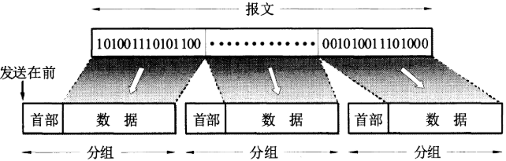</div>
- 首部里存了源地址、目标地址等信息
- 只有某分组在链路上传送时才占用该链路
- 当一链路拥堵时，剩下的分组可以由其他路由器转发经过其他链路到达目标结点

- 到达某路由器结点先存储下来（存在内存，而不是磁盘，速度更快）
- 不需要建立连接、释放连接的过程，更迅速
- 动态分配带宽，对链路逐段占用


# 计算机网络性能


## 速率


## 带宽


## 吞吐量


## 时延

### 发送时延

发送时延 = 数据块长度 (比特) / 信道带宽 (比特/秒)


## 时延带宽积


## 往返时间


## 利用率


# 物理层

> **屏蔽掉传输媒体和通信手段的差异，使数据链路层感受不到差异专注于本层**


## 通信方式

- 单向通信（单工）：只有一个方向的通信而没有反方向的交互（广播等）
- 双向交替通信（半双工）：双方都可以发送信息，但不能同时发送
- 双向同时通信（全双工）：双方都可以发送信息，且能同时发送


## 调制

> **基带信号**（来自信源的信号，声波、计算机输出的数据信号等。基带信号可分为数字基带信号和模拟基带信号。相应，信源也分为数字信源和模拟信源）**带有很多低频成分，很多信道无法传输低频分量，需对基带信号调制**


### 基带调制

> **对基带信号的波形进行变换，变换后仍是基带信号**

- 不归零制
- 归零制
- 曼彻斯特编码
- 差分曼彻斯特编码


### 带通调制

> **使用载波进行调制，将基带信号的频率范围搬到更高的频段，并转换为模拟信号**

- 调幅
- 调频
- 调相


## 信道传输速率

- 码元传输速率越高/信号传输越远/噪声干扰越大/传输媒体质量越差 => 出现码间串扰，接收端波形失真越严重

- 信道传输速率限制因素：①信道能够通过的频率范围、②信噪比

- $$
  香农公式：C = W log_2(1 + S/N) \ \ \ \ C:信道极限信息传输速率\ W:信道宽度(Hz)\ S:信号功率\ N:噪声功率\
  $$

- W 和 S/N都达到限度，如何再提高信息传输速率？

  > 让每个码元携带更多比特的信息量，相同时间传送的信息量提高3倍
  >
  > 基带信号：101011000 => φ5φ3φ0


### 信道能够通过的频率范围

- 信道的频带越宽，即能通过的信号高频分量越多，信道传输速率越高


### 信噪比

- 信噪比越大，信道传送速率越高 
  $$
  信噪比(dB) = 10log_{10}(S/N)
  $$
  

## 传输媒体

| 导引型传输媒体 | 特点 | 非导引型传输媒体 | 特点 |
| -------------- | ---- | ---------------- | ---- |
| 双绞线         |      | 短波通信         |      |
| 同轴电缆       |      | 无线电波通信     |      |
| 光缆           |      | 微波接力通信     |      |
|                |      | 卫星通信         |      |


## 信道复用技术

> **通过共享信道，最大限度提高信道利用率**


- 如何让众多用户合理方便使用信道资源？
  - 静态划分信道
  - 动态划分信道
    - 随机接入(以太网属于随机接入)
    - 受控接入

| 类型     | 特点 |
| -------- | ---- |
| 频分复用 |      |
| 时分复用 |      |
| 波分复用 |      |
| 码分复用 |      |


# 数据链路层

> **该数据链路，是物理链路+通信协议**
>
> 在广播式多路访问链路中（**局域网**），由于可能存在介质争用，它还可以细分成介质访问控制(**MAC**)子层和[逻辑链路控制(**LLC**)子层，**MAC子层专职处理介质访问的争用与冲突问题**。


## 信道分类

- 点对点信道：一对一
- 广播信道：一对多


## 三个基本问题

### 封装成帧

> **网络层交下来的IP数据包报 添加 首部和尾部 组成帧，IP数据包成为帧的数据部分**

- 每一种链路层协议都规定了所能传送的帧的数据部分长度上限（最大传送单元—MTU）

- 当数据部分是可打印的ASCII码组成的文本文件时，帧定界可以使用特殊的帧定界符SOH、EOT(只是名称，是不可打印的ASCII码，十六进制编码分别为01、04)

<div align="center">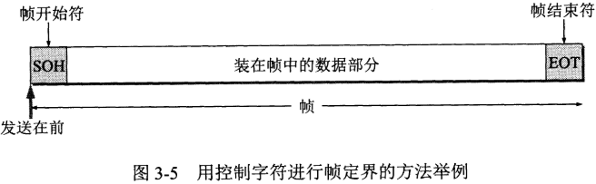</div>
### 透明传输

> **当数据部分是文本文件组成时，不会出现与定界符相同的字符，所以不管从键盘输入什么都可以放在帧数据部分传送出去。对数据来说，，无论数据如何组合，链路层就像透明不存在一样不会妨碍它传输。**

- 当数据部分是非ASIIC码文件(二进制的计算机程序、图片等)时，数据部分的字符可能与定界符重复，接收端的链路层会错误地找到边界，导致数据丢失

  > **字节填充法**
  >
  > 发送端的数据链路层在数据部分的**相重字符前加上转义字符ESC**(十六进制1B)
  >
  > 接收端链路层接受后将转义字符删除再传给网络层
  >
  > - 数据本身含有```ESCEOT```，则前面再加上转义符，变成```ESCESCEOT```


### 差错检测

> 现实链路不理想，比特在传输过程中会产生差错(如，比特差错)，为了减少误码率，数据链路层通常使用**循环冗余检验（CRC）**的检测技术


- 误码率BER = 错误比特 / 传输总比特

- 循环冗余检验过程：（假设数据M:101001，则k=6，n位冗余码）

  > - 发送端CRC运算：发送数据 2<sup>n</sup>M + FCS (k+n位)  
  >   - 为检错而添加的冗余码常称为**FCS序列**
  >   
  >     收发双方事先商量长度为(n+1)位数P，2<sup>n</sup>M除以P，得到n位的余数R，R作为FSC序列
  >   
  >   - 2<sup>n</sup>M，M后加上n个0
  > - 接受端CRC检验：收到的每一帧的数据除以P，若余数R=0，则帧没有错，接受；反之丢弃

- 循环冗余检验CRC：
  - 只能用在所传数据是以帧为单位的情况
  - 使用CRC只能实现无比特差错，但还不是可靠传输


## 点对点协议PPP

> **互联网用户通常需要连接到某个 ISP 之后才能接入到互联网，PPP 协议是用户计算机和 ISP 进行通信时所使用的数据链路层协议**


### PPP协议组成

- 一个将IP数据报封装到串行链路的方法
- 一个用来建立、配置、测试数据链路连接的链路控制协议LCP
- 一套网络控制协议


### PPP协议帧格式

<div align="center"></div>
- 首部4个字段：F标志字段 + A地址字段 + C控制字段 + 协议字段

  - 协议字段

    为0x0021时，信息字段为 IP数据报

    为0xC021时，信息字段为PPP链路控制协议LCP的数据

    为0x8021时，信息字段为网络层的控制字段

- 尾部2个字段：CRC的帧检验序列FCS + F标志字段

- 字节填充：异步传输(逐个字符地传送)时，当信息部分与控制字段重复的字符时，发送端采用字节填充方式来实现透明传输
  - 转义符定义为0x7D
  - 信息段中的0x7E => 0x7D,0x5E
  - 信息段中的0x7D => 0x7D,0x5D
  - 信息段中的ASIIC码字符(数值小于0x20,如0x03) => 0x7D,0x03 

- 零比特填充：同步传输(一连串比特连续发送)时，采用零比特填充实现透明传输

  - 01111110会被误认为是标志字段F，发送端扫描信息字段，发现有5个连续地1，则立即插入0


## CSMA/CD协议

> 一种节点**直接**向广播信道发送数据，并**避免碰撞**的方法
>
> **半双工通信**


- 多点接入：总线型网络，许多主机连在一个总线上，即广播信道
- 载波监听：每个主机不停监听信道。发送前，监听到信道正在使用，有数据要发也必须等待
- 碰撞检测：发送数据时，主机也在监听信道。当发生碰撞时就停止发送（发生碰撞时，碰撞双方发送的帧都失效）。虽然主机会等信道空闲再发送，但存在传播时延有可能信道已经在使用了。
  - 检测到碰撞发送失败后，会强化碰撞，即发送32或48比特的人为干扰信号让用户知道发生了碰撞


## 局域网

> 局域网是一种典型的广播信道，主要特点是地理范围和站点数目均有限。
>
> 主要有以太网、令牌环网、FDDI 和 ATM 等，目前以太网占领着有线局域网市场。
>
> 局域网工作的层次跨越了**数据链路层和物理层**

- 按网络拓扑结构对局域网分类：
  - 星形
  - 环形
  - 总线形


## 以太网

> 以太网是一种目前应用最普遍的局域网技术，
>
> 标准拓扑结构为总线型拓扑，
>
> 使用```CSMA/CD```协议

<div align="center"></div>
- 早期使用集线器连接

  - 虽然使用集线器的局域网表面上是星形网，但在逻辑上仍是总线网，使用```ＣＳＭＡ/ＣＤ```协议

  - 当一个比特从一个接口进入集线器后，集线器将其信号强度放大*(从而扩大传输距离)*并复制多个，然后转发到剩下的所有接口
  - 集线器工作在物理层
  - 只进行简单的转发，不进行碰撞检测。当集线器同时收到来自两个接口的数据，则发生碰撞

- 现在常使用交换机

  - 能使相互通信的主机无碰撞地传输数据

  - 具有并行性，能同时联通多对接口

  - 一般是全双工方式

    - 不使用ＣＳＭＡ/ＣＤ协议，全双工方式工作，为什么还叫以太网？

      > 因为帧结构没有变，仍采用以太网的帧结构

  - 内部的帧交换表(地址表)是通过自学习算法方式逐渐建立的

  - 交换机接口有存储器，当输出口拥堵时，会讲输入的帧缓存


### 扩展以太网


- 高速以太网
  
- ```100BASE-T``` (在双绞线上传送```100Mbits/s```基带信号的星型拓扑结构以太网)　等
  
- 虚拟以太网

  >  当局域网过大时，往往会带来维护上的问题，这时候可以使用VLAN。
  >
  > 虚拟局域网*(VLAN)*可以建立与物理位置无关的逻辑组；只有在同一个虚拟局域网中的成员才会收到链路层**广播**信息。

  


###  MAC层

> 主要负责控制与连接物理层的物理介质。
>
> 发送数据时，MAC协议可以事先判断是否可以发送数据，如果可以发送将给数据加上一些控制信息，最终将数据以及控制信息以规定的格式发送到物理层；
>
> 在接收数据的时候，MAC协议首先判断输入的信息并是否发生传输错误，如果没有错误，则去掉控制信息发送至LLC层。


#### MAC地址

> 局域网中的**硬件地址**，或**物理地址**，因为地址在**MAC帧**中，所以又叫**MAC地址**

- 6 字节
- 用于唯一标识网络适配器
- 每台主机有多少个适配器，就有多少个MAC地址


#### MAC帧格式

<div align="center">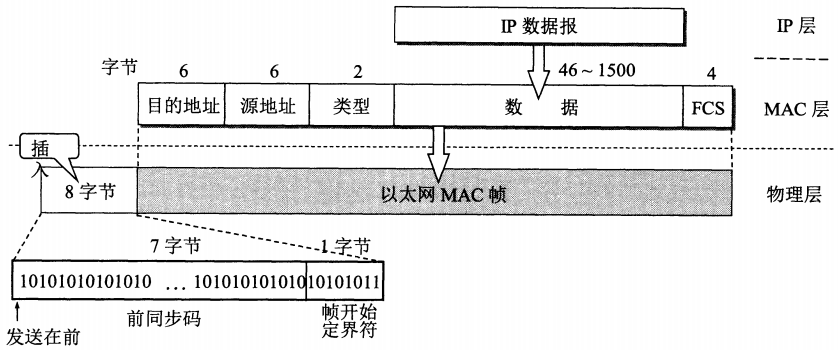</div>
- 以太网帧格式有两种标准，V2标准　与　IEEE802.3标准；一般用V2标准
- 第三个字段表示类型
  
- 当值为0x0800时，表示上一层是IP数据报
  
- 首部没有帧长度字段，尾部也没有帧结束定界符

  > 以太网传输数据以帧为单位，当发送方将一个帧发送完毕不再继续发送帧(曼彻斯特编码的特点)，所以能确定数据段结束位置

- 当数据字段长度小于46字节时，会在后面添加填充字节；

  接收端的MAC子层剥去首部和尾部后将含有填充字节的数据交给上层协议；

  上层有能力识别哪些是填充字节


# 网络层

> 网络层向上只提供简单灵活的、无连接的、努力交付的数据报服务

- 发送分组前不需先建立连接
- 每个分组独立发送，不需顾及前后分组，不需编号
- 网络层不保证服务质量，可能出现失序、出错、丢失、超时等情况
- 传输网络不提供端到端的可靠传输服务，所以路由器简单，成本低(因为端系统是计算机，有很强的差错处理能力)


## 虚拟互连网络（IP网）

> 为了实现网络上主机间的通信，使用 IP 协议把异构的*(如以太网和无线网)*一个个网络连接起来，使得连接后，在网络层多个网络变成了一个**“统一的网络”**。

<div align="center"></div>
## 网际协议IP

> 是TCP/IP协议中最重要的两个协议之一，用来使互连的网络能够通信


- 与IP协议配套使用的有:

  - 地址解析协议(ARP)

  - 网际控制报文协议(ICMP)

  - 网际组管理协议(IGMP)

    IP协议需要使用ARP协议；ICMP、IGMP协议需要使用IP协议

<div align="center">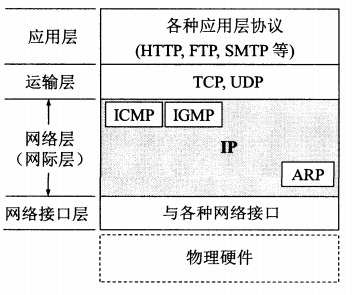</div>
### IP地址

> 给互联网上的每一台主机(或路由器)的每一个接口分配一个在全球范围内是唯一32位的标识符


#### IP地址与硬件地址区别

<div align="center">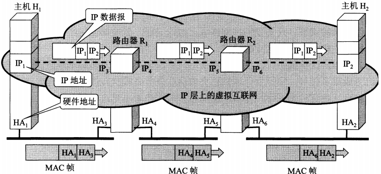</div>
#### IP地址编址方式

- 分类的IP地址
- 子网的划分
- 构成超网

分配IP地址越来越灵活，从只能以/8，/16，/32为单位，到在A、B、C类地址基础上占用主机位来分配IP地址，再到根据用户需要改变CIDR地址块来分配


## 分类的IP地址

<div align="center"></div>
- **IP地址::={<网络号>,<主机号>}**
- A、B、C类地址都是单播地址(一对一通信)，最常用
- D类为多播地址(一对多通信)
- E类保留为以后使用

| 网络类别 | 最大可指派的网络数         | 第一个可指派的网络号                 | 最后一个可指派的网络号                   | 每个网络中的最大主机数 |
| -------- | -------------------------- | ------------------------------------ | ---------------------------------------- | ---------------------- |
| A类      | 2<sup>7</sup>-2 = 126      | 00000001=1                           | 01111110=126                             | 2<sup>24</sup>-2       |
| B类      | 2<sup>14</sup>-1 = 16383   | 10000000 00000001 = 128.1            | 10111111 11111111 = 191.255              | 2<sup>16</sup>-2       |
| C类      | 2<sup>21</sup>-1 = 2097151 | 11000000 00000000 00000001 = 192.0.1 | 11011111 11111111 11111110 = 223.255.255 | 2<sup>8</sup>-2        |


一般不使用的特殊IP地址：

- A类地址：

  网络号：①网络号全为0，是个保留地址，意为本网络  ②网络号为127，保留作为本地软件环回测试本主机的进程之用

  主机号：①主机号全为0，该主机所在的网络地址  ②主机号全为1，该网络上的所有主机

- B类地址：

  网络号：①网络号128.0不指派

  主机号：①主机号全为0  ②主机号全为1

- C类地址：

  网络号：①网络号192.0.0不指派 

  主机号：①主机号全为0  ②主机号全为1

| 网络号 | 主机号             | 源地址使用 | 目的地址使用 | 代表含义                     |
| ------ | ------------------ | ---------- | ------------ | ---------------------------- |
| 0      | 0                  | ✔          | ✘            | 在本网络的本主机             |
| 0      | host-id            | ✔          | ✘            | 在本网络上的某台主机host-id  |
| 全1    | 全1                | ✘          | ✔            | 只在本网络上进行广播         |
| net-id | 全1                | ✘          | ✔            | 对net-id上的所有主机进行广播 |
| 127    | 非全0或全1的任何数 | ✔          | ✔            | 用于本地软件环回测试         |

### IP地址特点

- 同一局域网上的主机或路由器的IP地址中的网络号一样
- 路由器有两个或两个以上的IP地址，每个接口都有不同的网络号
- 用网桥(链路层)或转发器(物理层)等相连的局域网仍然是一个网络，因为具有相同的网络号


### IP层转发分组

> 基于目的主机所在网络，从一个路由转发到另一个路由
>
> 只有到达最后一个路由器时，才试图向目的主机直接交付

**【目标主机所在网络地址，下一跳地址】**

1. 从IP报文首部提出目标主机地址D，从而得出目标网络地址N
2. 若N与此路由器直接相连，则直接交付**（**还需把D转成MAC地址，封装成帧发送出去**）**
3. 若路由表中有目的地址为D的特定主机路由，则把数据报传给路由表中指定的下一跳路由
4. 若路由表中有到达网络N的路由，则把数据报传给路由表中指定的下一跳路由
5. 若路由表中有一个默认路由，则把数据报传给路由表中的默认路由**(**只要目的网络是其他网络，则一律选择默认路由**)**
6. 报告转发分组出错


## 地址解析协议ARP

> 解决知道一个机器(主机或路由器)的IP地址，找出其硬件地址的问题

<div align="center"></div>
### 地址解析原理

<div align="center">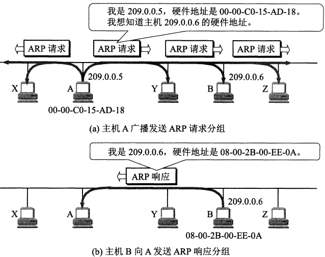</div>
- 每台主机上都有ARP高速缓存

- 当A主机需要向本局域网上的B主机发送IP数据报，需先查找ARP高速缓存中是否有B的IP地址，

  - 如有，则根据B的IP地址找到其硬件地址

  - 没有(可能B刚入网 或 A刚加电，其高速缓存是空的)，则

    A运行ARP进程，A向**本局域网**的所有主机广播发送ARP请求分组 **(**含有自己的IP地址到MAC地址的映射，顺便存入目标主机，便于反过来的应用，提高效率**)**

    当目标主机的IP地址与请求分组中的IP地址一致时，就收下分组，并向A发送自己的响应分组

    A将B的IP地址到MAC地址的映射写入ARP缓存

- 当A与B不在同一个网络，则A的ARP中存入连接网络的路由器的IP到MAC地址的映射，再由路由器继续完成
- ARP协议把IP地址解析为链路层所需的MAC地址的过程是自动进行的


## IP数据报

<div align="center">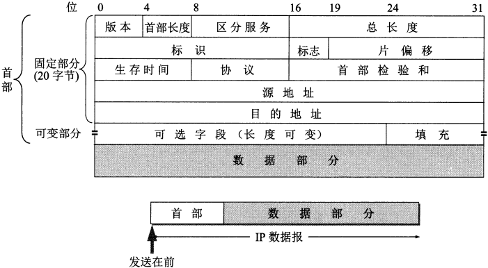</div>
- 版本：IP协议的版本，通信双方必须一致，如IPv4、IPv6

- 首部长度：以**32位**为单位。最小值为0101(表示首部长度为5个32位，即20字节)，最大值为1111(表示首部长度为15个32位，即60字节)；当可选字段长度不是32位(4字节)的整数倍，则用字节填充 **(**全0的字段**)**

- 区分服务：用来获得更好的服务，一般情况不使用

- 总长度：首部与数据的总长度。以**1字节**为单位。总长度字段为16位，所以数据报最大长度2<sup>16</sup>-1 = 65535，这样的长度实际很少遇到。

  IP层下面的数据链路层协议规定了每一个数据帧中的数据字段的最大长度，称为最大传送单元MTU，当IP数据报封装成链路层的帧数据时，如果太长，就会**分片**处理。

- 片偏移：分片得到的分组在原来较长分组中的相对位置。片偏移以**64位(8字节)**为偏移单位，所以每个分片的长度是8字节的整数倍。

- 标识(identification)：用来标识分片后的数据报片隶属于哪个原分组，拥有相同标识的数据报片能重装成原来的数据报

- 标志(flag)：占3位，但只有两位有意义。( )(DF)(MF)

  MF=1，后面还有分片；MF=0，此为若干数据报片的最后一个

  DF=1，不能分片；DF=0，能分片

- 生存周期：TTL(Time To Live)，为了防止无法交付的分组在互联网中不断兜圈子，浪费网络资源。由数据报的源点设置该字段。

  原来：以秒为单位。每经过一个路由，TTL减去数据报在路由消耗的时间。直到0，该报文被路由器丢弃。

  现在：因路由处理数据加快。功能变为“跳数限制”，以跳数为单位。路由器每次处理报文之前就把TTL减一

- 协议：指出携带的何种数据应该上交给哪个协议进行处理，例如 ICMP、TCP、UDP 、IGMP等

- 首部校验和：用来确定首部在传输过程中是否出错；分组每经过一个路由器都要检验；**只检验数据报的首部**。

  发送方将IP数据报首部划分为16位字的序列，将首部检验和置为0；用反码算术运算把所有16位字相加得到的值取反码写入校验和字段。

  接收方接收到数据报，将首部所有16位字用反码算术运算相加再取反码。

  当结果为0，则首部未变化，保留数据报；反之，丢弃

- 源地址

- 目的地址

- 可变部分的可选字段：1~40字节不等，用来支持排错、测量、安全等。


## 划分子网

> 在分类IP基础上，通过在主机号字段中拿一部分作为子网号，把两级 IP 地址划分为三级 IP 地址，将原来的网络分为若干个彼此隔离的子网
>
> 已成为互联网的正式标准协议

**IP地址::={<网络号>,<子网号>,<主机号>}**


### 分类IP的缺点

- IP地址空间利用率有时很低

  (如，某单位申请了B类地址网络，但连着的主机却不多，又不愿意申请C类足够使用的地址，造成资源浪费)

- 给每个物理网络分配一个网络号会使路由表变得很大，影响网络性能

- 两级IP地址不够灵活


### 划分子网的特点

- 某单位将所属的物理网络分成若干子网，本单位以外的网络看不见该网络由多少子网组成，对外仍是一个网络
- 其他网络发给本网络某主机的IP数据报，①仍根据数据报的目的网络号找到连接在本网络的路由器，②再由路由器根据目的网络号和子网号找到目的子网，将数据报交给目的主机

<div align="center"></div>
### 子网掩码

> 从IP数据报首部无法看出任何关于子网划分的信息，解决路由器将数据报交给哪个子网的问题(因为外部看不到子网的划分)

<div align="center">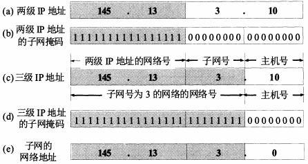</div>
- 子网掩码最好是连续的1，以免发生出错

- 无论是否有子网，路由器接收到分组后，根据首部的目标IP地址 和 子网掩码 进行与运算，立即得出网络地址

- 从网络地址外面看，145.13.0.0是普通的B类网络，子网掩码是225.225.0.0

  进入网络里面，有很多子网145.13.x.0，他们的子网掩码是255.255.255.0

- 为什么无论是否划分子网，都要用子网掩码？

  > 为了便于查找路由表
  >
  > 现在互联网标准规定，必须使用子网掩码。路由表中也有子网掩码一栏。
  >
  > 当没有进行子网划分，使用默认子网掩码


#### 默认子网掩码

<div align="center">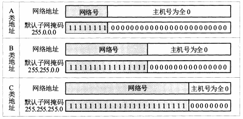</div>
#### 子网划分选择

[参考计算](http://blog.sina.com.cn/s/blog_5753d0930101fxdf.html)


| 子网号的位数 |    子网掩码     | 子网数           | 每个主机数       |
| :----------: | :-------------: | ---------------- | ---------------- |
|   **A类**    |                 |                  |                  |
|      2       |   255.192.0.0   | 2<sup>2</sup>-2  | 2<sup>22</sup>-2 |
|     ...      |                 |                  |                  |
|      22      | 255.255.255.252 | 2<sup>22</sup>-2 | 2<sup>2</sup>-2  |
|   **B类**    |                 |                  |                  |
|      2       |  255.255.192.0  | 2<sup>2</sup>-2  | 2<sup>14</sup>-2 |
|     ...      |                 |                  |                  |
|      14      | 255.255.255.252 | 2<sup>14</sup>-2 | 2<sup>2</sup>-2  |
|   **C类**    |                 |                  |                  |
|      2       | 255.255.255.192 | 2<sup>2</sup>-2  | 2<sup>6</sup>-2  |
|     ...      |                 |                  |                  |
|      6       | 255.255.255.252 | 2<sup>6</sup>-2  | 2<sup>2</sup>-2  |

- 以上，都是子网号不能全为0,1的情况

- A类的子网号位数没有23,24；B类没有15,16；C类没有7,8；

- 现在全1，全0的子网号可以使用，但用之前需知道路由软件是否支持这种用法

- 划分子网增加了灵活性，但却减少了能够连接在网络上的主机总数。

  （本来一个B类地址网络最多能连接655234台，现在子网数 x 每个子网连接主机数 小于原本的数）


### 使用子网时分组的转发

**【目标主机所在网络地址，子网掩码，下一跳地址】**

1. 从IP报文首部提出目的IP地址D

2. 判断是否直接交付。

   用与路由器直接相连的网络的子网掩码 与 D 逐位相与：

   若结果与对应网络的网络地址相符，则直接交付**（**还需把D转成MAC地址，封装成帧发送出去**）**

3. 若路由器中有目的地址为D的特定主机路由，则把数据报传给路由表该项指定的下一跳路由器

4. 将路由表中的每一项的子网掩码 与 D进行与运算，得到结果N：

   若N与每一项的目的网络地址一致，则把数据报传给路由表该项指定的下一跳路由器

5. 若路由表中有默认路由，则把数据报传给默认路由

6. 报告转发分组出错


## 无分类编址CIDR(构造超网)

> 无分类编址 CIDR 消除了传统 A 类、B 类和 C 类地址以及划分子网的概念，使用网络前缀和主机号来对 IP 地址进行编码，网络前缀的长度可以根据需要变化。

**IP地址 ::= {<网络前缀>,<主机号>}** 32位


- 更加有效地分配IPv4的地址空间，在新的IPv6使用之前，能容许互联网规模继续增长

- CIDR把网络前缀都相同的连续的IP地址组成一个 “CIDR块”，

  根据地址块中的任一地址，可以得到该地址块的最小地址、最大地址

- 地址掩码，为了更方便进行路由选择 ？

- CIDR 的地址掩码可以继续称为子网掩码。


### 表示法

- 斜线记法，CIDR法

  128.14.35.7/20，

  20表示前20位是网络前缀，是地址掩码中1的个数

  能看出该地址块拥有2<sup>12</sup>个IP地址

- 10.0.0.0/10 => 10/10

- 0000101000* , *表示主机号


### 路由聚合

> 一个 CIDR 地址块中有很多地址，一个 CIDR 表示的网络就可以表示原来的很多个网络，并且在路由表中只需要一个路由就可以代替原来的多个路由，减少了路由表项的数量。把这种通过使用网络前缀来减少路由表项的方式称为路由聚合，也称为  **构成超网** 。


### 查找路由表

最长前缀匹配 + 二叉树查找


## 网际控制报文协议ICMP

> 为了更有效转发IP数据报和提高交付成功的机会。
>
> 不是高层协议，ICMP报文是封装在IP数据报数据部分的


### 报文格式

<div align="center"></div>
- 代码：进一步区分某种类型的不同情况
- 校验和：校验**整个报文**在传输过程中是否出错


### 报文种类

<div align="center"></div>
#### 差错报告报文

- 终点不可达：当路由器或主机不能交付数据报时就向源点发送终点不可达报文

- 时间超过：路由器收到TTL=0的IP报文时，就丢弃报文，向源点发送时间超过报文

- 参数问题：当路由器或目的主机收到的IP报文首部有字段值不正确时，就丢弃，并向源点发送参数问题报文

- 改变路由：路由器将改变路由报文发给主机，让主机把报文发给另外的路由

  主机中也有路由表，当主机发送报文时先查找自己的路由表查看发出。

  主机不会与连接在网络上的路由器定期交换路由信息(为了效率,因为主机数量远大于路由器数量)，只设置了默认路由。

  不管发往哪的数据报，都发给默认路由，默认路由(通过与其他路由交换信息)知道去其他网络的最佳路由，交给其他路由，并发送给源点改变路由报文

<div align="center"></div>
#### 询问报文

- 回送请求和回答：路由器或主机向某主机发送ICMP回送请求报文，收到询问的主机必须给源主机或路由器发送ICMP回答报文。测试目的站是否可达与状态。
- 时间戳请求与回答：发送ICMP时间戳请求报文请某路由器或主机回答的当前时间。回答报文中有32位的字段，存储当前时刻距离1900.1.1的秒数。用来时间同步与测量。


### ICMP应用

#### ping

> 分组网间探测，用来测试两台主机间的连通性。
>
> 是应用层直接使用网络层ICMP，未涉及运输层的TCP/UDP

- 向目的主机发送回送请求报文，目的主机收到之后会发送回送回答报文。会根据时间和成功响应的次数估算往返时间以及丢包率。


#### traceroute

> 跟踪一个分组从源点到终点的路径

- 源主机向目的主机发送一连串封装着**无法交付**的UDP用户数据报的IP数据报P1，P2，P3......，分别设置TTL为1,2,3......
- 路径上的第一个Router1收到P1时，TTL=1，TTL-1 = 0，发送给源主机**ICMP时间超过的差错报告报文**
- 以此类推，每到路径上的一个新路由都会发送时间超过的差错报告报文。
- 最后一个数据报到达目的主机，TTL=1，主机不处理TTL，但发送给源主机ICMP终点不可达差错报告报文。
- 源主机根据返回的报文，得到所经过路由的IP以及往返时间


## 互联网的路由选择协议

> 路由表既可以手动指定，也可以通过路由选择协议自动生成
>
> 路由选择协议的核心是路由算法(即如何获得路由表中的各项目)


### 路由算法特点

- 正确和完整，沿着路由表的指引分组一定能到达目的网络目的主机
- 路由选择的计算应简单
- 稳定性，得出的路由不能不停变化
- 自适应，能随着网络通信量和拓扑结构的变化而自适应地调整
- 互联网划分成许多小的自治系统AS，不同AS可以有不同的路由选择协议
- 最佳，使分组平均时延最小，网络吞吐量最大
- 公平，所有用户端到端的时延差不多


### 种类

- 自治系统**内部**的路由选择：**RIP、OSPF**
- 自治系统**间**的路由选择：**BGP**


#### 内部网关协议RIP

#### 内部网关协议OSPF

#### 外部网关协议BGF


## 路由器


## IPv6


## 虚拟专用网VPN


## 网络地址转换NAT


# 运输层

> 运输层屏蔽了网络层的细节，向其上的应用层提供通信服务
>
> 属于面向通信部分的最高层，用户功能中的最低层


- 源主机通过IP协议把分组送到目的主机，但分组停留在主机的网络层，没有到真正的端点主机的应用进程。
- 所以网络层为主机之间提供逻辑通信，而运输层为应用进程之间提供端到端的逻辑通信

- 运输层两个主要协议：
  - **用户数据报协议UDP**
  - **传输控制协议TCP**

<div align="center">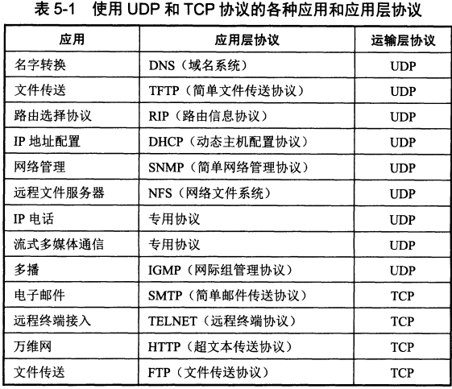</div>
## 运输层的端口

> 在协议栈层间的抽象的协议端口，是软件端口

- 应用层所有的应用进程都通过运输层再传到网络层：**复用**
- 运输层从网络层收到数据后，分别交付给指明的各应用进程：**分用**

- 所以，需要区分应用进程。单个计算机中的进程可以用标记来区分，但是在在互联网通信中不可行，因为①不同操作系统的计算机进程用不同格式的标识，②进程的创建撤销是动态的，无法作为作为通信终点

- 方法：运输层将所传报文交到目的主机的合适的目的端口(**协议端口号，简称端口**，不同操作系统实现端口方式不同)，最后交付目的进程由TCP/UDP完成。

  端到端的通信，不仅需要知道对方的IP地址，还要知道端口号


<table>
    <tr><td>客户端使用的端口号</td>
    <td colspan='2'>服务端使用的端口号/短暂端口号</td></tr>
<tr>
	<td rowspan='2'>49152~65535</td>
    <td>熟知端口号/系统端口号</td>
    <td>登记端口号</td>
</tr>
<tr>
    <td>0~1023</td>
    <td>1024~49151</td>
</tr>
</table>


## UDP


### 特点

- **无连接：**发送数据前不需要建立连接，减少了开销和发送数据前的时延
- **不可靠交付：**尽最大努力交付但不保证可靠交付，因为不维持复杂的连接状态表
- **面向报文：**将应用层交下来的报文不处理，直接添加了UDP首部就发给网络层；网络层交上来的报文，去除首部后直接发给应用层。
- **没有拥塞控制：**当出现拥塞时源主机发送速率不会降低。（适合视频会议、IP电话等要求源主机以恒定速率发送数据又允许丢失一些数据）
- 支持**一对一、一对多、多对一、多对多**通信
- **首部开销小**：首部8字节


### 首部格式

<div align="center">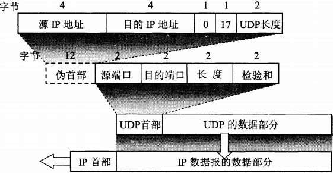</div>
- 源端口：需要对方回信时使用，不需要则全0

- 目的端口

- 长度：UDP数据报的长度，最小值为8(仅有首部)

- 检验和：检验UDP**数据报**在传输过程中是否出错，出错就**丢弃**报文，并由网际控制报文协议ICMP发送“端口不可达”**差错报文**给发送方**（**也可以将报文上交应用层，并附上差错警告**）**

  计算校验和过程：

  在UDP报文首部之前加入12位的伪首部 **(**只是此刻临时存在，不向下传也不向上传**)**

  **发送方**，①先将全0填入校验和，②将伪首部与UDP数据报分成若干个16位**（**数据报数据部分为奇数字节时，填入一个全0字节，但不发送**）**，③按二进制反码计算出16位字的和，④将和取反码填入校验和

  **接收方**，①将伪首部与UDP数据报分成若干个16位**（**数据报数据部分为奇数字节时，填入一个全0字节，但不发送**）**，②按二进制反码计算出16位字的和，③结果全1，则没有差错

  

## TCP

### 特点

- **面向连接**：应用层发送数据之前先建立TCP连接，发送之后释放连接
- **点对点**通信
- **可靠交付**：通过TCP连接传送的数据无差错、不丢失、不重复、按序到达
- **面向字节流**：应用层交下的是数据块，TCP将其看成**无结构的字节流**。数据块太短，则TCP积累着足够长再发送；太长则进行划分后再发送