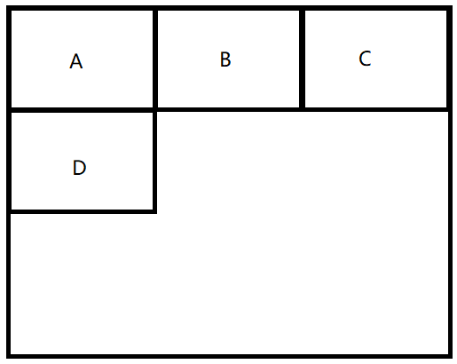

# 百姓网

## 一面

- 怎么实现文本不能复制

  - JS 禁止右键点击事件：

    ```javascript
    // 整个文档屏蔽：
    document.ontextmenu = function(){ return false; }
    // 某个区域屏蔽
    document.getElementById('myDiv').eventListener('ontextmenu',function(){return false;})
    ```

  - CSS pointxxx属性

  - 空元素覆盖


- 为什么C语言的数组声明时有长度，JavaScript没有
  - 因为JavaScript数组不是单纯的数组，是个对象。hash？


- 手写一个 call


- NaN


- transition 和 animation


- 判断一个链表长度
  - 一个循环，看有没到链表尾部 + 快慢指针


- Vue数据双向绑定


- async 怎么捕获异常


- ```javascript
  catch{
      return true;
  }finally{
      return false;
  }
  // 最后返回的是？
  ```

  - false

    

- commonJS 模块 和 ES6模块区别


- 说一下 继承


- ES6继承 和 原型链继承 比，有什么优势


## 二面

- 计算机网络 五层 、 七层


- 什么是长连接


- 什么是无状态


- 304 
  - 回答了协商缓存。（但是协商缓存只是一种情况）


- 302


- 400、403


- 用户登录状态怎么判断
  - session
  - token？


- tcp三次握手


- 基本数据结构有哪些


- 链表特点


# 海康威视

## 一面

- 项目
- CSS盒子模型
- 怎样实现垂直居中
- JavaScript的事件机制
- 算法：给一个字符串，判断出现的最多的字符


# 迅盟科技

## 技术面

- 说一下闭包，闭包的使用场景
- 说一下 let、var、const
- 说一下箭头函数与普通函数的区别
- 怎么改变this指向
- bind、apply、call区别
- flex布局
- 平时怎么学习的

## hr面


# 美团

## 一面

- 项目

  - 兼容cookie和本地存储怎么实现的？

    - 为什么用 cookie 和 本地存储
    - cookie 和 localStorage 区别

    

  - 讲讲避免页面闪动

    - loading什么时候结束

    

  - 淘宝的移动端适配方案的原理

    - 获取的是设备的什么信息
    - 改变的是什么标签，改变了哪些内容

    

  - 说一下项目中的按需渲染

    - 还有哪些优化页面性能的方法（我：缓存……）

    

  - history 改善 Ajax 是什么实现的

    - 为什么没有考虑 H5 的 history 的兼容性问题

    

  - 封装饼状图是怎么实现的

    - 饼状图怎么使用
    - 构造函数怎么写的
    - canvas 的什么API 用来填充颜色
    - canvas 怎么改变线条的粗细、颜色

    

  - 服务端渲染怎么实现的

    - 需要实例化Vue吗
    - 在 create、beforeMounted、mounted 中都可以吗
    - 为什么在后两个中不可以

    

  - 说一下GraphQL

    

- 怎么实现如下效果：

  <div align="center"></div>


- 浏览器是怎么实现跨域的
  - （我说了iframe）iframe是怎么实现跨域的


- CSS3动画可以用哪些实现
  - 怎么用


- 为什么要用语义标签


- 说一下 eventloop
  - 有哪两个队列


- 说一下promise

  - 如果一个 promise 已经是 resolved，再调用resolve会执行吗

  - 如果是rejected呢，调用resolve会执行吗

  - 用promise实现下面的wait方法(x秒后执行函数)

    ```javascript
    function wait(second){}
    wait(4).then(function(){
        console.log(1);
    })
    ```

    

- 说一下原型和原型链

  - var obj = {} 的原型是什么

    

- let、const、let的区别

  

- 说一下下面的结果

  ```javascript
  // 题目1
  var obj = {
      x:1,
      fun(){
          return this.x;
      }
  }
  obj.fun()
  // 题目2
  var obj = {
      x:1,
      fun(){
          return this.x;
      }
  }
  var fun = obj.fun;
  // 题目3
  var obj = {
      x:1,
      fun:()=>{
          return this.x;
      }
  }
  obj.fun()
  fun();
  // 题目4
  var obj = {
      x:1,
      fun:()=>{
          return this.x;
      }
  }
  var fun = obj.fun;
  fun();
  // 报错，为什么会报错
  ```

  

- 用构造函数实现一个链表


- 假如一个链表是：

  ```javascript
  function Node(val,next){
      
  }
  var linkList = new Node();
  var link = {
      val:1,
      next:{
          val:2,
          next:{
              val:3,
              next:null
          }
      }
  }
  // 请实现链表的逆转
  function reverse(link){
      
  } // 3 2 1
  ```


# 盒马

## 一面

- history 优化 Ajax 列表怎么实现的？用的什么方法

- 点击浏览器箭头监听的事件是什么

- 描述一下Ajax请求的过程

- Ajax的状态码分别代表什么

- loading什么时候结束

- 如果很多个异步请求，怎么处理（我回答了promise的all）

  - 如果出现rejected呢
  - 如果都是rejected呢

- 502是什么

- js基本数据类型

- 怎么判断一个变量的数据类型

- Vue 单向数据流

- Vue 跨代组件通信怎么处理？用过Vuex吗？什么原理？

- 了解过设计模式吗？(发布订阅模式、观察者模式) 请你实现一个发布订阅模式 和 观察者模式

  

# 网易严选

## 一面

- 遍历对象的方法
- 说一下对象属性的四大要点（value、length。。。）
- 没用过map吗
- 说一下 Object.defineProterty
- 遍历数组的方法
- 说一下数组的方法
  - slice 和 splice区别
- 有用过 reduce、reserve 吗
- express 怎么判断是不同用户的请求
- 说一下express中间件的原理
- 除了 fs 模块，还用过其他模块吗？比如 stream


# 华为

## 一面

- click事件，能拆分成哪些更小的事件
  - mouseup、mousedown
- 有自己实现过v-model吗
- 断点续传服务器端有做过压测吗
- 怎样写一个组件
- es6的新的数据类型是？马上要出来的数据类型是
- 关于服务器端渲染，有了解更多吗


# 数字浙江

## 一面

- 说一下tcp协议
- 说一下计算机网络各层是干什么的
- 说一下http和https
- 在浏览器环境中，怎么看到http的信息
- http的结构
- 除了json数据，还可以发送什么
- http请求方法有哪些
- http状态码
- 说一下闭包
- 闭包的应用场景是什么
- 说一下盒子模型
- Vue的生命周期
- 内置事件绑定是在什么时候


## 二面

- 请你解释一下什么是时间复杂度和空间复杂度
- 冒泡排序 和 堆排序 的时间复杂度分别是多少
- http 的请求有哪些
- cookie 、sessionStorage、sessionStorage
- 盒子模型
- 浏览器内核有哪些


## hr面

- 为什么不考研