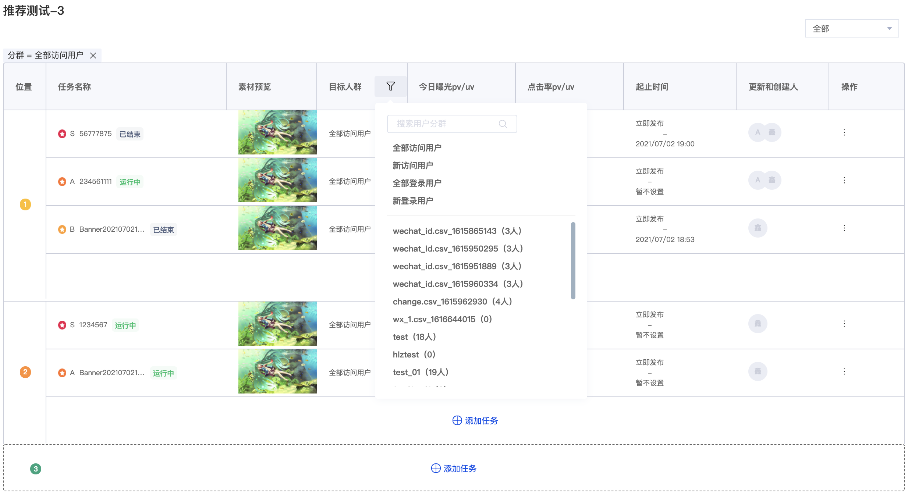

# 业务组件

## BannerTable

- 效果

  <div text-align='center'></div>


- 实现

```react
🔧
// 在BannerManage中使用
const table = bannerGroups.map((item, index)=>{
  let data = items || [];
  if(filterAudienceId || filterAudienceType){
    data = data.filter(item=> item.filterId === filterAudienceId && item.filterType === filterAudienceType)
  }
  if(filterState){
    data = data.filter(item=> item.state === filterState)
  }
  if(!data.length){ 🌟
    return null;
  }
  return 
  <DraggableItem>
    <BannerTable data={data}/>
  </DraggableItem>
})

export default BannerManage:React.FC<{}> = ()=>{
  return 
  <CampaignAdapter>
  	<Header/>
    {!!(filterAudienceId || filterAudienceType)&&<UserFilterTag/>}
    <div></div>
  </CampaignAdapter>
}
```


```react
⚙️
// BannerTable的实现
```

